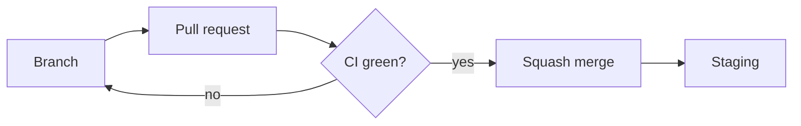

# Contributing to docs

This page is the house style for everything under `docs/` and `specs/`. It
distills the [Google developer documentation style guide](https://developers.google.com/style)
and the [Diátaxis](https://diataxis.fr/) framework into the rules this
project applies, and it tells you how to build and check the site.

## Choose the right kind of page

Diátaxis sorts documentation by what the reader is doing. Before you write,
decide which one question the page answers, and keep it to that question.

| The reader is | and needs | so write a | in `docs/` |
| --- | --- | --- | --- |
| learning | to do something | tutorial | `tutorials/` |
| working | to do something | how-to guide | `how-to/` |
| working | to know something | reference page | `reference/` |
| learning | to know something | explanation | `explanation/` |

Some tests that catch the common mistakes:

- A tutorial promises a result and gets every reader there. It does not
  explain alternatives. If you are writing "you could also", you are writing
  a how-to guide or an explanation.
- A how-to guide assumes competence and solves one goal. It does not teach.
- A reference page describes; it does not instruct. Tables beat prose.
- An explanation discusses; it has no steps.

One page, one quadrant. When a page needs both steps and background, split
it and link the two.

Specs live in `specs/` and follow their own template. They are reference
pages for what the product must do; see [Writing conventions](specs/README.md#writing-conventions)
in the specs index for the rules they add.

## Write in the Google style

- **Address the reader as "you".** Use "we" only for the team's own
  decisions, and rarely.
- **Present tense, active voice.** "The gate warns" rather than "the gate
  will warn"; "the API refuses the write" rather than "the write is
  refused". Passive voice is fine when the actor does not matter.
- **Sentence case** for every title and heading. One `#` heading per page.
  Do not skip heading levels, and do not put code font or links in headings.
- **Task headings use the bare verb.** "Add a migration", not "Adding a
  migration". Conceptual headings are noun phrases: "The inventory
  lifecycle".
- **Numbered steps, one action each,** starting with a verb. State where
  before what: "In `mkdocs.yml`, add the page to `nav`." State the purpose
  before the action when it helps: "To rebuild the venv, run `uv sync`."
  After a step whose result is not obvious, say what the reader should see.
- **One idea per sentence.** Keep sentences short. Do not chain clauses with
  semicolons; start a new sentence.
- **Plain words.** Write "for example" and "that is", not `e.g.` and `i.e.`.
  Avoid `simply`, `easily`, `just`, `please`, `obviously`, `currently`,
  `via`, `etc.`, and `in order to`. Do not point with `above` or `below`;
  name the section or link to it.
- **Expand an abbreviation** the first time a page uses it, except units and
  gas formulas: greenhouse gas (GHG), global warming potential (GWP).
- **Code font** for identifiers, file paths, commands, environment
  variables, HTTP methods, and literal values. **Bold** for UI elements the
  reader clicks or reads on screen: click **Create correction**.
- **Serial comma**, American spelling to match the code (`organization`),
  and unambiguous dates: `2026-09-09` in metadata, "9 September 2026" in
  prose.
- **No pre-announcements.** Describe what exists. Future work goes into a
  draft spec or a decision record, never into a description of the product.

### No em-dashes

Do not use an em-dash (`—`) anywhere: prose, specs, QA procedures, commit
messages, pull request descriptions, code comments, or UI copy. Use a
colon, a semicolon, a comma, parentheses, or a full stop. En-dashes in
numeric ranges (`2-3 hours`) are fine.

The one exception is text quoted verbatim from somewhere else, such as a
product string a QA procedure tells a tester to look for. Do not alter a
quote to satisfy the rule; quote the clause before the dash, or describe the
rest.

## Draw diagrams in Mermaid

Write diagrams as [Mermaid](https://mermaid.js.org/) code in a fenced block
so they live in version control, render in light and dark mode, and can be
reviewed in a pull request.

````markdown

````

Rules:

- Use `flowchart`, `sequenceDiagram`, `stateDiagram-v2`, `classDiagram`, and
  `erDiagram`. Other diagram types render inconsistently across the two
  color schemes.
- Start every diagram with `accTitle` and `accDescr`. Screen readers use
  them, and they double as the diagram's caption in review.
- Do not set a theme with `%%{init}%%` directives. The site applies the
  light or dark theme; a per-diagram theme fights the toggle.
- Keep a diagram under about 15 nodes. One diagram explains one thing; two
  small diagrams beat one large one.
- Quote labels that contain parentheses, colons, or slashes:
  `node["Vite (:5173)"]`.

Screenshots and other images go in `docs/assets/`, with alt text.

## Give every page an owner and a review date

Start each page with front matter:

```yaml
---
owner: github-handle
last_reviewed: 2026-09-09
---
```

The owner is who to ask about the page. When you review a page and it still
holds, update `last_reviewed`, even when nothing else changed. A page older
than six months is due for review.

## Build and check the site

You need [uv](https://docs.astral.sh/uv/). Everything else installs into a
local virtual environment on first use.

| Command | What it does |
| --- | --- |
| `make docs-serve` | Serves the site on http://127.0.0.1:8000 with live reload. |
| `make docs` | Builds the static site into `site/`. Any warning fails the build. |
| `make docs-check` | The docs Definition of Done: the strict build, then Vale on the Markdown you changed. |
| `make vale` | Runs Vale alone, on files changed against `origin/main`. Pass `BASE=<ref>` to diff against something else. |

The strict build fails when a page is missing from `nav` in `mkdocs.yml`,
when a relative link points at a file that does not exist, or when an anchor
does not match a heading. Fix the cause; do not relax the check.

### Add a page

1. Create the Markdown file under the quadrant it belongs to, with front
   matter.
2. In `mkdocs.yml`, add the file to `nav` under the same section.
3. Run `make docs`. The build lists any link it cannot resolve.
4. Run `make docs-serve` and read the page in the browser, in both color
   schemes if it has a diagram.

New specs and QA procedures need the same `nav` entry. The build fails
until they have one, which is how the site stays complete.

### Install Vale

[Vale](https://vale.sh/) checks prose against the Google style and the
house rules. It is advisory: the pull request check reports warnings and
does not block a merge, except for the em-dash rule, which is an error.

1. Install the binary: `brew install vale`, or download a release from
   https://github.com/errata-ai/vale/releases and put it on your `PATH`.
2. Run `make vale`. The first run downloads the Google style package into
   `.vale/styles/`, which is ignored by git.

When Vale flags a product or protocol term it does not know, add the term
to `.vale/styles/config/vocabularies/CarbonOS/accept.txt` in the same pull
request.

## Write a decision record

Write an architecture decision record (ADR) when you choose a tool, change
a cross-cutting structure, or set a rule the build enforces. See the
[decision records index](adr/README.md) for the template and the numbering.

## Where existing content lives

`specs/` and `docs/qa/` stay where the development workflow expects them.
The site reaches them through two symbolic links, `docs/specs` and
`docs/reference/qa`. On Windows, enable symbolic links before you clone:

```bash
git config --global core.symlinks true
```
