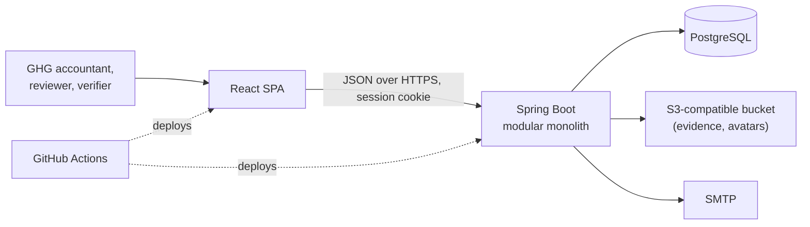
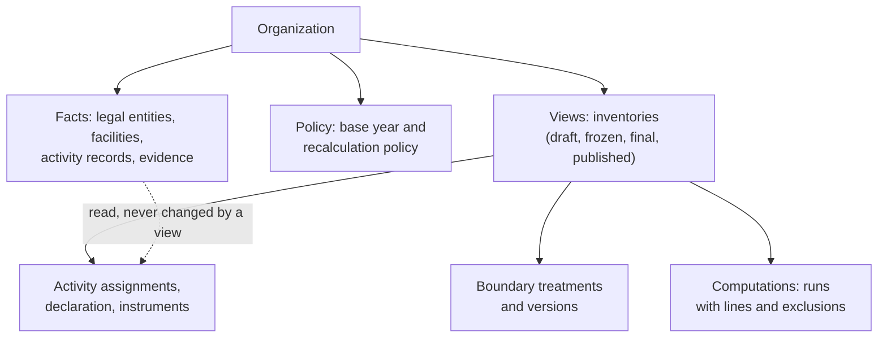
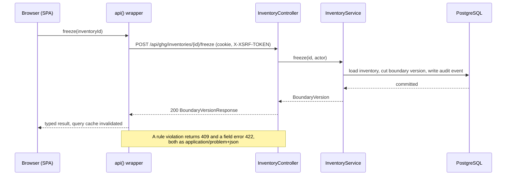

# Architecture

CarbonOS is a modular monolith: one Spring Boot process with strict
internal boundaries, one React single-page application in front of it, one
PostgreSQL database behind it, and an S3-compatible bucket for files. This
page explains why it is shaped that way and how a request moves through it.

## System context

## Why one process with hard walls

A greenhouse gas inventory is one consistent ledger: an emission figure is
only defensible when the record, the factor, the boundary share, and the
run that combined them can be shown together. Splitting that across
services would trade a transaction for a saga and make every verifier
question harder to answer. So the backend is one deployable and one
database.

The walls come from Spring Modulith. Each business capability is a
top-level package; its public API is the root package and everything
under `internal/` is private. `ModularityTests` fails the build when a
module imports another's internals, and modules talk through application
events where they can. The result is a codebase that can be split later
if it ever needs to be, without paying for the split now. See
[Backend modules](../reference/backend-modules.md) for the modules and
their events.

## Facts, views, computations

The domain model separates three kinds of thing, and most of the product's
rules follow from keeping them apart.

- **Facts** are what happened: a legal entity with its ownership, a
  facility, ten thousand litres of diesel in June with an invoice attached.
  Facts belong to the organization, not to any inventory. Correcting a fact
  needs a reason and keeps the history; removing one leaves a tombstone.
- **Views** are accounting decisions over the facts for one reporting
  period under one consolidation approach: which entities are in the
  boundary and at what share, how each record is classified, which
  instruments apply. Two inventories can view the same facts differently,
  which is how an equity-share view and an operational-control view coexist.
- **Computations** are runs. A run reads a frozen view, applies the factors
  and shares, and writes its lines as a snapshot that never changes. A
  later fact correction produces a new run, not a changed one; a published
  report is stored as it was read.

This is why an inventory must be frozen before it can run, why runs are
numbered and never reused, and why a correction after publication is a new
inventory that supersedes the old one. The
[inventory lifecycle](inventory-lifecycle.md) walks through those states.

## A request, end to end

Three things in that path are deliberate. The browser never builds a
request itself; `api()` in `src/lib/api.ts` adds credentials and the
CSRF token and turns a problem detail into a typed error that forms can
print inline. The controller speaks records, never entities, so the wire
format cannot drift with the schema by accident. And the service is the
only place a rule lives: the controller does not know that a frozen
inventory refuses writes, and neither does the SPA; it learns from the 409.

## What is deliberately not here

No message broker, no cache, no second database, no microservices, no
server-side rendering. Each would solve a problem the product does not
have yet. The decision records under `docs/adr/` are where such a change
would be argued.
