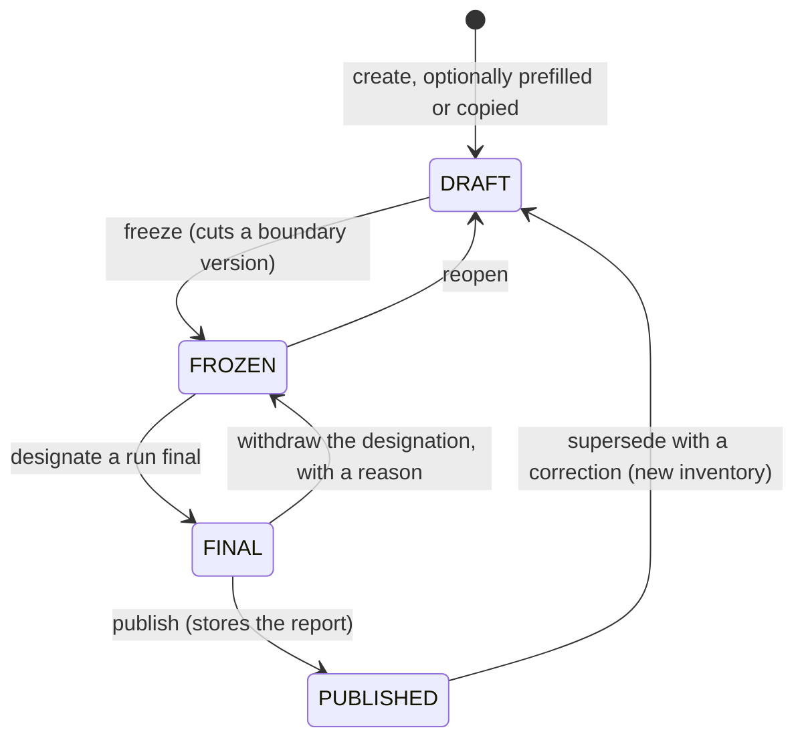

# The inventory lifecycle

An inventory moves through four states, and each transition exists to
protect a figure that someone signs. This page explains what each
state permits and why the rules are as strict as they are. The specs that
define them are [05.1](../specs/05.1-inventory-lifecycle-and-run-snapshots.md),
[05.2](../specs/05.2-run-numbering-and-voiding.md) and
[05.3](../specs/05.3-inheritance-and-the-published-record.md).

## What each state permits

| State | You can | You cannot |
| --- | --- | --- |
| `DRAFT` | Edit the boundary, the operational boundary declaration, market instruments, and every classification and exclusion. | Launch a run. The pre-flight gates report on a draft, but the launch waits for a freeze. |
| `FROZEN` | Launch runs, void a run with a reason, read everything. | Change anything the run reads. Every such write returns 409 until the inventory is reopened. |
| `FINAL` | Publish. Withdraw the designation with a reason and go back to `FROZEN`. | Reopen. The final run's numbers are what the reviewer approved; changing the boundary under them would make the designation meaningless. |
| `PUBLISHED` | Read the report exactly as it was published, see what came after it in a separate block, and create a correction. | Change anything. Facts corrected at organization level after publication show as "changed since publication" on the published view and do not alter it. |

## Why freezing cuts a version

A run needs a boundary that does not move under it. Freezing writes a
boundary version: every entity and facility in the boundary with its
share under the inventory's consolidation approach, its membership window,
and the exclusions with their reasons. Runs record which version they
used, so two runs of the same inventory can be compared and a reviewer can
see exactly what changed between them. Reopening does not delete the
version; the next freeze writes a new one, and the base year's structural
change detection compares the two.

## Why runs are immutable and numbered

A run is a snapshot: every line carries the converted quantity, the factor
and its version, the share, and the result, so the report can be re-added
by hand. Nothing updates a run. A wrong run is voided with a reason and
stays listed under its number, because a report that referenced "run 003"
must keep meaning the same thing. Numbers are never reused.

## Why a correction is a new inventory

Once a report is published, the verifier's opinion attaches to that
document. A correction therefore starts as a new draft that inherits the
published inventory's boundary, instruments, declaration, and every
classification and exclusion, each marked as inherited, and it records the
reason it exists. The published inventory points at its correction and the
correction's report says what changed against the published run: lines
added, removed and changed, and the difference in tonnes. Nothing about
the original moves.

## Where the pre-flight fits

Between `DRAFT` and a run sit the validation gates: reporting boundary,
activity data completeness, classification, emission factors, and base
year. They run on every state and report errors and warnings, but only a
frozen inventory can launch. The gates are how the product refuses to
compute a figure it could not defend; the states are how it refuses to
change one it already has.
