# The inventory lifecycle

An inventory moves through four states, and each transition exists to
protect a figure that someone signs. This page explains what each
state permits and why the rules are as strict as they are. The specs that
define them are [05.1](../specs/05.1-inventory-lifecycle-and-run-snapshots.md),
[05.2](../specs/05.2-run-numbering-and-voiding.md),
[05.3](../specs/05.3-inheritance-and-the-published-record.md) and
[05.5](../specs/05.5-review-at-scale-and-deliberate-lifecycle-acts.md).

```mermaid
stateDiagram-v2
    accTitle: The four inventory states and their transitions
    accDescr: A draft is frozen once its classification is clean, which cuts a boundary version and allows runs. A frozen inventory can be reopened with a reason, or a run can be designated final with a review note. A final designation can be withdrawn with a reason, or the inventory published. A published inventory is superseded by a correction that starts as a new draft.
    [*] --> DRAFT: create, optionally prefilled or copied
    DRAFT --> FROZEN: freeze (classification clean; cuts a boundary version)
    FROZEN --> DRAFT: reopen, with a reason
    FROZEN --> FINAL: designate a run final, with a review note
    FINAL --> FROZEN: withdraw the designation, with a reason
    FINAL --> PUBLISHED: publish (stores the report)
    PUBLISHED --> DRAFT: supersede with a correction (new inventory)
```

## What each state permits

| State | You can | You cannot |
| --- | --- | --- |
| `DRAFT` | Edit the boundary, the operational boundary declaration, market instruments, upstream rules, and every classification and exclusion. | Launch a run. The pre-flight gates report on a draft, but the launch waits for a freeze. Freeze while an included record is unclassified, departs from its default scope without a justification, disagrees with Appendix F, or is a draft at a facility in the boundary: the freeze is refused (409) and names the records. |
| `FROZEN` | Launch runs, void a run with a reason, read everything, reopen with a reason of at least 10 characters. | Change anything the run reads. Every such write returns 409 until the inventory is reopened. |
| `FINAL` | Publish. Withdraw the designation with a reason and go back to `FROZEN`. | Reopen. The final run's numbers are what the reviewer approved; changing the boundary under them would make the designation meaningless. |
| `PUBLISHED` | Read the report exactly as it was published, see what came after it in a separate block, and create a correction. | Change anything. Facts corrected at organization level after publication show as "changed since publication" on the published view and do not alter it. |

## Why freezing cuts a version

A run needs a boundary that does not move under it. Freezing writes a
boundary version: every entity and facility in the boundary with its
share under the inventory's consolidation approach, its membership window,
and the exclusions with their reasons. Runs record which version they
used, so two runs of the same inventory can be compared and a reviewer can
see exactly what changed between them. Reopening does not delete the
version; the next freeze writes a new one, and the base year's structural
change detection compares the two.

## Why a freeze waits and a reopen needs a reason

Freezing used to go through with unclassified records, so the only way to
finish the classification was a reopen that cut a new boundary version for
no boundary change. Since spec 05.5 the freeze waits for a clean
classification: the two halves of the view are frozen together, so both
must be ready. A boundary omission (a facility neither in nor excluded)
still allows the freeze, because the boundary and its exclusions can be
reasoned about in either order and the run gate catches the omission.

Reopening cuts nothing, but it is the act that makes the next freeze cut a
new version, so it carries a reason, and the version it supersedes records
who reopened it, when and why. Designating a final run is confirmed with
the run and its total, and takes an optional review note that the report
header prints with who designated it and when. Chapter 7 asks for a review
and approval step with records of who decided what; these are those
records.

## Two numberings

A **boundary version** counts freezes of one inventory. A **report
version** counts the inventories of one period: 1 for the first, one more
per correction (spec 07.4). The product never prints a bare "version":
the header row reads "Report version 2, supersedes 2025 Operational" and
section 1 reads "Boundary version 3 of 3", on the page and in the PDF.

## Why runs are immutable and numbered

A run is a snapshot: every line carries the converted quantity, the factor
and its version, the share, and the result, so the report can be re-added
by hand. Nothing updates a run. A wrong run is voided with a reason and
stays listed under its number, because a report that referenced "run 003"
must keep meaning the same thing. Numbers are never reused.

## Why a correction is a new inventory

Once a report is published, the verifier's opinion attaches to that
document. A correction therefore starts as a new draft that inherits the
published inventory's boundary, instruments, declaration, upstream rules, and
every classification and exclusion, each marked as inherited, and it records the
reason it exists. The published inventory points at its correction and the
correction's report says what changed against the published run: lines
added, removed and changed, and the difference in tonnes. Nothing about
the original moves.

## Where the pre-flight fits

Between `DRAFT` and a run sit the validation gates: reporting boundary,
activity data completeness, classification, emission factors, and base
year. They run on every state and report errors and warnings, but only a
frozen inventory can launch. The gates are how the product refuses to
compute a figure it could not defend; the states are how it refuses to
change one it already has.
