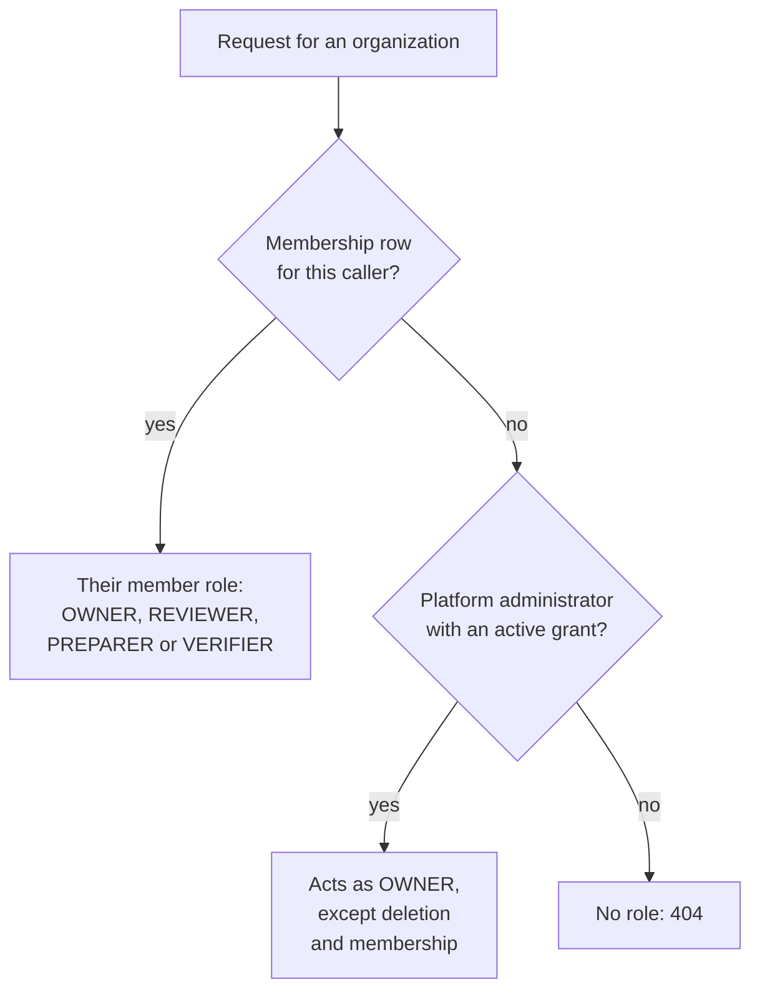

# Roles and access

CarbonOS has two separate role systems: one for the platform, one for each
client organization. They govern different things and almost never meet.
This page explains what each one decides, why an organization is invisible
to everyone outside it, and the single bridge between the two. The specs
that define the behavior are
[01.2](../specs/01.2-organization-membership-and-roles.md),
[01.3](../specs/01.3-organization-confidentiality-and-deletion-safeguards.md)
and [01.4](../specs/01.4-role-aware-ui-and-visible-refusals.md).

## The two ladders

| | Platform role | Organization role |
| --- | --- | --- |
| Stored in | `users.role` | `ghg_organization_members.role` |
| Values | `ADMIN`, `MEMBER` | `OWNER`, `REVIEWER`, `PREPARER`, `VERIFIER` |
| Who holds it | Whoever runs CarbonOS | The client's own team |
| Governs | `/api/admin/**` only | Everything under `/api/ghg/**` |
| Grants | Creating logins, approving access requests, setting platform roles | Recording facts, classifying, running, publishing, managing members |

The role a client would call their administrator is `OWNER`. No
organization role is named admin.

A platform administrator is not automatically anything inside an
organization. Conversely, an owner cannot create a login or change anyone's
platform role. The two ladders answer different questions: the platform
role asks "may you use CarbonOS at all", the organization role asks "what
may you do to this client's inventory".

## Membership decides visibility

One method decides every read and write under `/api/ghg`: `roleIn` in
`GhgAccess`. It looks for a membership row for this caller and this
organization. If there is none, the caller has no role, and the request
returns 404 for the organization and for everything nested under it:
entities, facilities, activity records, inventories, runs, and reports.

The status is 404 rather than 403 on purpose. A stranger is not told that
an organization with that id exists.

Two consequences follow, and both are deliberate:

- **A platform administrator who is not a member sees an empty GHG home.**
  Opening an organization's URL directly returns 404. Administering the
  platform is not the same as being invited into a client's inventory.
- **An owner of one organization is an outsider to every other
  organization.** Being an owner of A grants nothing in B. There is no
  cross-organization branch in the decision at all.

## Support access, the one bridge

Support staff sometimes have to look inside a client's organization to work
a case. Rather than let the platform role reach in silently, CarbonOS makes
it an explicit, visible, expiring act.

A platform administrator finds the organization in an administrator-only
list, then assumes access with a reason of at least ten characters. The
grant lasts 24 hours from the moment it is taken, or until the
administrator ends it.

While it is active, the administrator has an owner's rights, with two
exceptions that never transfer: **deleting the organization** and
**changing its membership**. Both are reserved to an owner by membership.
An administrator who tries either gets 403.

The organization's own people can see all of it. Assuming, ending and
expiring are recorded in the organization's history as
`ADMIN_ACCESS_ASSUMED` with the reason, `ADMIN_ACCESS_ENDED` and
`ADMIN_ACCESS_EXPIRED`, and they appear on the overview under **Support
access**. Acts performed under a grant are attributed to the
administrator's own account.

Without a grant, an administrator can still see one thing: the
administrator-only organization list, which carries each organization's
name, owner emails, and member count. It carries no inventory data, no
facility counts and no totals. That list is how support staff find the
organization they need to help.

## Who can add a user, and where

"Adding a user" means two different acts, at two different levels.

**Creating a login** is the platform administrator's act, either directly
under **Manage users** or by approving an access request. An approved
request always creates a `MEMBER`, never an administrator.

**Adding someone to an organization** is the owner's act, and it adds an
account that already exists. An owner cannot invite a stranger. If the
email has no account, the form says:

> No account with that email. Add the user under Manage users first.

For an administrator, "Manage users" is a link. For an owner who is not an
administrator, the message continues "Ask a platform administrator to add
them." There is no invitation flow; the account comes first, then the
membership.

## One word, three meanings

Be careful with the word admin when reading the code or the API. It means
three different things:

1. `ADMIN` on `users.role` is the platform role.
2. The organization role a client calls their admin is `OWNER`.
3. `myRole` on an organization reports the string `ADMIN` when the caller
   is a platform administrator holding active support access.

The third is a display value only. It tells the screen to show the
**Support access** badge and to enable an owner's controls while keeping
deletion and membership closed. It grants nothing by itself, and it never
appears in the database, where the only member roles are the four real
ones.

The collision is known and was left alone deliberately. Renaming the value
would churn working, tested code for no change in behavior, and the word
never reaches a user: the badge on screen reads "Support access".
