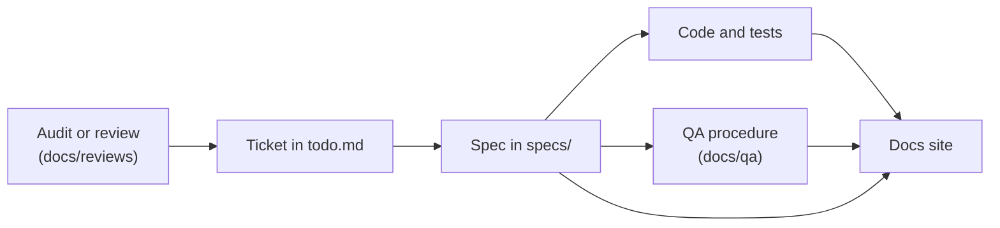

# The spec workflow

Every non-trivial change to CarbonOS starts as a document in `specs/`,
and that document stays the reference for what the product must do after
the code ships. This page explains why the project works that way and how
the pieces around a spec fit together.

## Why spec first

The product implements a standard. The GHG Protocol Corporate Standard,
its Scope 2 Guidance and the Scope 3 Standard say what a defensible
inventory contains, and a verifier tests the product against those
words, not against the code. Writing the spec first forces the question
"which requirement does this satisfy, and how does a verifier check it?"
before the first line of code, and it gives the reviewer something to
approve that is smaller than a pull request.

A spec is also where the domain vocabulary is settled. The glossary in
[spec 00](../specs/00-principles-and-domain-model.md) maps each Protocol
term to the CarbonOS term, and every later spec uses those words.

## The lifecycle

```mermaid
stateDiagram-v2
    accTitle: The lifecycle of a spec
    accDescr: A spec is drafted, approved by the owner, implemented in the same pull request as the code, and kept in step afterwards; a later spec can supersede part of it.
    [*] --> Draft: copy TEMPLATE.md, add to the index
    Draft --> Approved: owner review
    Draft --> Draft: open questions answered in the spec
    Approved --> Implemented: code, tests and spec merge together
    Implemented --> Implemented: kept in step with every change
    Implemented --> Draft: a new spec supersedes a section
```

| Status | Means | Who moves it |
| --- | --- | --- |
| `Draft` | Being written or discussed. Nothing is built from it. | The author |
| `Approved` | The owner agrees with the behavior. Implementation can start. | The owner |
| `Implemented` | The code matches the spec and the tests named in **Verification** exist. | The pull request that merges the code |

When reality diverges from an implemented spec, the spec changes in the
same pull request as the code. A spec that no longer matches the product
is worse than none, because a verifier reads it.

## What surrounds a spec

- **Audits and reviews** under `docs/reviews/` are where findings come
  from: an external GHG officer walked the product and wrote down 51 of
  them.
- **Tickets** in `todo.md` turn findings into work with a priority, the
  Standard's requirement, and a "done when" written the way the officer
  would retest it. A ticket names its spec once one exists.
- **Specs** describe the behavior. One spec often closes several tickets,
  and a chapter's sub-specs (05.1, 05.2, 05.3) refine its parent as the
  product grows.
- **Tests** named in the spec's **Verification** section prove it in CI.
- **QA procedures** under `docs/qa/` are what a human runs on staging.
  Each procedure names the specs it covers, and the wording of every
  label and message it quotes is checked against the source.

## What does not need a spec

A typo, a dependency bump, a refactor that changes no behavior, a docs
page. The test is whether a verifier or a reviewer could disagree about
what the product should do; when they could, write the spec.
