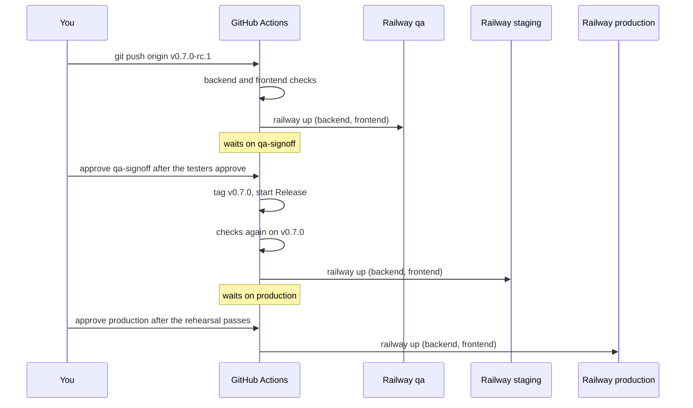

# Deploy and release

A release is one commit promoted through three environments by two
approvals. A release candidate tag deploys qa for the testers; their
sign-off tags the version, which deploys staging as a rehearsal; approving
the production job deploys production. Merging to `main` deploys nothing.
This guide covers the promotion, the one-time Railway setup behind it, and
how to wipe or copy an environment's database.



## Cut a release candidate

1. Choose the next version. Versions follow `vMAJOR.MINOR.PATCH`; a
   release that changes what users can do bumps `MINOR`. The candidate is
   the version with an `-rc.N` suffix, starting at `rc.1`.
2. Tag `main` and push the tag:

    ```bash
    git switch main && git pull --ff-only
    git tag v0.7.0-rc.1 && git push origin v0.7.0-rc.1
    ```

    The `QA` workflow runs the backend and frontend checks on the tagged
    commit, then runs `railway up` for the backend and the frontend in the
    qa environment. The backend starts, Flyway applies any new migration,
    and Railway waits for `/actuator/health` before it switches traffic.

3. Tell the testers the candidate is on qa. They quote it in QA failure
   issues as `v0.7.0-rc.1 (sha)`.

If QA finds a problem, fix it on `main` and tag `v0.7.0-rc.2`. The
earlier run stays waiting for a sign-off it never gets; cancel it from the
Actions page.

## Sign off the candidate

1. Open the `QA` run for the candidate in GitHub Actions. Its last job,
   `QA sign-off (tags the release)`, is waiting for a review.
2. Approve it once the testers have signed off.

    The job tags the same commit `v0.7.0`, pushes the tag, and starts the
    `Release` workflow. It refuses if `v0.7.0` already exists: a version is
    released once.

## Rehearse on staging and release to production

1. The `Release` run repeats the checks on `v0.7.0` and deploys staging.
   Open the staging frontend listed in
   [Environments](../reference/environments.md), confirm the backend's
   deployment log says `Successfully applied N migrations`, and spot-check
   the change.
2. Back in the run, approve `Deploy to Railway (production)`.

    The deploy job is bound to the GitHub `production` environment, whose
    required reviewer gates it. The job then runs `railway up` against the
    production environment.

3. Confirm the production health endpoint reports `UP` and spot-check
   the frontend.

A version tag pushed by hand also starts `Release`; the sign-off path is
the normal one.

## Wipe an environment's database

The Railway Postgres services have no public proxy, so the wipe runs
`psql` inside the Postgres container over `railway ssh`.

1. One time only: sign in with `railway login` and register a key with
   `railway ssh keys add -k ~/.ssh/id_ed25519.pub`.
2. Run the wipe:

    ```bash
    make db-wipe ENV=qa            # prompts you to type "qa"
    make db-wipe ENV=qa ARGS=--yes # no prompt
    ```

    The script checks that the container belongs to the environment you
    named, prints what the database holds, drops and recreates the
    `public` schema, redeploys the backend so Flyway migrates from V1 and
    the startup seeder recreates the administrator, and waits until the
    health endpoint reports `UP`. Every account, organization, and run is
    gone; the seeded administrator is the only user left.

Production requires `ARGS=--yes-production` and typing `production` at
the prompt, which cannot be skipped.

## Copy one environment into another

`make env-copy FROM=staging TO=qa` copies staging's database and bucket
into qa, so testers continue with their accounts and data. Both Postgres
services need a TCP proxy for the copy (service > Settings > Networking in
the Railway dashboard), which sets `DATABASE_PUBLIC_URL`; remove the
proxies afterwards. The script drops the target's schema first, dumps and
restores with a `postgres:17` container, then copies the bucket through
the AWS CLI container. Run it before the target's first deploy, or after
`make db-wipe` on the target, so the schema versions match. Production is
never a target.

## One-time Railway setup

These steps were done once for this project. They are here so the next
environment, or a rebuild, follows the same shape.

1. Create a Railway project with three environments: `qa`, `staging` and
   `production`. A new environment can be duplicated from an existing one
   with `railway environment new qa --duplicate staging`, which copies the
   services and their variables, not their data.
2. In each environment, create three services: `backend` with root
   directory `/backend`, `frontend` with root directory `/frontend`, and a
   PostgreSQL service.

    The root directory matters: `railway up` uploads the repository root
    and each service picks out its own directory from that upload.

3. On the `backend` service, set the variables in
   [Environments](../reference/environments.md) using Railway references to
   the Postgres service, give the environment its own bucket in
   `carbonos.storage.*`, and set the health check path to
   `/actuator/health`.
4. On the `frontend` service, set `VITE_API_URL` to the backend's public
   URL, and on the backend set `APP_BASE_URL` to the frontend's.
5. Create a project token for each environment under **Project Settings
   > Tokens** and add them as secrets on the matching GitHub environments:
   `RAILWAY_QA_TOKEN` on `qa`, `RAILWAY_STAGING_TOKEN` on `staging`,
   `RAILWAY_PRODUCTION_TOKEN` on `production`.
6. Under **Settings > Environments** in GitHub, add a required reviewer to
   `qa-signoff` and to `production`; `qa` and `staging` have none.
7. Turn off Railway's own GitHub auto-deploy for these services. GitHub
   Actions owns deployment, so leaving it on double-deploys every tag.

Two gotchas worth knowing: a Spring Boot health contributor that reports
`DOWN` fails the whole deploy, because Railway retries the health check
for five minutes and then gives up (the mail health indicator is disabled
for that reason), and the Railway CLI's project tokens must be created in
the dashboard, not through the API.
