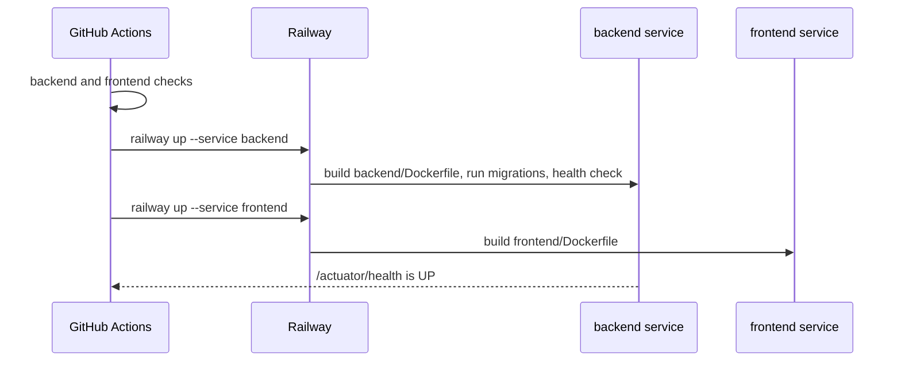

# Deploy and release

Merging to `main` deploys to staging without anyone lifting a finger.
Releasing to production is a tag. This guide covers both, the one-time
Railway setup behind them, and how to wipe an environment's database.



## Deploy to staging

- Merge a pull request into `main`.

    The `Staging` workflow runs the backend and frontend checks again on
    the merge commit, then runs `railway up` for the backend and the
    frontend. The backend starts, Flyway applies any new migration, and
    Railway waits for `/actuator/health` before it switches traffic.

To confirm, open the staging frontend listed in
[Environments](../reference/environments.md) and check the backend's
deployment log for `Successfully applied N migrations`.

## Release to production

1. Confirm staging is healthy with the commit you want to release.
2. Choose the next version. Versions follow `vMAJOR.MINOR.PATCH`; a
   release that changes what users can do bumps `MINOR`.
3. Tag `main` and push the tag:

    ```bash
    git switch main && git pull --ff-only
    git tag v0.6.0 && git push origin v0.6.0
    ```

4. Open the `Production` workflow run in GitHub Actions and approve the
   deployment when it asks.

    The deploy job is bound to the GitHub `production` environment, whose
    required reviewer gates it. The job then runs `railway up` against the
    production environment.

5. Confirm the production health endpoint reports `UP` and spot-check
   the frontend.

## Wipe an environment's database

The Railway Postgres services have no public proxy, so the wipe runs
`psql` inside the Postgres container over `railway ssh`.

1. One time only: sign in with `railway login` and register a key with
   `railway ssh keys add -k ~/.ssh/id_ed25519.pub`.
2. Run the wipe:

    ```bash
    make db-wipe ENV=staging            # prompts you to type "staging"
    make db-wipe ENV=staging ARGS=--yes # no prompt
    ```

    The script checks that the container belongs to the environment you
    named, prints what the database holds, drops and recreates the
    `public` schema, redeploys the backend so Flyway migrates from V1 and
    the startup seeder recreates the administrator, and waits until the
    health endpoint reports `UP`. Every account, organization, and run is
    gone; the seeded administrator is the only user left.

Production requires `ARGS=--yes-production` and typing `production` at
the prompt, which cannot be skipped.

## One-time Railway setup

These steps were done once for this project. They are here so the next
environment, or a rebuild, follows the same shape.

1. Create a Railway project with two environments: `staging` and
   `production`.
2. In each environment, create three services: `backend` with root
   directory `/backend`, `frontend` with root directory `/frontend`, and a
   PostgreSQL service.

    The root directory matters: `railway up` uploads the repository root
    and each service picks out its own directory from that upload.

3. On the `backend` service, set the variables in
   [Environments](../reference/environments.md) using Railway references to
   the Postgres service, and set the health check path to
   `/actuator/health`.
4. On the `frontend` service, set `VITE_API_URL` to the backend's public
   URL.
5. Create a project token for each environment under **Project Settings
   > Tokens** and add them as the GitHub repository secrets
   `RAILWAY_STAGING_TOKEN` and `RAILWAY_PRODUCTION_TOKEN`.
6. Under **Settings > Environments > production** in GitHub, add a required
   reviewer so production deploys need approval.
7. Turn off Railway's own GitHub auto-deploy for these services. GitHub
   Actions owns deployment, so leaving it on double-deploys every merge.

Two gotchas worth knowing: a Spring Boot health contributor that reports
`DOWN` fails the whole deploy, because Railway retries the health check
for five minutes and then gives up (the mail health indicator is disabled
for that reason), and the Railway CLI's project tokens must be created in
the dashboard, not through the API.
