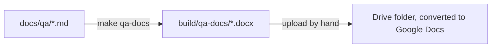

# Publish the QA procedures

The QA team works in Google Workspace and types the verdicts of a procedure
into its own copy of a Google Doc. `make qa-docs` produces the documents from
`docs/qa`: pandoc converts the README and each procedure to DOCX with the
title, the version, working links and landscape pages, and you upload the
files to the shared Drive folder, where Drive turns them into Google Docs. There is no
workflow for this on purpose: a round of testing happens far less often than
a push, so the export is run by hand before a round.



## What the documents carry

- The H1 becomes the document title; the sections become Heading 1 and the
  cases Heading 2, so the Google Docs outline works.
- The subtitle reads `Version <ref> (<short sha>), built <date>`. Testers copy
  it into "Procedure and version tested" in the sign-off table. Export from
  a checked-out release tag so the subtitle names it (`git switch --detach
  v0.6.0`).
- Links to specs and to other procedures point at GitHub
  (`https://github.com/miketak/carbonos/blob/<ref>/...`) at the ref you
  exported from, so a procedure links to that version's spec wording.
  `scripts/qa-docs/github-links.lua` does the rewriting.
- The pages are A4 landscape with 2 cm margins (`set_page_layout` in
  `scripts/publish_qa_docs.py`; pandoc 3.1 ignores the page setup of a
  reference document, so the script writes it after the conversion). Each
  case is a table with the columns Step, Action, Expected result, Pass/Fail
  and Notes; `scripts/qa-docs/step-tables.lua` recognises that header and
  fixes the column widths (4, 26, 30, 8 and 32 percent), so the action and
  the expected result get the room and the Notes column is wide enough to
  write in. Change `PAGE_MARGIN` or the `WIDTHS` table to adjust them.
- Every table gets a 1 pt grid after pandoc runs (`add_table_borders` in
  `scripts/publish_qa_docs.py`), because pandoc's default table style rules
  only the top and bottom edges and Google Docs would import the sign-off
  table without an outline. Change `TABLE_BORDER_EIGHTHS` (eighths of a
  point) to adjust it.
- The files are named after their sources (`001-access-and-roles.docx`); the
  build output lists the document title each one carries.

## Export and upload

1. Install pandoc once: `sudo apt-get install pandoc` or `brew install pandoc`.
2. Check out the version the team will test, usually the release tag:

    ```bash
    git fetch --tags && git switch --detach v0.6.0
    make qa-docs
    ```

    The ten files land in `build/qa-docs/`, which git ignores.

3. In Google Drive, open the **CarbonOS QA** folder, create a subfolder named
   after the version (`v0.6.0`), and upload the ten files into it. Drive
   converts DOCX to Google Docs on upload when **Convert uploads to Google
   Docs editor format** is on in Drive's settings; otherwise right-click a
   file and choose **Open with > Google Docs**, which saves a converted copy.
4. Share the folder with the testers as viewers and send them the link. The
   README's "Where to fill in your verdicts" section tells them to make a
   copy and how to report failures.

Do not edit the uploaded documents: the Markdown is the source, and the next
export replaces them.

## Troubleshooting

| Symptom | Cause and fix |
| --- | --- |
| `pandoc is not installed` | Install pandoc; the script needs it on the `PATH`. |
| The subtitle names a branch, not a version | You exported from a branch. Check out the tag and export again. |
| Tables have no outline, or the pages are portrait, in Google Docs | The file was not produced by `make qa-docs` (the borders and the page setup are added after pandoc). Export again. |
| A step table's columns are all the same width | The header row differs from `Step \| Action \| Expected result \| Pass/Fail \| Notes`, so the width filter skipped it. Fix the header in the Markdown. |
| A spec link opens a 404 | The link points at the exported ref; a spec renamed after that release is expected to 404 in an old snapshot. |
