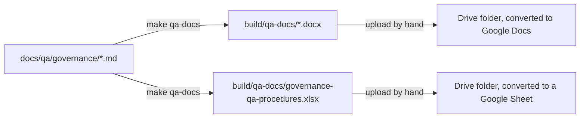

# Publish the QA procedures

The QA team works in Google Workspace. `make qa-docs` produces two things
from `docs/qa/<persona>` (governance by default): pandoc converts the
persona's README and each procedure to DOCX with the title, the version,
working links and landscape pages, and `scripts/qa_sheets.py` builds the
verdict workbook, one sheet per procedure with one row per step. You upload
the files to the shared Drive folder, where Drive turns the documents into
Google Docs and the workbook into a Google Sheet. Testers read the document
and record their verdicts in the sheet. There is no workflow for this on
purpose: a round of testing happens far less often than a push, so the
export is run by hand before a round.


```mermaid
flowchart LR
    accTitle: How a QA procedure becomes a Google Doc
    accDescr: make qa-docs converts one persona under docs/qa with pandoc, rewriting spec links to GitHub, setting landscape pages and outlining the tables, into DOCX files under build/qa-docs, and builds the verdict workbook from the same Markdown; the maintainer uploads both to the shared Drive folder, which converts the documents to Google Docs and the workbook to a Google Sheet.
    md[docs/qa/governance/*.md] -->|make qa-docs| docx[build/qa-docs/*.docx]
    md -->|make qa-docs| xlsx[build/qa-docs/governance-qa-procedures.xlsx]
    docx -->|upload by hand| drive[Drive folder, converted to Google Docs]
    xlsx -->|upload by hand| sheet[Drive folder, converted to a Google Sheet]
```

## What the documents carry

- The H1 becomes the document title; the sections become Heading 1 and the
  cases Heading 2, so the Google Docs outline works.
- The subtitle reads `Version <ref> (<short sha>), built <date>`. Testers copy
  it into "Procedure and version tested" in the sign-off table. Export from
  a checked-out release tag so the subtitle names it (`git switch --detach
  v0.6.0`).
- Links to specs and to other procedures point at GitHub
  (`https://github.com/miketak/carbonos/blob/<ref>/...`) at the ref you
  exported from, so a procedure links to that version's spec wording.
  `scripts/qa-docs/github-links.lua` does the rewriting.
- The pages are A4 landscape with 2 cm margins (`set_page_layout` in
  `scripts/publish_qa_docs.py`; pandoc 3.1 ignores the page setup of a
  reference document, so the script writes it after the conversion). Each
  case is a table with the columns Step, Action, Expected result, Pass/Fail
  and Notes; `scripts/qa-docs/step-tables.lua` recognises that header and
  fixes the column widths (4, 26, 30, 8 and 32 percent), so the action and
  the expected result get the room and the Notes column is wide enough to
  write in. Change `PAGE_MARGIN` or the `WIDTHS` table to adjust them.
- Every table gets a 1 pt grid after pandoc runs (`add_table_borders` in
  `scripts/publish_qa_docs.py`), because pandoc's default table style rules
  only the top and bottom edges and Google Docs would import the sign-off
  table without an outline. Change `TABLE_BORDER_EIGHTHS` (eighths of a
  point) to adjust it.
- The files are named after their sources (`001-access-and-roles.docx`); the
  build output lists the document title each one carries.

## The verdict workbook

`build/qa-docs/<persona>-qa-procedures.xlsx` is built from the same Markdown
by `scripts/qa_sheets.py`, which parses each procedure's heading block, its
sections and cases and the step tables, and refuses a file whose shape it
does not recognise (a step table with other columns, a case with no steps, a
case id used twice). It carries:

- **Read me**, the build version and how to fill the workbook in.
- **Summary**, a sign-off block per procedure (the version string prefilled,
  Tester, Date and Issues filed to type) and one row per case that counts the
  PASS, FAIL and N/A verdicts on the procedure's sheet by `COUNTIF`, with the
  blanks left and a Result that reads FAIL when any step failed, PASS when
  every verdict step passed, and nothing while a verdict is missing.
- **One sheet per procedure**, named `NN Title`: the objective, what it
  covers, the time, the prerequisites, then the columns Section, Case, Step,
  Step id, Action, Expected result, Pass/Fail and Notes, one row per step.
  Each section and case opens with a title row; a case's rationale follows
  in italics. The Pass/Fail cell offers PASS, FAIL and N/A from a list and
  colours itself. A setup step (no expected result) is greyed and takes no
  verdict. The header row is frozen and filterable, so a tester can filter
  the sheet to the FAIL rows before filing issues. Known non-goals and the
  change notes close the sheet.

The step id (`3.A1.2`: procedure, case, step) is the one the drivers' run
records use, so a human verdict and a driver's result on the same step can be
compared.

`make qa-sheets-check` parses the governance procedures, builds the workbook
in memory and reads it back, writing nothing; `make docs-check` and the docs
CI job run it, so a procedure that stops fitting the parser fails the build
that changed it. Only the governance persona is built and checked for now:
`make qa-docs PERSONA=mining XLSX=0` exports the mining documents alone.

## Export and upload

1. Install pandoc once: `sudo apt-get install pandoc` or `brew install pandoc`.
2. Check out the version the team will test, usually the release tag:

    ```bash
    git fetch --tags && git switch --detach v0.6.0
    make qa-docs
    ```

    The documents and the workbook land in `build/qa-docs/`, which git
    ignores. A persona with a `fixtures/` folder (governance has one) gets a
    copy of it in `build/qa-docs/fixtures/`; the procedures name those files
    and assume the tester has them.

3. In Google Drive, open the **CarbonOS QA** folder, create a subfolder named
   after the version (`v0.6.0`), and upload the documents and the workbook
   into it, plus the `fixtures` folder when the export made one. Drive
   converts DOCX to Google Docs and XLSX to Google Sheets on upload when
   **Convert uploads to Google Docs editor format** is on in Drive's
   settings; otherwise right-click a file and choose **Open with > Google
   Docs** (or **Google Sheets**), which saves a converted copy.
4. Share the folder with the testers as editors and send them the link.
   They read the documents and record the verdicts and notes in the sheet,
   one row per step; the Summary tab tallies the cases and carries the
   sign-off.

The Markdown stays the source: a correction goes into `docs/qa` and the next
export, never only into a Drive document. Each round gets its own version
folder, so a new export does not overwrite a filled-in one.

## Troubleshooting

| Symptom | Cause and fix |
| --- | --- |
| `pandoc is not installed` | Install pandoc; the script needs it on the `PATH`. |
| The subtitle names a branch, not a version | You exported from a branch. Check out the tag and export again. |
| Tables have no outline, or the pages are portrait, in Google Docs | The file was not produced by `make qa-docs` (the borders and the page setup are added after pandoc). Export again. |
| A step table's columns are all the same width | The header row differs from `Step \| Action \| Expected result \| Pass/Fail \| Notes`, so the width filter skipped it. Fix the header in the Markdown. |
| A spec link opens a 404 | The link points at the exported ref; a spec renamed after that release is expected to 404 in an old snapshot. |
| `uv run --locked` reports that the lockfile needs updating | `pyproject.toml` changed without `uv lock`. Run `uv lock` and commit `uv.lock`. |
| `qa_sheets.py` refuses a procedure (`step table header is ...`, `case X appears twice`) | The Markdown no longer has the shape the parser reads. For a generated procedure, fix the YAML and re-export; the message names the file and line. |
| The Summary shows 0 everywhere in Google Sheets | The verdicts were typed on a copy of the procedure sheet, or the sheet was renamed; the `COUNTIF` formulas name the sheets as exported. |
