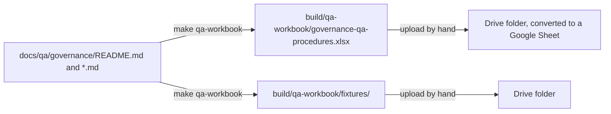

# Publish the QA workbook

The QA team works in Google Workspace and records verdicts in a sheet.
`make qa-workbook` builds the verdict workbook from `docs/qa/<persona>`
(governance by default): one sheet per procedure with one row per step, an
Accounts sheet that carries everything the README says a tester needs, and a
Summary that tallies the verdicts. You upload the workbook and the fixture
files to the shared Drive folder, where Drive turns the workbook into a
Google Sheet. The workbook is the only export (ADR 0010): there are no
documents to read beside it, and the Markdown stays the source. There is no
workflow for this on purpose: a round of testing happens far less often than
a push, so the export is run by hand before a round.


```mermaid
flowchart LR
    accTitle: How the QA procedures become a Google Sheet
    accDescr: make qa-workbook parses one persona's README and procedures under docs/qa into build/qa-workbook: the verdict workbook and a copy of the fixture files; the maintainer uploads both to the shared Drive folder, which converts the workbook to a Google Sheet the testers fill in.
    md[docs/qa/governance/README.md and *.md] -->|make qa-workbook| xlsx[build/qa-workbook/governance-qa-procedures.xlsx]
    md -->|make qa-workbook| fx[build/qa-workbook/fixtures/]
    xlsx -->|upload by hand| sheet[Drive folder, converted to a Google Sheet]
    fx -->|upload by hand| drive[Drive folder]
```

## What the workbook carries

`scripts/qa_sheets.py` parses each procedure's heading block, its sections
and cases and the step tables, and the README's "Before you start" bullets,
accounts table and fixture files table. It refuses a file whose shape it does
not recognise (a step table with other columns, a case with no steps, a case
id used twice, a README without the accounts table). The workbook has:

- **Read me**, the build version (`Version <ref> (<short sha>), built
  <date>`, which testers copy into "Procedure and version tested") and how to
  fill the workbook in. Build from a checked-out release tag so the version
  names it.
- **Accounts**, so the workbook stands on its own: the README's "Before you
  start" bullets, its accounts table with a **Sign in as** column (the name
  the steps use), an **Email** column derived by formula from the mailbox the
  tester types once in the yellow cell, the password and the window, and the
  fixture files table. Every cell on the procedure sheets that names an alias
  (`you+kofi@…`) is a formula over that mailbox cell, so once it is typed the
  steps print the tester's real addresses.
- **Summary**, a sign-off block per procedure (the version string prefilled,
  Tester, Date and Issues filed to type) and one row per case that counts the
  PASS, FAIL and N/A verdicts on the procedure's sheet by `COUNTIF`, with the
  blanks left and a Result that reads FAIL when any step failed, PASS when
  every verdict step passed, and nothing while a verdict is missing.
- **One sheet per procedure**, named `NN Title`: the objective, what it
  covers, the time, the prerequisites (which end with the accounts the
  procedure uses), then the columns Section, Case, Step, Step id, Action,
  Expected result, Pass/Fail and Notes, one row per step. Each section and
  case opens with a title row; a case's rationale follows in italics. The
  Pass/Fail cell offers PASS, FAIL and N/A from a list and colours itself. A
  setup step (no expected result) is greyed and takes no verdict. The header
  row is frozen and filterable, so a tester can filter the sheet to the FAIL
  rows before filing issues. Known non-goals and the change notes close the
  sheet.

The step id (`3.A1.2`: procedure, case, step) is the one the drivers' run
records use, so a human verdict and a driver's result on the same step can be
compared.

`make qa-sheets-check` parses the governance procedures, builds the workbook
in memory and reads it back, writing nothing; `make docs-check` and the docs
CI job run it, so a procedure that stops fitting the parser fails the build
that changed it. Only the governance persona is built and checked: the
hand-written mining procedures do not yet have the shape the parser reads
(Linear ECO-42 converts or retires them).

## Build and upload

1. Check out the version the team will test, usually the release tag:

    ```bash
    git fetch --tags && git switch --detach v0.9.0
    make qa-workbook
    ```

    The workbook lands in `build/qa-workbook/`, which git ignores, with a copy
    of the persona's `fixtures/` folder beside it; the steps name those files
    and assume the tester has them.

2. In Google Drive, open the **CarbonOS QA** folder, create a subfolder named
   after the version (`v0.9.0`), and upload the workbook and the `fixtures`
   folder into it. Drive converts XLSX to Google Sheets on upload when
   **Convert uploads to Google Docs editor format** is on in Drive's
   settings; otherwise right-click the file and choose **Open with > Google
   Sheets**, which saves a converted copy.
3. Share the folder with the testers as editors and send them the link. Each
   tester types the mailbox they read in the Accounts sheet's yellow cell,
   runs the procedure sheets in order, and records the verdicts and notes,
   one row per step; the Summary tab tallies the cases and carries the
   sign-off.

The Markdown stays the source: a correction goes into `qa/packs` (for a
generated procedure) or `docs/qa` and the next build, never only into the
sheet. Each round gets its own version folder, so a new build does not
overwrite a filled-in one.

## Troubleshooting

| Symptom | Cause and fix |
| --- | --- |
| The version names a branch, not a release | You built from a branch. Check out the tag and build again. |
| `uv run --locked` reports that the lockfile needs updating | `pyproject.toml` changed without `uv lock`. Run `uv lock` and commit `uv.lock`. |
| `qa_sheets.py` refuses a procedure (`step table header is ...`, `case X appears twice`) | The Markdown no longer has the shape the parser reads. For a generated procedure, fix the YAML and re-export; the message names the file and line. |
| `no "## The accounts" table` | The persona's README lost its accounts table or its "Before you start" bullets; the Accounts sheet is built from them. |
| The steps still read `you+kofi@…` | The mailbox cell on the Accounts sheet is empty; type the mailbox you read and the addresses fill in. |
| The Summary shows 0 everywhere in Google Sheets | The verdicts were typed on a copy of the procedure sheet, or the sheet was renamed; the `COUNTIF` formulas name the sheets as exported. |
