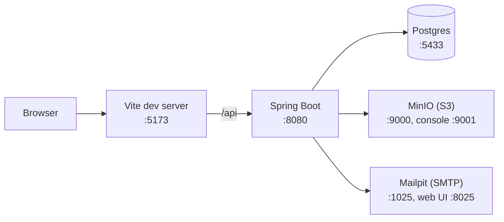

# Set up the dev environment

This guide gets the backend, the frontend and their supporting services
running on your machine. It assumes a Linux or macOS shell; on Windows, use
WSL 2.

## Before you begin

Install these once:

| Tool | Version | How |
| --- | --- | --- |
| Docker with Compose | current | Docker Desktop, or the Docker Engine on Linux |
| Node | 22 | nvm: `nvm install 22` |
| Java | 25 (Temurin) | SDKMAN: `sdk install java 25-tem` |
| uv | current | https://docs.astral.sh/uv/ |
| tmux | any | `sudo apt install tmux` or `brew install tmux` |

The backend build sources SDKMAN itself, so a non-login shell still finds
Java. If you run Maven by hand, run
`source "$HOME/.sdkman/bin/sdkman-init.sh"` first.

## Local services



Postgres listens on 5433, not 5432, because many machines already run a
Postgres on the default port. MinIO is the local stand-in for the S3-style
bucket that holds evidence files. Mailpit catches every outbound email so
nothing leaves your machine.

## Start everything with one command

1. From the repository root, run `make dev-up`.

    tmux opens a window with the backend on top, Postgres logs bottom left
    and the Vite dev server bottom right. Inside an existing tmux session the
    window is named `dev-console`; outside tmux, a session named
    `carbonos` is created.

2. Wait for the backend pane to print `Started CarbonosApplication`.
3. Open http://localhost:8080/actuator/health.

    The response is `{"status":"UP"}`.

4. Create an administrator:

    ```bash
    make admin EMAIL=you@example.com PASSWORD=change-me-now
    ```

5. Open http://localhost:5173 and sign in.

To stop everything, run `make dev-down`. It closes the panes it opened
and stops the containers.

## Start the pieces by hand

Use separate terminals when you want to restart one piece without the
others.

1. Start the services: `make db-up`.
2. Start the backend: `make backend`. It runs Spring Boot with the
   `local` profile, which points at the compose services.
3. Start the frontend: `make frontend`. The Vite dev server proxies
   `/api` to port 8080, so the browser never needs the backend's address.

## Reset the local database

Run `make db-reset`. It drops the compose volumes and starts the services
again; the next backend start replays every Flyway migration on an empty
database. Create the administrator again afterwards.

## Keep an eye on memory

The backend's integration tests start Postgres, MinIO and Mailpit in
Testcontainers. On a machine with less than 8 GB of RAM, run one Maven
build at a time, and expect the frontend test suite to slow down while
Maven runs.
