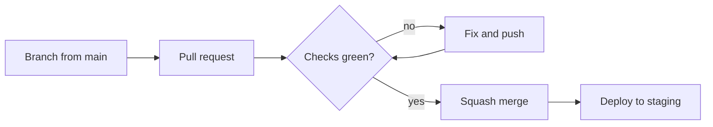

# Ship a change

CarbonOS is trunk-based: short-lived branches, a pull request into `main`,
green checks, a squash merge, and an automatic deploy to staging. This guide
takes one change through that path.



## Before you begin

- A non-trivial feature needs an approved spec first. See
  [Write a spec](write-a-spec.md).
- Know which checks your change needs: the backend half, the frontend
  half, the docs half, or all three. See [Run the checks](run-the-checks.md).

## Make the change

1. Start from an up-to-date `main`:

    ```bash
    git switch main && git pull --ff-only
    git switch -c feat/short-description
    ```

    Branch prefixes follow the commit type: `feat/`, `fix/`, `chore/`,
    `docs/`, `refactor/`, `test/`.

2. Make the change, with tests. New behavior gets a test; a bug fix gets a
   regression test.
3. If the change adds or alters a table, add a Flyway migration. See
   [Add a migration](add-a-migration.md).
4. If the change alters how engineers build, run, verify or ship the
   system, update the affected page under `docs/` in the same branch.
5. Run the checks locally.

## Commit

- Write a conventional commit:

    ```text
    feat: scope the recalculation hold to inventories that report against the base year
    ```

    The type is one of `feat`, `fix`, `chore`, `docs`, `refactor`,
    `test`. The subject is a sentence fragment in the imperative, in
    sentence case, without a trailing period. The body says what changed
    and why, not how. No em-dashes anywhere.

## Open the pull request

1. Push the branch and open a pull request against `main`:

    ```bash
    git push -u origin feat/short-description
    gh pr create --base main --fill
    ```

2. In the description, say what the change does, which spec it implements,
   and how you verified it.
3. Wait for the checks. The backend check takes the longest, about ten
   minutes.

    A red check blocks the merge. Fix the cause and push; the checks run
    again.

## Merge

1. Squash-merge the pull request. The squash keeps `main` at one commit
   per change.
2. Within a few minutes, the `Staging` workflow deploys the backend and
   the frontend to the Railway staging environment.
3. Open the staging frontend and confirm your change is there. See
   [Environments](../reference/environments.md) for the addresses.

Releases to production are a separate step; see
[Deploy and release](deploy-and-release.md).
