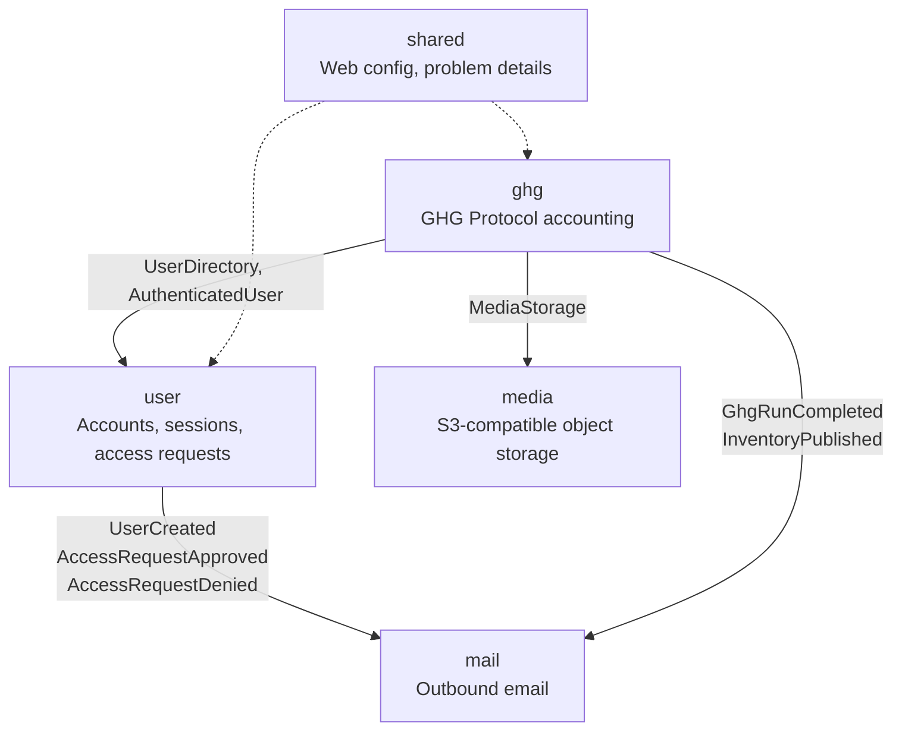

# Backend modules

The backend is a modular monolith on Spring Modulith. Each top-level package
under `com.carbonos` is one module. A module's public API lives in its root
package; everything under `internal/` is private to it. `ModularityTests`
fails the build when a module reaches into another's internals, so the
diagram here is enforced, not aspirational.

## Modules

| Module | Responsibility | Public API (root package) | Tables |
| --- | --- | --- | --- |
| `user` | Accounts, session login, the administrator-facing user API, the self-service access-request loop (spec 01, 01.1). | `AuthenticatedUser` (the session principal), `UserDirectory` (account lookup), events `UserCreated`, `AccessRequestApproved`, `AccessRequestDenied` | `users`, `access_requests` |
| `ghg` | Everything the GHG Protocol specs describe: organizations, entities, facilities, activity data, factors, boundaries, inventories, runs, base years, reports (specs 02 to 08), plus membership, support access and the organization tombstone (specs 01.2, 01.3). | Events `GhgRunCompleted`, `InventoryPublished` | Every `ghg_*` table, including the factor pack catalogue below |
| `mail` | Turns other modules' events into SMTP messages. Owns no tables and exposes no API. Delivery is at-least-once through the Modulith event registry; unsent mail is retried on restart. | none | none (the event publication log is Modulith's) |
| `media` | Object storage for evidence and profile files on any S3-compatible store: MinIO locally, a Railway bucket in production. | `MediaStorage` | `media_files` |
| `shared` | Cross-cutting infrastructure: web configuration, RFC 9457 problem details, the global exception handler. Business logic never lives here. | n/a | none |

### Where a factor pack lives

A factor pack used to be a JSON file on the classpath, loaded once at startup.
It is now a row set in the database (spec 02.5), so a maintainer can correct a
row without a release and a report can name the vintage behind a figure:

| Table | Holds |
| --- | --- |
| `ghg_factor_packs` | The families, keyed by `pack_key`: the lineage of one publication, such as `defra`. |
| `ghg_factor_pack_editions` | One dated release of a family, keyed by `edition_id` (`defra-2026`), with its status, provenance, applies-from date, evidence checksum, curator and approver. |
| `ghg_factor_pack_rows` | A row per factor per edition, with the publisher's category, activity and detail in three columns. |
| `ghg_factor_pack_changes` | The change log frozen at publication, one entry per code. |
| `ghg_factor_pack_events` | The publication trail. It is not `ghg_audit_events`, which requires an organization or an inventory on every event. |

`V43__seed_factor_pack_editions.sql` seeds the ten shipped packs as published
editions, 2,836 rows, generated from the JSON files. `FactorPacks` reads the
catalogue and caches each assembled pack per instance, which assumes one
backend instance per environment, as Railway runs today. Only a published
edition is visible to an organization.

## Events

| Event | Published by | Consumed by | Carries |
| --- | --- | --- | --- |
| `UserCreated` | `user` | `mail` | user id, email |
| `AccessRequestApproved` | `user` | `mail` (sends the set-password link) | request id, email, display name, setup token |
| `AccessRequestDenied` | `user` | `mail` | request id, email, display name |
| `GhgRunCompleted` | `ghg` | none yet | run id, inventory id, total kg CO2e |
| `InventoryPublished` | `ghg` | none yet | inventory id, run id |

Cross-module communication prefers events (`ApplicationEventPublisher` and
`@ApplicationModuleListener`) over direct calls. A direct call is allowed
only against another module's public API, which is how `ghg` stores
evidence through `MediaStorage`.

## Conventions inside a module

- Controllers speak DTOs (Java records) and never return entities. Errors
  are problem details: `GhgFieldException` answers 422 with an
  `errors.<field>` map, `GhgRuleViolationException` 409,
  `GhgNotFoundException` 404.
- Repositories are Spring Data JPA; the schema comes from Flyway
  migrations and Hibernate validates it at startup.
- Time-ordered facts (runs, boundary versions, audit events) are immutable
  once written; corrections add rows, they do not update them.
- An organization and everything under it is visible to its members only
  (spec 01.3). `GhgAccess` decides: an outsider, a platform administrator
  without support access, and a removed organization all give 404. The
  administrator-only endpoints live under `/api/admin/**`, which
  `SecurityConfig` reserves for the ADMIN platform role, and the service
  checks the role again.

## Generated documentation

`./mvnw verify` runs `ModularityTests.writesModuleDocumentation`, which
writes a C4-style PlantUML diagram and an AsciiDoc canvas per module under
`backend/target/spring-modulith-docs/`. The diagram on this page is drawn
by hand; when you add a module or an event, regenerate, then compare.
