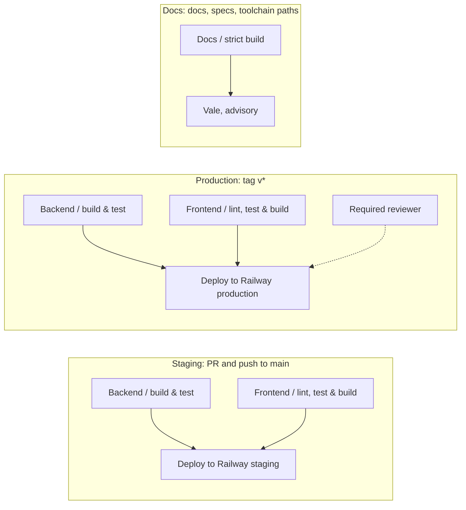

# CI

Three GitHub Actions workflows live under `.github/workflows/`. Together
they enforce the Definition of Done on every pull request and own every
deployment.

## Staging

| | |
| --- | --- |
| File | `staging.yml` |
| Triggers | `pull_request` to `main`; `push` to `main` |
| Concurrency | `staging-<ref>`; in-progress runs are cancelled on pull requests only |
| Jobs | `Backend / build & test` (Temurin 25, Maven cache, `./mvnw -B verify`); `Frontend / lint, test & build` (Node 22, `npm ci`, lint, format check, test, build); `Deploy to Railway (staging)` |
| Deploy condition | Push to `main` only, after both check jobs pass |
| Environment | GitHub environment `staging`; secret `RAILWAY_STAGING_TOKEN` |
| Deploy steps | `npm install -g @railway/cli`, then `railway up --service backend --ci` and `railway up --service frontend --ci` from the repository root |

The backend job includes `ModularityTests`, which fails the build when a
module imports another module's internals and writes the module
documentation under `backend/target/spring-modulith-docs/`.

## Production

| | |
| --- | --- |
| File | `production.yml` |
| Trigger | `push` of a tag matching `v*` |
| Concurrency | `production`, never cancelled |
| Jobs | The same two check jobs, then `Deploy to Railway (production)` |
| Environment | GitHub environment `production` with a required reviewer; secret `RAILWAY_PRODUCTION_TOKEN` |

## Docs

| | |
| --- | --- |
| File | `docs.yml` |
| Triggers | `pull_request` and `push` to `main`, only for paths under `docs/`, `specs/`, or the docs toolchain files (`mkdocs.yml`, `pyproject.toml`, `uv.lock`, `.python-version`, `.vale.ini`, `.vale/`) |
| Concurrency | `docs-<ref>`, in-progress runs cancelled |
| Permissions | `contents: read` |
| Job | `Docs / strict build`: `uv sync --locked`, `uv run mkdocs build --strict`, then Vale on the changed Markdown with `continue-on-error` |

Nothing is published. The Vale step reports warnings in the job log and
never fails the job.

## Required checks

A pull request cannot merge while a check is failing. The two `Staging`
check jobs run on every pull request. The docs job runs only when its paths
change, so it is not a required check: a path-filtered required check would
never report on other pull requests and would block them.
