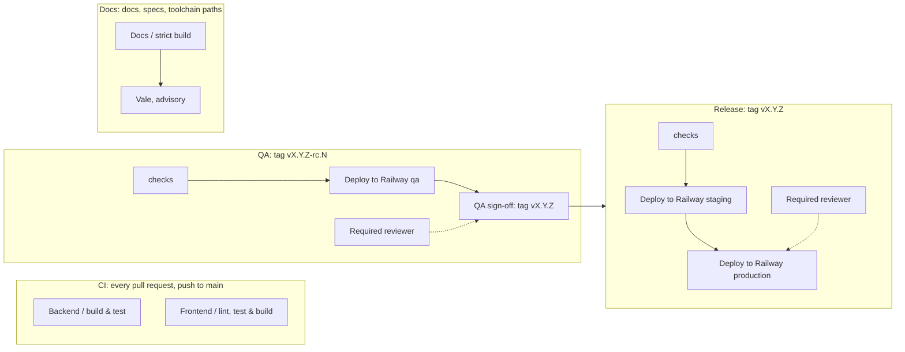

# CI

Four GitHub Actions workflows live under `.github/workflows/`. `CI` enforces
the Definition of Done on every pull request; `QA` and `Release` own every
deployment, each started by a tag and promoted by an approval; `Docs` builds
the site strictly. Nothing deploys from a merge to `main`.

## CI

| | |
| --- | --- |
| File | `ci.yml` |
| Triggers | `pull_request` (any base branch, so stacked pull requests are checked); `push` to `main` |
| Concurrency | `ci-<ref>`; in-progress runs are cancelled on pull requests only |
| Jobs | `Backend / build & test` (Temurin 25, Maven cache, `./mvnw -B verify`); `Frontend / lint, test & build` (Node 22, `npm ci`, lint, format check, test, build) |
| Deploys | Nothing |

The backend job includes `ModularityTests`, which fails the build when a
module imports another module's internals and writes the module
documentation under `backend/target/spring-modulith-docs/`.

## QA

| | |
| --- | --- |
| File | `qa.yml` |
| Trigger | `push` of a tag matching `v[0-9]+.[0-9]+.[0-9]+-rc.[0-9]+`, for example `v0.7.0-rc.1` |
| Concurrency | `qa`, never cancelled |
| Jobs | The two check jobs; `Deploy to Railway (qa)`; `QA sign-off (tags the release)` |
| Environments | `qa` (secret `RAILWAY_QA_TOKEN`); `qa-signoff` with a required reviewer |
| Sign-off | The job waits for the reviewer. Once approved it tags the same commit `vX.Y.Z` (refusing if that tag exists), pushes the tag, and starts `Release` with `gh workflow run`, because a tag pushed with the workflow token starts no workflow on its own |

A candidate that fails QA is never approved; the run stays waiting and can
be cancelled. The fix lands on `main` and is tagged `rc.2`.

## Release

| | |
| --- | --- |
| File | `release.yml` |
| Triggers | `push` of a tag matching `v[0-9]+.[0-9]+.[0-9]+`; `workflow_dispatch` on a version tag (what the QA sign-off uses) |
| Concurrency | `release`, never cancelled |
| Jobs | `Release / the ref is a version tag` (refuses any other ref); the two check jobs; `Deploy to Railway (staging)`; `Deploy to Railway (production)` |
| Environments | `staging` (secret `RAILWAY_STAGING_TOKEN`), deployed without a gate; `production` (secret `RAILWAY_PRODUCTION_TOKEN`) with a required reviewer |
| Deploy steps | `npm install -g @railway/cli`, then `railway up --service backend --ci` and `railway up --service frontend --ci` from the repository root |

Staging is the production rehearsal: the same commit the testers approved,
deployed the same way production is. Approving the production job is the
release.

## Docs

| | |
| --- | --- |
| File | `docs.yml` |
| Triggers | `pull_request` (any base) and `push` to `main`, only for paths under `docs/`, `specs/`, the docs toolchain files (`mkdocs.yml`, `pyproject.toml`, `uv.lock`, `.python-version`, `.vale.ini`, `.vale/`) and the `Makefile` |
| Concurrency | `docs-<ref>`, in-progress runs cancelled |
| Permissions | `contents: read` |
| Job | `Docs / strict build`: `uv sync --locked`, `uv run mkdocs build --strict`, then Vale on the changed Markdown with `continue-on-error` |

Nothing is published. The Vale step reports warnings in the job log and
never fails the job.

## Required checks

The repository ruleset on `main` requires a pull request and the two `CI`
check jobs, `Backend / build & test` and `Frontend / lint, test & build`,
before a merge; repository administrators can bypass it, which is what
lets the owner push `main` directly. The docs job is not required: a
path-filtered required check would never report on other pull requests and
would block them. The check names are the job names; renaming a job breaks
merging until the ruleset is updated.

## Follow-ups

- A tag-deployed environment gives testers a build that does not move, at
  the cost of no live view of `main`; if the team wants one, a `dev`
  environment deployed on push to `main` is a fourth workflow of the same
  shape.
- Railway pull request environments would give every pull request its own
  URL; not set up.
