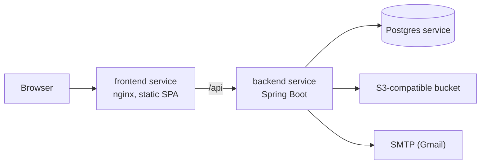

# Environments

CarbonOS runs in four places: your machine, the Railway qa environment
that a release candidate tag deploys to for the testers, the Railway
staging environment that the approved version deploys to as a rehearsal,
and the Railway production environment that a second approval deploys to.
Nothing deploys from a merge to `main`.

## The four environments

| | Local | QA | Staging | Production |
| --- | --- | --- | --- | --- |
| Frontend | http://localhost:5173 | see the Railway dashboard until the domain is recorded here | https://frontend-staging-2e61.up.railway.app | https://frontend-production-3228.up.railway.app |
| Backend | http://localhost:8080 | see the Railway dashboard | https://backend-staging-641b.up.railway.app | https://backend-production-14df8.up.railway.app |
| Deployed by | you | tag `vX.Y.Z-rc.N` | the QA sign-off, which tags `vX.Y.Z` | approval of the production job on that run |
| Who uses it | you | the testers | a rehearsal of the release | nobody yet |
| Database | compose Postgres 17 on 5433 | Railway Postgres | Railway Postgres | Railway Postgres |
| Object storage | MinIO on 9000 | Railway bucket | Railway bucket | Railway bucket |
| Mail | Mailpit on 1025, UI on 8025 | Gmail SMTP | Gmail SMTP | Gmail SMTP |
| Administrator | `make admin` | seeded from variables | seeded from variables | seeded from variables |
| Wipe | `make db-reset` | `make db-wipe ENV=qa` | `make db-wipe ENV=staging` | `make db-wipe ENV=production ARGS=--yes-production` |
| Copy from another | | `make env-copy FROM=staging TO=qa` | | never a target |

Health for any backend is `GET /actuator/health`.

## Backend variables

| Variable | Purpose |
| --- | --- |
| `DATABASE_URL`, `DATABASE_USERNAME`, `DATABASE_PASSWORD` | JDBC connection; on Railway they reference the Postgres service. |
| `CARBONOS_ADMIN_EMAIL`, `CARBONOS_ADMIN_PASSWORD` | The administrator seeded at startup, idempotently. The canonical way to get a first account on Railway. |
| `MAIL_HOST`, `MAIL_PORT`, `MAIL_USERNAME`, `MAIL_PASSWORD`, `MAIL_SMTP_AUTH`, `MAIL_STARTTLS`, `MAIL_FROM` | Outbound mail. |
| `APP_BASE_URL` | The environment's own frontend address, used in email links. |
| `carbonos.storage.*` | Endpoint, region, keys, bucket, path style, and whether to create the bucket. Locally these point at MinIO. |
| `PORT` | Set by Railway; the server listens on it. |

The mail health indicator is disabled, because a health contributor that
reports `DOWN` fails a Railway deploy even when the application started.

## Frontend variables

| Variable | Purpose |
| --- | --- |
| `VITE_API_URL` | The backend's public address, baked in at build time. Locally the Vite proxy makes it unnecessary. |

## Local profile

`backend/src/main/resources/application-local.yaml` points the datasource
at `localhost:5433` and storage at MinIO, and turns `com.carbonos` logging
to `DEBUG`. `make backend` activates it.
