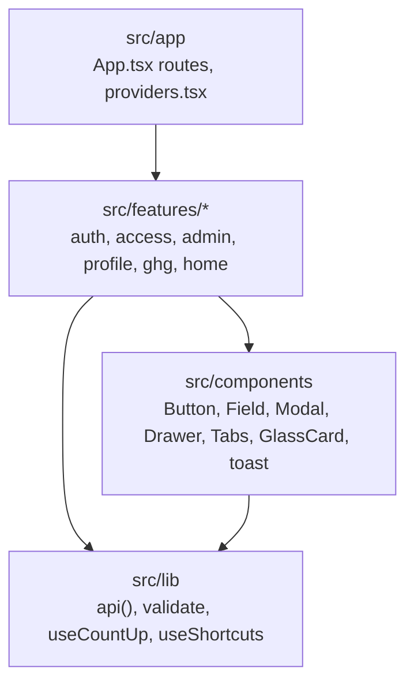

# Frontend structure

The frontend is a React 19 single-page application built with Vite 8 and
TypeScript in strict mode. It is feature-sliced: each folder under
`src/features` mirrors a backend module and owns its pages, components
and queries.

## Folders

| Folder | Holds | Rule |
| --- | --- | --- |
| `src/app` | `App.tsx` (routes), `providers.tsx` (TanStack Query client, router, toasts) | Wiring only. |
| `src/features/<name>` | Pages, feature components under `components/`, `api.ts` (typed calls), `use<Name>.ts` (TanStack Query hooks), tests beside the code | A feature never imports another feature's internals. |
| `src/components` | Shared UI: `Button`, `InputField`, `SelectField` and `TextAreaField`, `Modal`, `Drawer` (a panel beside the page), `Tabs`, `StatusPill`, `MonthField`, `ProgressBar`, `GlassCard`, `Skeleton`, the toast host | No business logic. |
| `src/lib` | `api.ts` (the fetch wrapper), `validate.ts` (numeric checks), `useCountUp.ts`, `useShortcuts.ts` (single-key page shortcuts that stay quiet while typing) | Shared infrastructure only. |
| `src/test` | Render helpers with providers, the API mock | |

## Feature to module

| Feature | Backend module | Pages |
| --- | --- | --- |
| `auth` | `user` | Sign in, the post-login splash, route guards |
| `access` | `user` | Request access, set password |
| `admin` | `user`, `ghg` | Users list and administration; the organizations list where a platform administrator assumes support access (spec 01.3) |
| `profile` | `user`, `media` | Profile and avatar |
| `ghg` | `ghg` | Organizations, overview, entities, facilities, activity data and its source documents, units, emission factors, inventories, inventory detail, run detail, base year |
| `home` | none | Landing |

## The API wrapper

Every backend call goes through `api()` in `src/lib/api.ts`. It sends
credentials, fetches and attaches the CSRF token on mutating requests,
parses RFC 9457 problem details into `ApiError`, and exposes
`fieldErrors()` and `problemDetail()` so forms can print a 422's
`errors.<field>` map inline. `refusalMessage(error, myRole)` turns a 403, a
404, a 409, a 5xx or a dead connection into the one sentence every page
prints for it (spec 01.4), so a refused write is never silent. Server state
goes through TanStack Query; features do not hand-roll fetch effects.

## Roles on the screen

`src/features/ghg/roles.ts` holds the role sets of spec 01.4 (`mayWrite`,
`mayApprove`, `mayOwn`, `mayManageMembership`, `isReadOnly`) and the
sentences that name a role. A write control the caller's role does not
allow is hidden when it is the only content of its region and disabled
otherwise, through `RoleButton`, which carries the sentence as a tooltip
and as text an assistive technology reads. The screen is a display concern:
the server checks of spec 01.2 stay the authority.

## Scripts

| Script | Runs |
| --- | --- |
| `npm run dev` | Vite on 5173, proxying `/api` to 8080 |
| `npm run build` | `tsc -b && vite build` |
| `npm run lint` | oxlint |
| `npm run format` and `format:check` | Prettier |
| `npm test` and `test:watch` | vitest |
| `npm run preview` | Serves the production build |

Under a running Maven build the vitest suite slows down; raise the timeout
with `--testTimeout=60000` rather than skipping tests.
