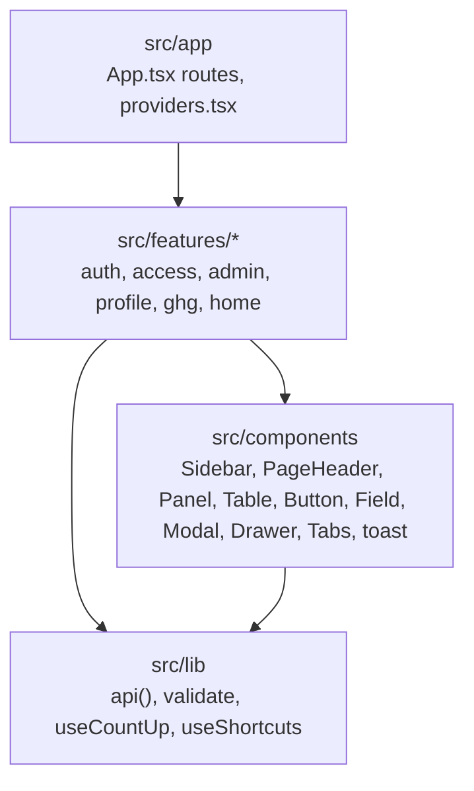

# Frontend structure

The frontend is a React 19 single-page application built with Vite 8 and
TypeScript in strict mode. It is feature-sliced: each folder under
`src/features` mirrors a backend module and owns its pages, components
and queries.

```mermaid
flowchart TB
    accTitle: The frontend folders and how they depend on each other
    accDescr: app wires routing and providers; features hold pages, components and queries per backend module; components is shared UI; lib is shared infrastructure that every feature calls.
    app["src/app\nApp.tsx routes, providers.tsx"]
    features["src/features/*\nauth, access, admin, profile, ghg, home"]
    components["src/components\nSidebar, PageHeader, Panel, Table, Button, Field, Modal, Drawer, Tabs, toast"]
    lib["src/lib\napi(), validate, useCountUp, useShortcuts"]
    app --> features
    features --> components
    features --> lib
    components --> lib
```

## Folders

| Folder | Holds | Rule |
| --- | --- | --- |
| `src/app` | `App.tsx` (routes), `providers.tsx` (TanStack Query client, router, toasts) | Wiring only. |
| `src/features/<name>` | Pages, feature components under `components/`, `api.ts` (typed calls), `use<Name>.ts` (TanStack Query hooks), tests beside the code | A feature never imports another feature's internals. |
| `src/components` | Shared UI, the kit of spec 10: `Sidebar` (the rail of the workspace and the administration area, with the `AccountMenu` in its foot) and `AppHeader` (the plain top bar of the organizations list and the profile), `Wordmark` (the CarbonOS lockup: the `CarbonOsMark` symbol and the two-tone name; `public/favicon.svg` is drawn from the same numbers in `carbonOsMarkGeometry.ts`), `PageHeader` (Back, breadcrumb, help, status line, title, chips, subtitle, actions), `Panel`, `Table` and its cells, `FilterRow` with `SearchField` and `FilterSelect`, `StatStrip`, `Tabs`, `Chip`, `StatusDot`, `Banner`, `SplitView` (a summary list beside a record's detail), `Popover`, `Button`, `InputField`, `SelectField` and `TextAreaField`, `MonthField`, `Modal`, `Drawer` (a panel beside the page), `ProgressBar`, `Skeleton`, `LoadingCard`, the toast host. Colour comes from the tokens in `index.css` (`src/lib/theme.ts` keeps the light or dark choice), never from the brand palette. | No business logic. |
| `src/lib` | `api.ts` (the fetch wrapper), `validate.ts` (numeric checks), `useCountUp.ts`, `useShortcuts.ts` (single-key page shortcuts that stay quiet while typing) | Shared infrastructure only. |
| `src/test` | Render helpers with providers, the API mock | |

`/app` is not a page. `LandingRedirect` resolves it: an administrator to the
administration panel, everybody else to their organization when they have
exactly one and to the organizations list otherwise (spec 01.6). The sign-in
form and the set-password flow both hand off to it, so the rule lives in one
place.

`/admin` is a layout route. `features/admin/AdminLayout` draws the shared
header and a collapsible sidebar around an `<Outlet />`, exactly as
`features/ghg/OrganizationLayout` does for an organization, and names the
administration sections once in its own `sections` array. Adding a page is a
child route and one entry there. `RequireAuth role="ADMIN"` wraps the layout,
not each page, so a member never sees the sidebar at all.

`OrganizationLayout` works the same way, with one difference: a section may
carry `ownerOnly`, which keeps it out of the nav for everybody but an owner by
membership (spec 01.7). The active-pill arithmetic counts rows and dividers
over the sections actually rendered, so a hidden entry never slides the pill
onto the wrong row, and dividers are named by the section they follow rather
than by index.

## The workbench pattern

Two screens are built the same way, and a third list-shaped screen should
reuse the parts rather than invent a layout: the activity register
(`ActivityPage`, spec 04.6) and the inventory's classification register
(`InventoryDetailPage` with `AssignmentsSection`, spec 05.6).

The shape is: a `useXFilters()` hook that keeps every filter, the page and
the open record in the URL (`activityFilters.ts`, `inventoryFilters.ts`),
eliding defaults and resetting the page whenever the list changes; one server
query that returns the page **and** the counts, with
`placeholderData: (previous) => previous` so a filter change does not blank
the table; a `StatStrip` above the table turning the counts into figures with one
action (`CompletenessBanner`), or the pre-flight chip and popover in the page
header (`PreflightChip`); `Tabs`, a `FilterRow`, the table and a footer; a body
with exactly three states (skeleton, filtered-empty, cold-empty); a
`SplitView` keyed off the `record` parameter, the register as a summary list
beside the record's detail, taking the current page so previous and next need
no fetch (`ActivityDrawer`, `AssignmentDetail`); `RoleButton` for write
gating; and `useShortcuts` with a cursor validated against the page.

Because the view is the URL, a link reopens it. That is the property to
preserve when editing either screen: a filter moved back into `useState` is a
link a reviewer can no longer send.

## Form surfaces

Spec 08 fixes which surface a form gets, so the same kind of job meets the
same kind of surface everywhere. A form that creates or edits a record with
an identity of its own is a page under the record's list (`InventoryFormPage`
at `inventories/new` and `inventories/:inventoryId/edit`, `FacilityFormPage`
at `facilities/new` and `facilities/:facilityId/edit`, `EntityFormPage` at
`entities/new` and `entities/:entityId/edit`), with a `Breadcrumb`
back to the list and the page title as the form's accessible name. A row
editor of a list-shaped register is a `Drawer` keyed off the URL, as above. A
one-shot form, a batch operation and a confirmation are a `Modal`. The
buttons that lead to a form page stay `RoleButton`s that navigate, so a
verifier meets the disabled control, not a page that refuses.

## Feature to module

| Feature | Backend module | Pages |
| --- | --- | --- |
| `auth` | `user` | Sign in, the post-login splash, route guards |
| `access` | `user` | Request access, set password |
| `admin` | `user`, `ghg`, `platform` | The administration shell and its dashboard, which opens on what needs a decision (spec 01.5); the access-request queue and the record of what was decided (spec 01.1); the users list; the organizations list where a platform administrator assumes support access (spec 01.3); the factor pack catalogue and the edition workbench, where a pack family, a draft edition and its rows are authored and the validation report is read (spec 02.5); the platform settings and the history of every change to them (spec 01.5) |
| `profile` | `user`, `media` | Profile and avatar (the resume upload was retired by spec 01.6) |
| `ghg` | `ghg` | Organizations, overview, entities, facilities, activity data and its source documents, units, emission factors, inventories, the inventory workbench (records, boundary, method, runs, report; spec 05.6), run detail, base year, and the organization settings page where an owner administers members, details, history and deletion (spec 01.7) |
| `home` | none | The public landing page (`landing/`: sections, copy, pricing tiers, and the lazily loaded three.js hero behind a WebGL probe), and the post-sign-in resolver at `/app` (spec 01.6) |

## The API wrapper

Every backend call goes through `api()` in `src/lib/api.ts`. It sends
credentials, fetches and attaches the CSRF token on mutating requests,
parses RFC 9457 problem details into `ApiError`, and exposes
`fieldErrors()` and `problemDetail()` so forms can print a 422's
`errors.<field>` map inline. `refusalMessage(error, myRole)` turns a 403, a
404, a 409, a 5xx or a dead connection into the one sentence every page
prints for it (spec 01.4), so a refused write is never silent. Server state
goes through TanStack Query; features do not hand-roll fetch effects.

## Roles on the screen

`src/features/ghg/roles.ts` holds the role sets of spec 01.4 (`mayWrite`,
`mayApprove`, `mayOwn`, `mayManageMembership`, `isReadOnly`) and the
sentences that name a role. A write control the caller's role does not
allow is hidden when it is the only content of its region and disabled
otherwise, through `RoleButton`, which carries the sentence as a tooltip
and as text an assistive technology reads. The screen is a display concern:
the server checks of spec 01.2 stay the authority.

## Scripts

| Script | Runs |
| --- | --- |
| `npm run dev` | Vite on 5173, proxying `/api` to 8080 |
| `npm run build` | `tsc -b && vite build` |
| `npm run lint` | oxlint, then `scripts/check-design-tokens.mjs`, which fails on a brand colour, a tint, a blur, a monospace face or a hex literal outside the landing page and the style sheet (spec 10, ADR 0009) |
| `npm run format` and `format:check` | Prettier |
| `npm test` and `test:watch` | vitest |
| `npm run preview` | Serves the production build |

Under a running Maven build the vitest suite slows down; raise the timeout
with `--testTimeout=60000` rather than skipping tests.
