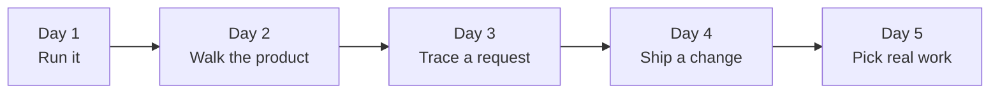

# Your first week

By the end of this tutorial you have run CarbonOS on your machine,
walked the product the way a user meets it, traced one request from the
browser to the database, shipped a small change through the pull request
flow, and picked your first piece of real work. Each day takes two to three
hours. You need a laptop with Docker, and an account on the GitHub
repository.



## Day 1: run the system

1. Install the prerequisites: Docker, Node 22, tmux, uv, and Java 25
   through SDKMAN. [Set up the dev environment](../how-to/set-up-the-dev-environment.md)
   lists the commands for each.
2. Clone the repository and open a terminal at its root.
3. Run `make help`.

    The terminal lists every target in the Makefile with a one-line
    description. You use `dev-up`, `verify`, and `docs-serve` this
    week.

4. Run `make dev-up`.

    tmux opens a window with three panes: the backend on top, Postgres logs
    bottom left, the Vite dev server bottom right. The backend pane ends
    with `Started CarbonosApplication` after about a minute the first time,
    while Maven downloads dependencies.

5. In a second terminal, create an administrator account:

    ```bash
    make admin EMAIL=you@example.com PASSWORD=change-me-now
    ```

6. Open http://localhost:5173 and sign in with that account.

    You land on the organizations page with no organizations yet. The
    loader that plays after sign-in shows a progress bar and can be skipped
    with a click.

7. Run `make docs-serve` in a third terminal and open
   http://127.0.0.1:8000.

    This site opens. Keep it open; the rest of the week links into it.

## Day 2: walk the product

CarbonOS builds a greenhouse gas (GHG) inventory the way the GHG Protocol
Corporate Standard prescribes. The fastest way to learn the domain is to
do what a user does, with the QA procedures as your script.

1. Read [spec 00, Principles and domain model](../specs/00-principles-and-domain-model.md)
   once, start to finish. It is about fifteen minutes. Pay attention to the
   three invariants: facts, views, and computations.
2. Open [QA procedure 2, Organization setup](../reference/qa/002-organization-setup.md)
   and run it on your local instance. It creates Sankofa Gold plc, a
   Ghanaian gold miner, with its entities, facilities, source streams and
   units.

    Every case has an expected result. When yours differs, note it; you
    have either found a bug or misread the product, and both are worth
    raising on day 5.

3. Run [procedure 3, Activity data](../reference/qa/003-activity-data.md)
   and [procedure 4, Boundary and inventory lifecycle](../reference/qa/004-boundary-and-lifecycle.md).

    By the end you have an inventory with a frozen boundary. The
    [inventory lifecycle](../explanation/inventory-lifecycle.md) explains
    why freezing matters.

## Day 3: trace a request

1. Read [Backend modules](../reference/backend-modules.md) and
   [Frontend structure](../reference/frontend-structure.md).
2. In the browser, open the inventory you created and open the developer
   tools network tab. Click **Freeze**.

    The browser sends `POST /api/ghg/inventories/{id}/freeze`. The
    response is the boundary version the freeze cut.

3. Find the code that handled it. Start at
   `frontend/src/features/ghg/api.ts` for the request, then
   `backend/src/main/java/com/carbonos/ghg/internal/web/InventoryController.java`
   for the endpoint, then `InventoryService.freeze` for the rule that cuts
   the version, then the `ghg_boundary_versions` table in the migrations.
4. Read [Architecture](../explanation/architecture.md). The request
   sequence there is the path you traced.

## Day 4: ship a change

1. Pick a wording change in the UI, such as a hint on a form, and make it.
2. Run the checks:

    ```bash
    make verify
    ```

    Both halves pass. The backend half takes several minutes because the
    integration tests start Postgres, MinIO and Mailpit in containers.
    Run one Maven build at a time on a machine with less than 8 GB of RAM.

3. Follow [Ship a change](../how-to/ship-a-change.md): a branch, a
   conventional commit, a pull request, green checks, a squash merge.

    The merge deploys nothing; the change reaches the testers with the
    next release candidate tag. See
    [Deploy and release](../how-to/deploy-and-release.md).

## Day 5: pick real work

1. Read [The spec workflow](../explanation/spec-workflow.md). Every
   non-trivial feature starts as a spec, and a spec has to be approved
   before anyone implements it.
2. Open `todo.md` at the repository root. The ticked items are done; the
   "Keep" list names behavior that needs a regression test, and the
   follow-up audit list names what the last review could not exercise.
3. Choose one item, and write down in a sentence what "done" looks like
   for it. Bring that sentence to your first planning conversation.

You now have a running system, a mental model of the domain, one request
traced end to end, one change on staging, and a first task. The how-to
guides cover everything you do repeatedly from here.
