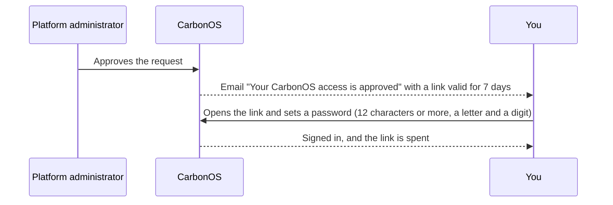

# Set your password and sign in

Setting your password turns an approved request into a working account and signs you in at once. Do it when the email "Your CarbonOS access is approved" arrives; afterwards, **Sign in** on the landing page is your way in.

<!-- sources: tasks/account/request-access-and-set-your-password.md (verified 2026-09-27); specs 01.2, 01.6; SetPasswordPage.tsx (labels, hint, refusals); PasswordPolicy.java and AccessRequestService.java (the rule, the single-use 7-day token); LoginPage.tsx ("Invalid email or password."); LandingRedirect.tsx and navigation.ts (where /app resolves); OrganizationsPage.tsx (the empty list); spec 01.9 and LoginPage.tsx ("Forgot your password?") -->

## Before you start

- A platform administrator approved your request and you have the email with the link, sent within the last 7 days.
- Or an administrator created your account under **Users** and gave you a temporary password: go straight to signing in.

## Set your password

1. Open the link in the email. The page **Set your password** reads "Welcome, *name*. Choose a password for *email*."
2. Fill **New password**. The rule under the field is the one the server applies: "At least 12 characters, with a letter and a digit."
3. Fill **Confirm password** with the same value. A difference is refused with "Passwords do not match."
4. Click **Set password and sign in**.

What you see: you are signed in, and CarbonOS opens where your work starts. The link is now spent. Opening it again, or after 7 days, reads "This link is invalid or has expired. Access links are valid for 7 days; you can always request access again." with **Back to CarbonOS**. A new request needs the administrator's approval again.

## Sign in

1. On the landing page, click **Sign in**.
2. Fill **Email** and **Password**, then click **Sign in**.

What you see: a wrong pair is refused with "Invalid email or password."; CarbonOS does not say which half is wrong. If you have forgotten the password, click **Forgot your password?** under **Sign in**; see [Reset a forgotten password](reset-a-forgotten-password.md). On success you land where your work starts: an administrator in the administration console, a member of one organization in that organization's overview, and a member of several on the **GHG accounting** list, one card per organization.

## Where a member of no organization lands

You land on **GHG accounting** under **No organizations yet**. What the card says depends on the platform's setting for who may create organizations: either "Create your first reporting organization to start the GHG Protocol workflow." with the button **New organization**, or "You are not a member of any organization yet. Ask an owner to add you, or a platform administrator." An owner adds you under the organization's **Settings** by your email; see [Add members and assign roles](../organization/add-members-and-assign-roles.md).

## Change the password later

A temporary password from an administrator, or any password you want to replace, is changed on your profile under **Change password**; see [Edit your profile](edit-your-profile.md#change-your-password).
