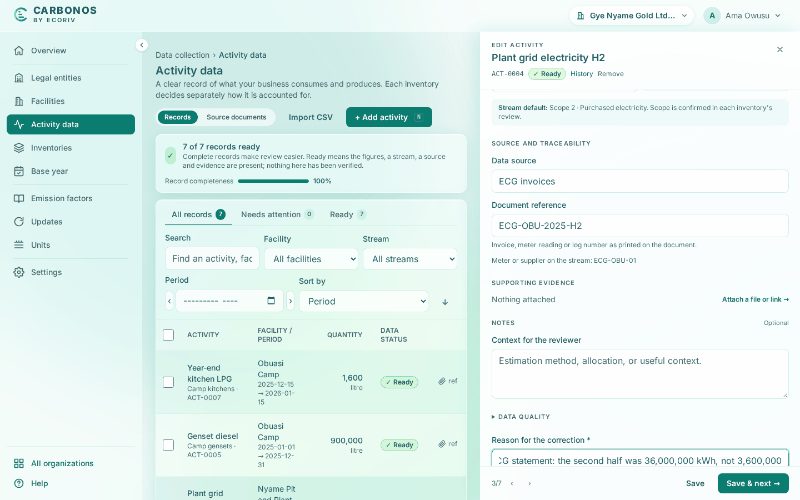

# Correct or remove a record and attach evidence

A correction keeps the old and new values and your reason in the record's history; evidence keeps the document with the figure it supports.

<!-- sources: tasks/activity-data/enter-correct-and-evidence-a-record.md (verified 2026-09-24); specs 04.4, 04.5; ActivityDrawer.tsx (reason field, toasts), ActivityHistoryModal.tsx, EvidencePanel.tsx, ActivityPage.tsx and RemoveDialog.tsx (removal dialog and toast), SourceDocumentsPage.tsx (filters, evidence index), RunDetailPage.tsx ("Since publication"), AssignmentDrawer.tsx ("Changed since publication"), ReportLabels.java ("Record removed"); screen text and figures from the Gye Nyame Gold walkthrough of 2026-09-28 (replay-log.txt): "4 record drawer", "4 record edited", "4 after save", "4 history" -->

## Before you start

- The record exists on **Activity data**, and you are a Preparer, Reviewer or Owner.
- A record a run has calculated can be corrected but not removed.

## Correct a figure

Gye Nyame Gold's import carried the second half of the year's electricity as 3,600,000 kWh; the second ECG statement shows 36,000,000.

1. Click the record's row, here **Plant grid electricity H2**. The drawer opens under the eyebrow **Edit activity**.
2. Change **Activity quantity *** from `3600000` to `36000000`.
3. Fill **Reason for the correction ***, at least 5 characters.
4. Click **Save**, or **Save & next →** for the following record.

What you see: "Record corrected. Past runs are unaffected." The row reads 36,000,000 kWh. **History** at the top of the drawer reads "Corrected by owner@gyenyame.example" with the moment, the reason and the change: "Quantity: 3600000 → 36000000".

## Attach evidence

1. Open the record and click the **Evidence** tab, or **Attach a file or link →** under **Supporting evidence**.
2. Under **Attach a file**, choose the document: "PDF, image, spreadsheet or text, up to 20 MB."
3. For a document that lives elsewhere, fill **Link name** and **URL** and click **Add link**.

What you see: "*file name* attached." or "Link attached.", and the item listed with who and when. The attachments column shows the count instead of "ref". "Files print on the run's lines and in the calculation file; a link opens the document where it lives."

**Source documents**, the second tab of **Activity data**, lists every file and link with its record and offers **Download evidence index (CSV)**. Its **Show** filter has **All documents**, **Links only** and **Record removed**.

## Remove a record

A record entered by mistake is removed, not deleted: "The record stays on file as removed, with your name, the date and the reason; inventories that reviewed it exclude it on their next review. A record a run calculated cannot be removed."

1. Open the record and click **Remove** at the top of the drawer.
2. Fill **Reason**, at least 5 characters, and click **Remove**.

What you see: "Activity removed." The row leaves the register; its documents stay under **Source documents** with the **Record removed** filter. Removing several rows at once asks for one reason.

## What happens next

An inventory that already reviewed the record keeps its classification. A published inventory marks the record "Changed since publication" and lists it under **Since publication** on the run's report page; the report stands as issued. To restate the year, see [Correct a published inventory](../reporting/correct-a-published-inventory.md).
