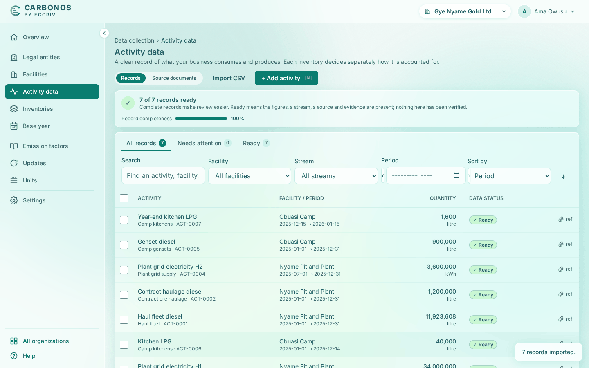
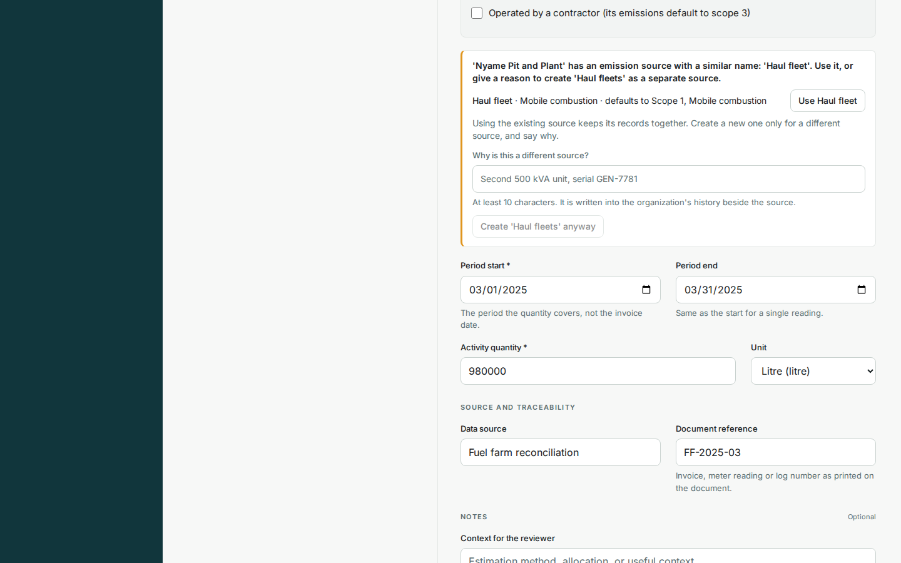

# Enter a record

Enter one record when an invoice, meter reading or log arrives; for a spreadsheet of rows, [import a CSV file](import-records-from-a-csv-file.md) instead.

<!-- sources: tasks/activity-data/enter-correct-and-evidence-a-record.md (verified 2026-09-24); specs 04.2, 04.5, 04.6, 04.10 and 10 (the split register, the completeness strip, the inline source and the reconcile prompt); QA governance 002 D4; ActivityDrawer.tsx (the record's detail: eyebrow, tabs, labels, hints, toasts), EmissionSourceField.tsx, ReconcileSourceNotice.tsx, GhgRules.java (ghg.stream.name-similar, ghg.stream.name-duplicate), badges.tsx and format.ts (pills and missing items), CompletenessBanner.tsx, InventoryFormModal.tsx (straddle setting); screen text and figures from the Gye Nyame Gold walkthrough of 2026-09-28 (replay-log.txt): "4 activity empty", "4 after import", "4 record drawer", "5 inventory dialog", "6 under review", "7 run page", and the local walkthrough of 2026-10-04 on the ECO-5 branch -->

## Before you start

- The facility exists under **Facilities**. Its emission sources may be registered there already, or described on the record as you go.
- You are a Preparer, Reviewer or Owner.

## Fill in the record

1. Open **Activity data** and click **+ Add activity**. The page splits: the register as a summary list on the left, the new record's detail on the right under the eyebrow **Add activity**.
2. Fill **Activity type ***, for example `Kitchen LPG`, and choose the **Facility ***.
3. Choose the **Emission source**, or **New emission source…** to describe one (next section). The detail prints the default a source carries, for example "Source default: Scope 2 · Purchased electricity."
4. Fill **Period start ***: "The period the quantity covers, not the invoice date." Fill **Period end**, or leave it: "Same as the start for a single reading."
5. Fill **Activity quantity *** and choose the unit. **Unregistered unit…** takes a code the list lacks.
6. Fill **Data source** and **Document reference**: "Invoice, meter reading or log number as printed on the document."
7. Under **Notes**, add **Context for the reviewer** when the figure needs explaining.
8. Under **Data quality**, keep **Method** as **Measured** for metered or invoiced figures, or choose **Estimated** or **Calculated**.
9. Set **Quality tier** if the source justifies one; blank follows the method. Add **Uncertainty, ± %** where the source states it.
10. Click **Save**. **Cancel**, or the close button beside the record's title, returns the full table.

What you see: "Activity recorded." The row shows the facility, the period, the quantity and the data status **Ready**, with "ref" in the attachments column until evidence is attached.

## Describe a new emission source on the record

When the invoice arrives before the source exists, you need not leave the form.

1. Under **Emission source**, choose **New emission source…**. A panel opens: "Added to *Facility* when the record is saved."
2. Fill **Source name ***, for example `Standby gensets`, choose **Kind**, and fill **Fuel or material (optional)** and **Meter or supplier (optional)** as the invoice names them. Tick **Operated by a contractor (its emissions default to scope 3)** when a contractor runs it.
3. Fill the rest of the record and click **Save** (or **Save draft**). The source and the record are saved together, and the source joins the facility's **Emission sources** page marked "added during data entry".

If the facility already has a source under a name like the one you typed, the save stops with a notice that lists each such source with its default: "'Nyame Pit and Plant' has an emission source with a similar name: 'Haul fleet'. Use it, or give a reason to create 'Haul fleets' as a separate source." Click **Use Haul fleet** to attach the record to the existing source with one click, and it saves again. Only if it really is a different source, fill **Why is this a different source?** with at least 10 characters (a serial number helps) and click **Create 'Haul fleets' anyway**; the reason is written into the organization's history beside the source. The exact name, in any case, is taken: the notice reads "'Nyame Pit and Plant' already has an emission source named 'haul fleet'." and offers only **Use Haul fleet**. Nothing is ever matched for you.

## Save a draft

With only the activity type and the facility known, click **Save draft**: "Draft saved." Fill in the figures later and click **Save**: "Record entered. It is now a fact."

## Ready or needs attention

The strip above the table counts the checks: **Records ready**, 7 "of 7" for Gye Nyame Gold, with the **Record completeness** bar and the sentence "Ready means the figures, an emission source, a data source and evidence are present; nothing here has been verified."; then **With a document on file** and **Needs attention**, whose link **Resolve *n* items →** opens the records to fix. A record that is not ready reads "Not ready for review yet." with the items missing: "Missing quantity", "Missing unit", "Missing period", "No emission source", "Missing source" or "Needs evidence"; its status names the first and counts the rest.

## A period that straddles the year end

Enter the record whole, as ACT-0007 was: `1600` litre, **Period start** `2025-12-15`, **Period end** `2026-01-15`; do not split the quantity by hand. Each inventory's setting **Records that straddle the period or a membership window** decides: **Pro-rate by days (default)** warns before the run, "17 of 32 days fall inside the reporting period and the membership window: the run pro-rates it to 53.13%", and **Block the run until the record is split** waits for one record per period.

## What happens next

The record carries no scope, category or factor; each inventory decides those for itself. See [Review and classify records](../inventories/review-and-classify-records.md) and [What is an activity record?](what-is-an-activity-record.md).
