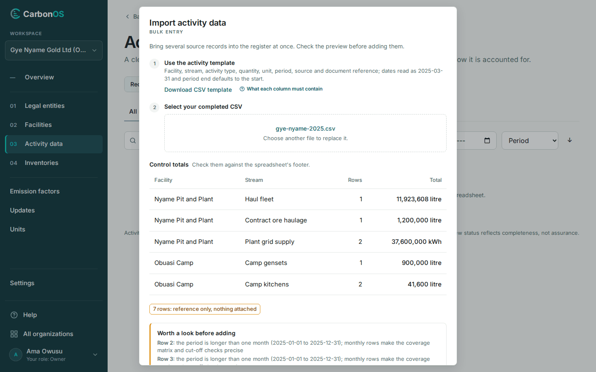

# Import records from a CSV file

An import brings several source records into the register at once, after a preview you check against the spreadsheet's footer. The file is kept with the records it creates.

<!-- sources: tasks/activity-data/import-records-from-csv.md (verified 2026-09-24); spec 04.6; ImportActivitiesModal.tsx (dialog text, preview blocks, "Add records"), ActivityPage.tsx (toast), ActivityImportService.java (warnings, rejections, draft match); screen text and figures from the Gye Nyame Gold walkthrough of 2026-09-28 (replay-log.txt): "4 import dialog", "4 preview", "4 after import" -->

## Before you start

- The facilities and emission sources the rows name exist; the import matches the `facility` and `emission_source` columns by name (a file that still heads the column `stream` is read the same way). The import creates no source: register one under **Facilities › Emission sources** or on a record first.
- The file follows [Prepare the CSV file](prepare-the-csv-file.md): one row per record, a CSV of up to 5 MB.
- You are a Preparer, Reviewer or Owner of the organization.

## Import the file

1. Open **Activity data** and click **Import CSV**. The dialog **Import activity data** opens.
2. Starting from scratch, click **Download CSV template** under **Use the activity template**. **What each column must contain** opens the column reference.
3. Under **Select your completed CSV**, click **Choose a CSV file**, or drop the file on the dialog.
4. Check **Control totals** against the spreadsheet's footer: rows and summed quantity per facility and emission source.
5. Read **Worth a look before adding**. These warnings do not stop the import.
6. Read the list of records to add, for example "7 records to add".
7. Click **Add records**.

What you see: "7 records imported." and one row per record in the register, numbered in the order of the file (ACT-0001 to ACT-0007 for Gye Nyame Gold). Rows the preview counted as "7 rows: reference only, nothing attached" carry "ref" in the attachments column. Row numbers in the preview count the header as row 1, as the spreadsheet does.

## What the warnings mean

- "Row 8: the period is longer than one month (2025-12-15 to 2026-01-15); monthly rows make the coverage matrix and cut-off checks precise": the row imports as it is.
- "matches draft *ACT-NNNN* (same facility, activity and period): the draft stays on file, complete or remove it": the row adds a new record next to the draft. Complete or remove the draft, so the register does not hold both.
- "'*Source*' mixes units in this file:" followed by the units: allowed, but worth checking.

## If the file is rejected

The preview reads "Nothing will import: *N* rows rejected. Fix them and choose the file again." and names each row with its problems, for example "no facility named 'Plant 2'". Nothing is added while any row is rejected. Every rejection message is listed in [Prepare the CSV file](prepare-the-csv-file.md#columns).

## What happens next

The records carry no scope, category or factor; an inventory decides those when it reviews them, see [Review and classify records](../inventories/review-and-classify-records.md). An inventory that already reviewed the organization's records sees the new ones once **Review activity data** is run again. Each record's history names the imported file.
