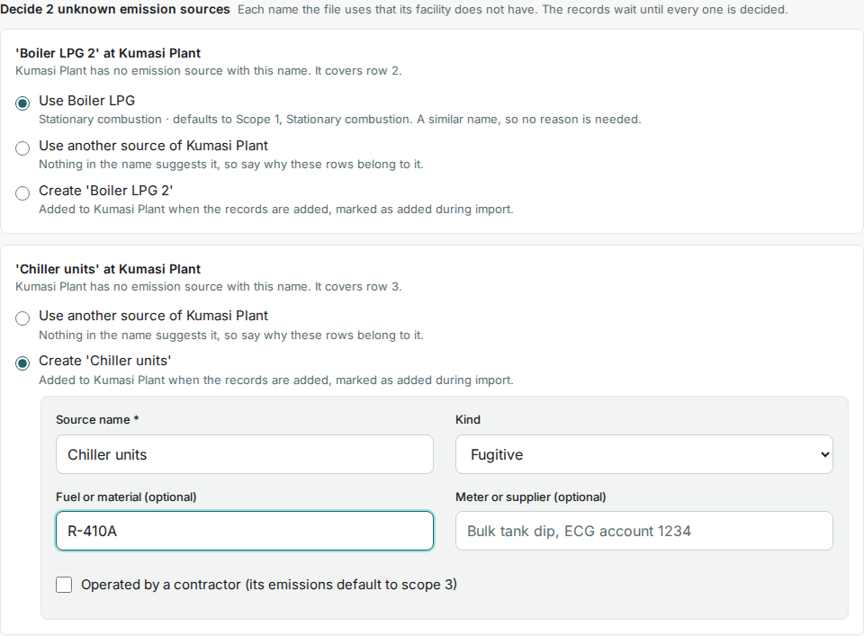

# Import records from a spreadsheet

An import brings several source records into the register at once, after a preview you check against the spreadsheet's footer. The file is kept with the records it creates.

<!-- sources: specs 04.5, 04.6, 04.10 and 04.11 (the page, the workbook, the decisions, the stages); QA procedure 3 cases A1, A2, B1 and J1; ImportActivitiesPage.tsx (page text, the decision cards, the stages, "Add records"), ImportDecisionCard.tsx, ActivityPage.tsx (toast), ActivityImportService.java (warnings, rejections); screen text and figures from the local walkthrough of 2026-10-05 -->

## Before you start

- The facilities the rows name exist; the import matches the `facility` column by name. An emission source the file names and the facility does not have is decided in the preview, so the sources need not exist first.
- The file follows [Prepare the spreadsheet](prepare-the-csv-file.md): one row per record, a CSV or an XLSX of up to 5 MB. A workbook is read from its first sheet.
- You are a Preparer, Reviewer or Owner of the organization.

## Import the file

1. Open **Activity data** and click **Import**. The page **Import activity data** opens, under the breadcrumb **Activity data › Import**.
2. Starting from scratch, click **Download CSV template** under **Use the activity template**. **What each column must contain** opens the column reference.
3. Under **Select your completed spreadsheet**, click **Choose a CSV or XLSX file**, or drop the file on the page. The page reads "Uploading…" with the percentage, then "Checking *N* rows…" (for a workbook, "Checking the workbook…").
4. Check **Control totals** against the spreadsheet's footer: rows and summed quantity per facility and emission source.
5. Read **Worth a look before adding**. These warnings do not stop the import.
6. Decide each name under **Decide *N* unknown emission sources**, if the block appears; see the next section.
7. Read the list of records to add, for example "7 records to add".
8. Click **Add records**. The page reads "Adding *N* records…" and returns to **Activity data**.

What you see: "7 records imported." and one row per record in the register, numbered in the order of the file (ACT-0001 to ACT-0007 for Gye Nyame Gold). When the import created emission sources, the message goes on: "1 emission source added during import." Rows the preview counted as "7 rows: reference only, nothing attached" carry "ref" in the attachments column. Row numbers in the preview count the header as row 1, as the spreadsheet does.

## Decide an unknown emission source

When a row names an emission source its facility does not have, nothing is rejected and nothing is matched silently. The row's status reads **Needs a decision**, and the preview lists the name once, with the rows it covers, under **Decide *N* unknown emission sources**. For each name, tick one of:

- **Use *name***, offered when the facility has a source with a similar name (as the record form offers it). No reason is needed: the preview proposed it.
- **Use another source of *facility***: choose the source and fill **Why this source?** with at least 10 characters, because nothing in the name suggested it.
- **Create '*name*'**: the source is described as the record form describes one (**Source name**, **Kind**, **Fuel or material**, **Meter or supplier**, **Operated by a contractor**). When a similar name exists, **Why is this a different source?** is required too.

**Add records** stays disabled until every name is decided. A source created here is marked "added during import" on the facility's **Emission sources** page, and the organization's history records each mapping with the rows it covered.

## What the warnings mean

- "The workbook has *N* sheets; only '*Sheet1*' was read.": only the first sheet imports.
- "quantity came from a formula; the saved value is the cached result": the cell is a formula, so the figure is what the spreadsheet last calculated. Check that it was recalculated before saving.
- "Row 8: the period is longer than one month (2025-12-15 to 2026-01-15); monthly rows make the coverage matrix and cut-off checks precise": the row imports as it is.
- "matches draft *ACT-NNNN* (same facility, activity and period): the draft stays on file, complete or remove it": the row adds a new record next to the draft. Complete or remove the draft, so the register does not hold both.
- "'*Source*' mixes units in this file:" followed by the units: allowed, but worth checking.

## If the file is rejected

The preview reads "Nothing will import: *N* rows rejected. Fix them and choose the file again." and names each row with its problems, for example "no facility named 'Plant 2'". Nothing is added while any row is rejected. Every rejection message is listed in [Prepare the spreadsheet](prepare-the-csv-file.md#columns).

## What happens next

The records carry no scope, category or factor; an inventory decides those when it reviews them, see [Review and classify records](../inventories/review-and-classify-records.md). An inventory that already reviewed the organization's records sees the new ones once **Review activity data** is run again. Each record's history names the imported file; for a workbook, **Source documents** keeps the file as uploaded and the table as it was read.
