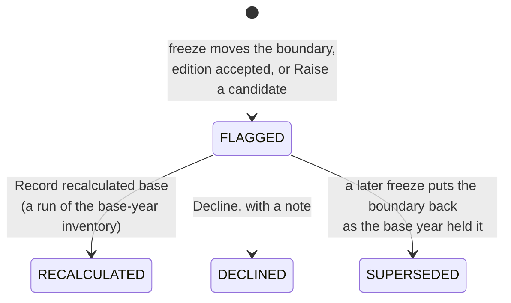

# When must I recalculate the base year?

A base year is the year later inventories are compared against, and the
GHG Protocol's chapter 5 asks a company to recalculate it when a
structural change, a change of methodology or the discovery of a
significant error makes the comparison unfair. CarbonOS records the base
year with the policy that says when that happens, raises a candidate for
recalculation whenever a change may require one, and holds the signature
on later years until the candidate is decided. This page explains the
designation, the three triggers, what a candidate is, and how a decision
is recorded.

<!-- sources: specs 06, 06.1; BaseYearPage.tsx; api.ts RecalculationStatus and RecalculationTrigger; InventoryService.java base-year gate; Validation.java holdsFinal (PR #101); governance QA 008 verified 2026-09-24 -->

## Designating the base year

On **Base year** you choose the inventory whose period is the base year,
a significance threshold as a percentage of base-year emissions, a reason
("The Standard asks for a year with verifiable data and the reason for
choosing it"), and a convention for mid-year structural changes: from the
transaction date, which is what membership windows do, or for the whole
year, as the Standard recommends. The base-year figure is the inventory's
final run; the page prints "Base-year run: Run 001 · 56.06 t CO₂e".

The designation sweeps the years already frozen: an inventory whose
boundary already differs from the base year's is weighed at once, and
its candidate appears without a new freeze.

## The three triggers

| Trigger | Example | Who raises it |
| --- | --- | --- |
| Structural change | A facility sold, acquired or moved between entities; a membership window changed. | A freeze whose boundary differs from the base year's raises the candidate automatically, weighed by the affected facilities' share of base-year emissions. |
| Methodology change | A new emission factor vintage, a changed calculation method. | Accepting a factor pack update raises one where the base year exists; otherwise **Raise a candidate** with the affected share, or a comparison run of the base-year inventory. |
| Significant error corrected | A quantity or a factor found to be wrong in the base year. | **Raise a candidate**, with the affected share or a comparison run. |

Organic growth or decline, and a facility that did not exist in the base
year, are not triggers, and the page says so.

## What a candidate is

A candidate's card states what changed, the share of base-year emissions
it affects, and whether that is above the threshold: "structural change:
Harbour Depot removed; 23.74% of base-year emissions, above the 5%
threshold, recalculation required", or "2.87% of base-year emissions,
below the 5% threshold, recalculation optional". Changes accumulate: a
candidate is weighed on its own and together with the earlier ones still
outstanding since the base year or the last recalculation, declined ones
included, so several small changes can cross the threshold together.

## What a candidate holds

An undecided candidate above the threshold, under the same consolidation
approach as the base year, holds the final designation and the
publication of every inventory that reports against the base year. The
Base year gate carries the error, and **Mark as final** is refused with
the reason: "The 2025 base year has a recalculation candidate above the
significance threshold (…). An inventory that reports against the base
year cannot be marked final until the recalculation is completed or
declined. Calculation runs stay available, because quantifying the
movement is how a recalculation is assessed." An inventory under another
approach gets a warning instead, and is not held.

## Deciding

**Record recalculated base** offers only the runs of the base-year
inventory, each with its total; you name the one that now stands as the
base and the card reads RECALCULATED with your email. **Decline** takes a
note and reads DECLINED. Either decision releases the hold. A candidate
raised by a boundary change is SUPERSEDED without a decision if a later
freeze puts the boundary back exactly as the base year held it: the card
says "put back in boundary version 3 as the base year held it".

A run's report prints the base year section: the year, the threshold,
the convention, the reason, the base-year run and its total, and the
recalculation history. If the run and the base year use different GWP
sets, the section says so, because the required-gases amendment
recommends the same set for both.

## Riverside's depot

Riverside designates FY2025 as its base year with a 5% threshold. In
2026 it sells Harbour Depot and leaves the depot out of FY2026 with the
reason "Depot sold on 2026-01-31; no operation in the period". Freezing
FY2026 raises a FLAGGED candidate: the depot's delivery fleet was 13.31 t
of the base year's 56.06 t, 23.74%, above the threshold. FY2026 can still
be run, but its run cannot be marked as final until the owner records a
recalculated base (a run of FY2025 without the depot, launched from a
correction that leaves it out) or declines the candidate with the reason
recorded. If the sale fell through and the depot were put back before
the next freeze, the candidate would read SUPERSEDED instead.

## What the product decides and what you decide

CarbonOS computes the share, compares it with the threshold you set,
holds the signature while the question is open, and keeps the answer.
Whether the base year should be recalculated, and to what, is the
organization's decision under the Standard; the candidate is the record
that the question was asked and answered.
