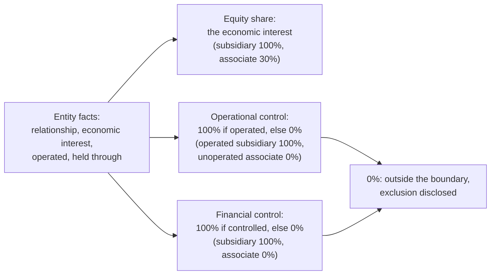

# Which operations belong in my inventory?

An inventory's organizational boundary answers one question: which of
the organization's operations count, and at what share. CarbonOS
answers it from the facts you recorded about each legal entity and the
consolidation approach the inventory uses, following Table 1 of the GHG
Protocol Corporate Standard. This page explains the three approaches,
how a relationship becomes a share, what a membership window is, and
what the product does with an operation that falls outside.

<!-- sources: specs 03, 03.1, 03.2, 03.3, 03.4; format.ts relationshipLabels, approachLabels, conventionLabels; BoundarySection.tsx; EntityFormModal.tsx; governance QA 002 B, 004 A and B verified 2026-09-24 -->

## Three approaches

The GHG Protocol lets a company consolidate its emissions in one of
three ways, and asks it to say which. You choose the approach when you
create an inventory, and it cannot change afterwards; a second inventory
over the same period can use another approach, and
[copying a view](../tasks/index.md) carries the decisions across.

| Approach | An operation counts | Its share is |
| --- | --- | --- |
| Equity share | When the company holds an economic interest in it | The economic interest, as a percentage |
| Financial control | When the company can direct its financial and operating policies | 100% or 0% |
| Operational control | When the company, or one of its subsidiaries, operates it | 100% or 0% |

The Standard's chapter 3 defines the approaches and says the choice is
the company's; CarbonOS enforces only that an inventory has one and that
every share follows from it.

## From a relationship to a share

Every legal entity carries the facts Table 1 needs: its relationship to
the reporting company, its economic interest, whether the company
operates it, whether the company financially controls it where that
differs from the relationship, and the parent it is held through. The
reporting company itself is there by definition, at 100% under every
approach, and cannot be removed or given a relationship.

An entity held through another takes the parent's share times its own,
because the Standard applies the consolidation policy at every level of
the group. A chain cannot loop: making an entity its own ancestor is
refused with "a parent chain cannot loop."

The five relationships CarbonOS records are the five rows of Table 1:
"Group company or subsidiary (financial control)", "Joint venture,
partnership or operation (joint financial control)", "Associate or
affiliate (significant influence, no control)", "Fixed-asset investment
(no significant influence)" and "Franchise (consolidated only with equity
rights or control)". The **Legal entities** page prints, for each entity,
the share it would carry under each of the three approaches.

## What the Boundary tab starts from

When you create an inventory with **Start with every operation the
approach includes in the boundary** ticked, the **Boundary** tab already
holds every entity with a share under the approach, and its facilities.
An entity with a 0% share under the approach is placed outside, its
checkbox disabled, and its row asks "Why is it left out?", because the
Standard asks a company to disclose the operations its approach leaves
out. Riverside's associate, if it had one, would sit outside an
operational-control inventory at 0% and inside an equity-share inventory
at 30%.

On the tab you can:

- Untick a facility, or an entity. Unticking an entity's only facility
  unticks the entity, and the reason control appears on the entity's row.
  A facility that is neither in the boundary nor excluded with a reason
  holds the run: "'Harbour Depot' (Riverside Distribution Ltd) is neither
  in the boundary nor excluded with a reason. Tick it in, or record why it
  is left out."
- Choose a reason for an operation left out: Non-GHG activity, Duplicate,
  Not applicable, Methodology exclusion, Other documented reason, and so
  on, with a detail. The report discloses the exclusion.
- Override the economic interest for this inventory only. The gate warns
  that the treatment in the view differs from the entity record; the
  entity itself is unchanged.
- Set a membership window.

## Membership windows

An entity acquired or disposed of during the period counts from the
transaction date. **Member from** is prefilled from the entity's
acquisition date and **Member until** from its disposal date; a window
that ends before it starts is refused. A record dated before the window
is excluded on review with the computed detail "member from 2025-07-01",
and the Reporting boundary gate carries a warning that the membership is
partial, which the report discloses. The organization's base-year policy
says whether structural changes are accounted from the transaction date
in this way or for the whole year, as the Standard recommends; see
[When must I recalculate the base year?](base-year-and-recalculation.md).

## What the freeze fixes

When you freeze the inventory, the boundary as it stands becomes boundary
version 1: every entity and facility in it, their shares, their windows,
and the exclusions with reasons. Runs cite that version, a verifier can
open it, and a later reopen and freeze cuts version 2 without touching
version 1. A freeze whose boundary differs from the base year's is also
what raises a base-year recalculation candidate.

## Riverside under the three approaches

Riverside Bottling Ltd operates both its sites, and Riverside Distribution
Ltd is a wholly owned, operated subsidiary. Under all three approaches
both entities count at 100%, so the three views would report the same
total. The differences appear the moment a partly owned or unoperated
operation joins: an associate at 30% would add 30% of its lines under
equity share and nothing under the two control approaches, with a
disclosed exclusion. Which of the three views a company reports is a
choice the Standard leaves to it; CarbonOS records the choice on the
report's first page.
