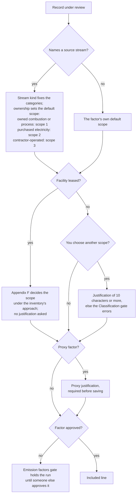

# How does CarbonOS decide a record's scope?

It does not; you do. A record carries no scope, category or emission
factor, because those are accounting decisions an inventory makes about
a fact, and two inventories may make them differently. What CarbonOS
does is suggest the default from the record's source stream and the
facility's lease, apply the GHG Protocol's rules for the cases the
Standard settles, and ask you to say why when you depart from them. This
page explains where the default comes from, when a justification is
required, and how a factor, a density and a proxy fit in.

<!-- sources: specs 04, 04.1, 04.2, 04.3, 04.4, 04.7, 04.8, 02.2; AssignmentDrawer.tsx; format.ts streamKindLabels, leaseLabels, categories, exclusionLabels, estimateStateLabels; governance QA 005 A to E verified 2026-09-24 -->

## What review does first

**Review activity data** on the **Records** tab brings the organization's
records into the inventory and decides the obvious ones without asking:
a record dated outside the period is excluded as Outside reporting
period; a record at a facility that is not in the boundary, or dated
before its entity's membership window, is excluded as Outside boundary,
with the computed detail; a removed record is excluded as Record removed.
Everything else is Unclassified, and the Classification gate holds the
freeze until each is classified or excluded.

## Where the default comes from

A **source stream** is a named source at a facility with a kind, such as
Stationary combustion or Purchased electricity, and a statement of
whether a contractor operates it. The kind fixes which categories the
record can be classified into; the ownership sets the default scope. A
boiler the company owns defaults to scope 1, stationary combustion; a
grid meter to scope 2, purchased electricity; a delivery fleet a
contractor operates to scope 3, category 1, because the Standard's chapter
4 puts a contractor's combustion in the customer's scope 3. Riverside's
delivery fleet diesel lands in scope 3 with no justification asked, and
the drawer says why.

A record with no stream takes the factor's own default scope, and the
drawer's picker shows the factor's suggested scope beside it. The
**Emission factors** page says the same thing: "A factor suggests a
scope; the classification decides."

## Leases

A facility's lease type is a fact of the facility, and every record at it
inherits the lease. Appendix F of the Standard settles the scope of a
leased asset under each approach, and CarbonOS applies it without asking
for a justification: under operational control a site leased in is the
lessee's scope 1 and 2; under equity share or financial control a finance
lease is scope 1 and 2 and an operating lease is scope 3, category 8. The
drawer prints "Leased facility: operating lease (leased in) inherited."
so the reader sees where the treatment came from.

## Departures, proxies and approval

If you choose a scope other than the default, the drawer says "The
stream suggests Scope 1." and opens a **scope justification** field. The
Classification gate carries an error until the justification has 10
characters: "'Boiler LPG' is classified in scope 3; its stream 'Boiler
LPG' defaults to scope 1. Record why (a justification of at least 10
characters), or classify it in scope 1."

A factor that stands in for one that is not published or not yet
approved is a **proxy**. Ticking **proxy factor** opens a justification
field, and nothing is sent to CarbonOS until it is filled: the rule "A
proxy factor needs a justification: say what the factor stands in for" is
met in the drawer before the API is reached.

A factor must be **approved** before a run can use it. Choosing an
unapproved one is allowed (the picker offers it under **Show unapproved**),
but the Emission factors gate errors until someone other than the person
who entered it approves it under **Emission factors**.

## Units and densities

CarbonOS converts a quantity into the factor's unit only within one
physical dimension: litres to cubic metres, kilowatt hours to megawatt
hours. When a record's unit is a mass and the factor is per litre, the
drawer asks for a density: "tonne meets a factor per litre: choose the
density that converts between them". A shipped **typical value** (Diesel,
0.84 kg per litre) is a planning value: a run may use it, a final run may
not, and the gate says so until you record the supplier's density under
**Units** or flag the classification as a proxy with a justification.
The drawer previews the arithmetic where a unit converts ("3 tonne →
3,603.6036 litre (density of Diesel (supplier CoA), 0.8325 kg/litre) ×
2.66155 kg CO₂e/litre"); where the record's unit is the factor's own,
there is no preview line.

## Records that straddle the period

A record whose period crosses the inventory's boundary, or an entity's
membership window, is pro-rated by days, and the completeness gate says
so: "17 of 32 days fall inside the reporting period and the membership
window: the run pro-rates it to 53.13%." Riverside's year-end LPG bill
of 800 litre counts 425 litre in 2025. If the inventory's straddle
treatment is **Block the run until the record is split**, the same
finding is an error instead, and the record must be split at the cut-off
or excluded.

## Exclusions without a false zero

A record you leave out is excluded with one of the reasons the drawer
offers, a justification of at least 10 characters, and one of three
statements about what it would have emitted: an estimated magnitude in
kg CO₂e, "This record emits nothing", or "Not estimated: there is no basis
to size this record". The report totals the exclusions per reason and
never prints "about 0 kg" for something nobody sized. A refrigerant that
is a Montreal Protocol gas rather than a Kyoto gas takes the reason
**Outside the scopes: Montreal Protocol gas** and a gas name instead of a
magnitude, and the report lists it in its own section outside the scopes.
That reason is offered only on a record whose unit is a mass.

## What the product checks and what it leaves to you

CarbonOS checks that every included record has a factor, that a
departure and a proxy carry a justification, that a factor is approved,
that a conversion stays in one dimension, and that the declaration and
the classifications agree. It does not check that the factor you chose is
the right factor for the activity, that the stream is the right kind, or
that the justification is a good one. Those are the accountant's
judgments, and the record of them is what the reviewer and the verifier
read.
