# Where do the numbers come from?

Every line of a run multiplies a quantity by an emission factor, and
every factor in CarbonOS has a source, a year, a unit, a gas split and
the dates it is valid for. Factors reach an organization by importing a
pack edition the platform publishes, or by hand. This page explains what
a pack, a family and an edition are, what a version and a vintage mean,
why a factor must be approved, and what happens when the platform
publishes a new edition of a pack you hold.

<!-- sources: specs 02.1, 02.3, 02.5, 02.6, 02.7, 02.9, 02.11; EmissionFactorsPage.tsx intro and packs card; AdminFactorPacksPage.tsx intro and statusHints; FactorPackUpdatesPage.tsx; AdoptionDiffDrawer.tsx; governance QA 002 F and G, 005 B7, 007 A to F verified 2026-09-24 -->

## Packs, families and editions

A **factor pack** is a family of editions of one publication. CarbonOS
ships two families: the UK Government (DESNZ) GHG conversion factors, as
the editions `defra-2025` and `defra-2026`, and the Ghana grid
electricity and transmission-loss factors, as the edition `ghana`. An
**edition** is one dated release, named by an identifier a report cites,
and it applies from a date: `defra-2026` applies from 1 January 2026.
Once an edition is published, its rows and values never change again,
because reports rest on them; a wrong value is corrected by a new edition.

On **Emission factors** the **Factor packs** card lists every published
edition with **View the factors in …** and **Import pack**. Importing an
edition adds its factors to the organization with their citations and
says what it did: "defra-2025, applying from 2025-01-01: 1928 added, 0
versioned, 0 tagged, 0 unchanged."

## Lineages, versions and vintages

A factor's code is the same across editions, so the same row in
`defra-2025` and `defra-2026` is one **lineage** with two **versions**,
each valid for its own dates. Importing a later edition never overwrites
a value: it closes the version you hold at the day before the edition
applies and cuts a new one from that date. The **Emission factors** page
shows "2 versions of this factor", one `defra-2025` valid to 31 December
2025 and one `defra-2026` from 1 January 2026, and the picker in an
inventory offers only the versions live in the inventory's period. That
is what a **vintage** means: a reported year keeps the factors it
reported with.

An edition can also drop lineages its predecessor carried. The import
says so ("445 lineages this edition drops, retired by nobody") and names
them, because a row that vanished from the publication is a fact a
verifier asks about.

## Approval is a control

A factor can be applied only once it is approved, and it is approved by
someone other than the person who entered it: "You entered 'Long-haul
flights (supplier)'. A factor is checked by someone other than the person
who typed it (Corporate Standard chapter 7): ask *name* to approve it."
Rows imported from a published edition arrive approved, because the
platform's two-administrator publication already checked them. Two kinds
of row arrive unapproved on purpose: a factor you enter by hand, and a
derived row a pack ships for you to check, such as the Ghana
transmission-loss factor, which is computed from the grid intensity and a
loss rate rather than published. Until someone approves it, the
**Method** tab does not offer it in an upstream rule, and a record
classified with an unapproved factor holds the run.

When nobody else is a member of the organization, the approval is
recorded as "(self-approved: nobody else could check it)" and the
report prints that sentence in its methodology section.

## Hand-entered factors

**Add factor** takes a name, a suggested scope and category, a unit, the
kilograms of CO₂e per unit, the gas masses where the source publishes
them, a blend composition for a refrigerant blend, the GWP basis of the
published figure, the source, and the publication and data years. A
blend's mass fractions must add up to 1. A hand-entered factor that no
run has applied can be deleted; one a run applied cannot, and is retired
by setting its validity end instead: "was applied by a calculation run.
Set its validity end to retire it instead of deleting it."

## How an edition is published

```mermaid
stateDiagram-v2
    accTitle: The states of a factor pack edition
    accDescr: An edition starts as a draft, created empty or cloned from a published edition. A draft that was never published can be deleted. Publishing needs every row to pass the rules, a source document on file with its checksum, an applies-from date, and an approver who is not the curator; the edition is then published and can be imported. When a later edition of the family is published, the earlier one is superseded: readable, not importable. A published edition can be withdrawn with a reason; it stays readable and every open notice for it closes.
    [*] --> DRAFT: New edition, or Clone
    DRAFT --> [*]: Delete draft
    DRAFT --> PUBLISHED: Publish<br/>(rules pass, source document with SHA-256,<br/>applies-from date, approver is not the curator)
    PUBLISHED --> SUPERSEDED: a later edition of the family is published
    PUBLISHED --> WITHDRAWN: Withdraw, with a reason
```



The platform's administrators maintain the catalogue under **Factor
packs** in the administration console. A draft is invisible to
organizations and its rows can change; a validation report lists every
row that breaks a rule (a code without its segments, an unregistered
unit, a missing data year), and publication is refused while any stands.
Publishing needs the source document the edition was transcribed from,
stored with its SHA-256 checksum, the date the edition applies from, and
an approver who did not build the draft; the dialog shows each condition
as met or not met, and the **Blast radius** drawer shows what would move
in each organization if it adopted the edition. Publishing changes no
organization's numbers.

## What a new edition changes for you

```mermaid
sequenceDiagram
    accTitle: From a published edition to an organization's decision
    accDescr: When an administrator publishes an edition, CarbonOS raises one notice for every organization that holds a predecessor of it, shown under Updates with a badge. A reviewer or owner opens the notice, reads which factors move and by how much, and either accepts it, answering how chapter 5 of the Standard treats the adoption, or declines it. Accepting cuts new versions from the applies-from date and may raise a base-year candidate; declining moves nothing. If the publisher withdraws the edition, the notice closes with the reason. A preparer can read the notice but not decide it, and support access cannot decide it either.
    participant P as Platform administrator
    participant C as CarbonOS
    participant R as Reviewer or owner
    P->>C: Publish an edition
    C->>R: One notice under Updates ("1 factor pack update waiting")
    R->>C: Review: what moves, by how much, earlier periods, diff hash
    alt Accept
        R->>C: Answer "How does chapter 5 treat this adoption?" and Accept
        C-->>R: "Adopted defra-2026: 1483 versions cut, 385 lineages added." History: Factor pack adopted
    else Decline
        R->>C: Decline
        C-->>R: Notice reads Declined; nothing moves
    else Withdrawn
        P->>C: Withdraw the edition, with a reason
        C-->>R: Notice reads "Withdrawn by the publisher"; nothing to decide
    end
```

A notice names the edition and its predecessor, the date it applies
from, every lineage it carries with the value you hold and the new value,
which rows move by more than five percent, the estimated movement in
kilograms of CO₂e from your last completed run, and the reported periods
that end before the applies-from date, because those will carry coverage
warnings once the new vintage is live. Accepting asks one question the
Standard's chapter 5 wants answered and keeps the answer: a vintage
progression (the edition applies to the next reporting year forward), a
retrospective adoption, or an erratum. If the organization has a base
year, accepting a methodology change or an erratum, or a progression at
or above the significance threshold, raises a recalculation candidate.

An edition that applies from a date inside a published period cannot be
accepted: "A reported period keeps the factors it reported with, so this
edition cannot be accepted until that inventory is reopened. Declining
stays available."

## What this means for a figure

A run line names the factor, its value and its version, and the report's
factor table prints the edition and the applies-from date for every
factor used, so a reader can find each number in the publication it came
from. What the product does not decide is whether the factor is the
right one for the activity, whether a proxy is acceptable, or whether a
new edition should be adopted this year; those are the organization's
decisions, and CarbonOS records them.
