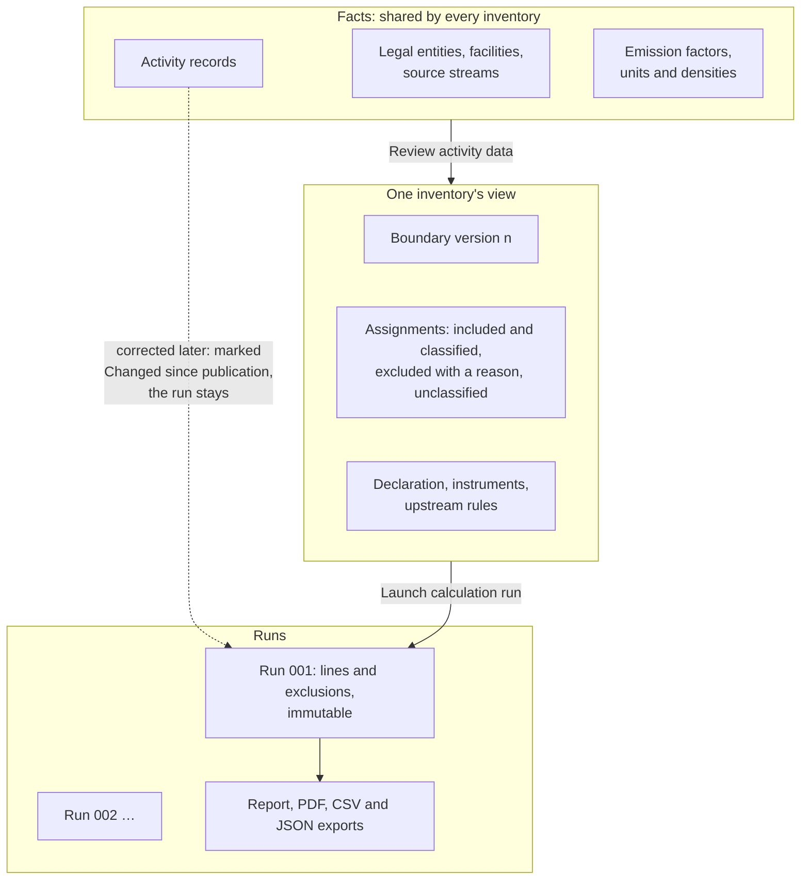

# Why does changing a record not change last year's report?

Everything in CarbonOS is one of three kinds of thing: a fact about the
organization, an inventory's view of those facts, or a run that
calculated the view at a moment. Keeping the three apart is what lets a
published report stand still while the facts behind it keep being
corrected. This page explains the three kinds, what each one owns, and
what a change to one does to the others.

<!-- sources: spec 00 (three invariants); specs 02, 04, 04.4, 05, 05.1, 05.2, 05.3; OverviewPage.tsx intro sentence; governance QA 003 E, 006 A, 006 F verified 2026-09-24 -->

## Three kinds of thing

**Facts** describe the organization and what it did. Legal entities with
their Table 1 facts, facilities with their lease and grid, source
streams, activity records with quantities, periods and evidence, the
factors it holds, its units and densities. Facts belong to the
organization, and every inventory reads the same ones. A fact is
corrected in place, with a reason, and its history keeps the old value.
"Fact" describes the role of these records, not a guarantee: the product
keeps what you entered and the evidence you attached; whether the figure
is right is your judgment.

**A view** is one inventory's accounting decisions about the facts, for
one period under one consolidation approach. It owns the boundary
(which entities and facilities count, with what share, between which
dates), an assignment for every record (included with a factor, scope and
category, or excluded with a reason), the scope 3 declaration, the scope 2
instruments and the upstream rules. Two inventories over the same facts
can report different totals, and both are right for their approach: an
equity-share view brings an associate in at 30%; an operational-control
view leaves it out.

**A run** is the view calculated. It copies every input it used into its
lines: the quantity as converted, the factor and its version, the
accounting share, the period share, the result per gas. Nothing edited
later changes a run, so a report that cites "Run 001" always finds the
same numbers.

## What a change does

| You change | What it affects | What it does not affect |
| --- | --- | --- |
| A fact (a quantity, a period, an entity's share) | The fact and its history. Every inventory that reads it, the next time it is reviewed or run. | Any run already launched. A published inventory's view marks the record "Changed since publication: quantity" and the report stays as issued. |
| A view (a classification, an exclusion, the boundary) | This inventory only, and only while it is a draft. | The facts, other inventories, and the runs already launched. |
| A run | Nothing: a run cannot be changed. A wrong run is voided with a reason and stays listed under its number. | |

CarbonOS never updates a report by itself. Reviewing brings facts into a
view when you click **Review activity data**; a run is calculated when you
click **Launch calculation run**; and the report you publish is the run
you designated as final. If a fact changes after that, you decide whether
the year needs a correction inventory, which supersedes the published
report with a new report version.

## The example

Riverside's preparer imported June's electricity as 6,000 kWh and
corrected it to 60,000 kWh before the first run, with the reason
"Meter reading was missing a zero; invoice shows 60,000 kWh". The record's
history keeps both values and the reason; the run launched afterwards
reads 60,000 kWh.

Later a second invoice shows 61,000 kWh. Correcting the record again does
not touch FY2025's published report: the record in that inventory's view
reads "Changed since publication: quantity", and Run 001 still shows
60,000 kWh and 28,128.54 kg. To restate the year, the reviewer creates a
correction, a new inventory that inherits every decision, and its run
reads 61,000 kWh. Its report says "Report version 2, supersedes FY2025"
and lists what changed against the published run.

## Why the separation is worth the extra step

A single figure often rests on a chain: a fact, a factor version, a share
from Table 1, a classification, a boundary version, a run. If any link
moved silently, a verifier could not follow the chain back, and a
reviewer's signature on a run would mean nothing a month later. Keeping
facts, views and runs apart is what makes the chain hold: each link is
recorded once, with who did it and when, and a change to one is a new
record rather than a rewrite. The price is that a correction after
publication takes a deliberate act rather than a silent update, and the
lifecycle page explains what that act does:
[What do Draft, Frozen, Final and Published mean?](the-inventory-lifecycle.md).
