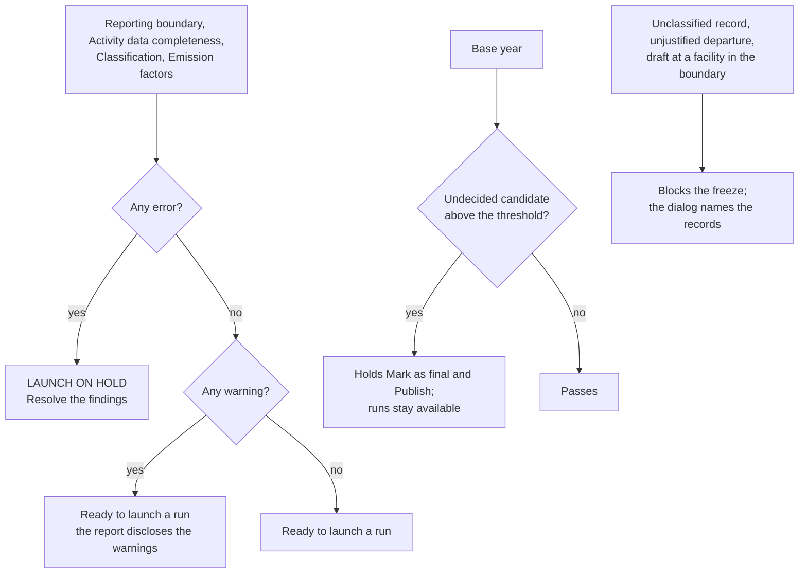

# Why is the launch on hold?

Five checks, the pre-flight gates, read an inventory the whole time it is
a draft or frozen, and say whether a calculation run may launch. This page
explains what each gate looks at, the difference between an error, a
warning and a note, the one gate that never holds a run, and how the
gates relate to the freeze.

<!-- sources: PreflightPanel.tsx (PASS/WARN/HOLD, READY TO LAUNCH/LAUNCH ON HOLD); PreflightBanner.tsx sentences; LifecycleBar.tsx freeze blockers; Validation.java Report.ready and holdsFinal (PR #101); InventoryService.java finding sentences; specs 05, 05.5, 05.7, 06.1, 07.6; governance QA 004 B to D, 005, 008 B verified 2026-09-24 -->

## Where you see the gates

The **Records** tab of the workbench carries the panel **Pre-flight
checks**, one row per gate with its status PASS, WARN or HOLD and its
findings underneath. Every other tab, and the workbench header, carries
the one-line banner: "Ready to launch a run" or "Launch on hold", with
the gate that is holding ("Reporting boundary is blocking.") and a
**Resolve the findings** link back to the panel. The gates recompute after
every change you save; you never run them by hand.

## The five gates

| Gate | What it reads | Typical findings |
| --- | --- | --- |
| Reporting boundary | The boundary versus the entity facts: shares, membership windows, facilities in or out, exclusions with reasons. | A facility neither in the boundary nor excluded with a reason (error). An entity with a 0% share under this approach left out without a reason (warning). A share in this view that differs from the entity record (warning). A partial-period membership (warning). "The inventory is a draft. Freeze it to enable a run." (error, on every draft). |
| Activity data completeness | The organization's records against the inventory's view. | Records not yet reviewed (warning). A record that straddles the period, with the days inside and the share the run will apply (warning; an error when the inventory blocks straddling records). A record citing a document reference with nothing attached (note). A record's data quality tier (note). |
| Classification | Every included record's scope, category and factor, and the scope 3 declaration. | An included record with no factor (error). A scope that departs from the stream's default without a justification (error). A declared scope 3 category with no lines and no reason (warning). Records classified into a category the declaration does not list (warning). The upstream rules in force (note). |
| Emission factors | The factors, densities and instruments the lines rest on. | A factor that is not approved (error). A typical density, a planning value a run may use and a final run may not (warning). A factor that publishes CO₂e only, so its gases cannot be split (warning). An instrument that fails or has not answered a Scope 2 Quality Criterion (warning). An instrument covering more electricity than the facility used (warning). No statement about the residual mix (warning). |
| Base year | The base year's recalculation candidates against this inventory. | An undecided candidate above the threshold under the same consolidation approach (error, but see the next section). The same under another approach (warning). A base year on a different GWP set (warning). |

## Errors hold, warnings fly, notes inform

An error (✕) sets the gate to HOLD and holds the launch. A warning (▲)
sets the gate to WARN and lets the run launch; the run carries the
condition into its lines and its report, where a reader sees it. A note
(ℹ) records something a verifier may ask about, such as the data quality
tier of a record, and holds nothing.

A warning is not a defect to clear before you may proceed. A partial
membership window is a fact about the year; a factor that publishes
CO₂e only is a fact about the source. The report discloses both.

## The gate that never holds a run

The **Base year** gate is different. When a recalculation candidate above
the significance threshold is undecided, later inventories under the same
approach cannot be marked as final or published until the candidate is
recalculated or declined, and the gate says so with an error. Runs stay
available, and the banner reads "Base year holds the final designation;
runs stay available." That is deliberate: quantifying the movement is how
a recalculation is assessed, so the product must let you run while it
holds the signature.

## Gates and the freeze

The gates decide whether a run may launch. A separate, shorter list
decides whether the inventory may be frozen at all: an included record
with no factor, a scope departure without a justification, and a draft
record at a facility in the boundary each block the freeze, and the freeze
dialog names them ("8 records are not classified; classify or exclude
them first"). A boundary omission does not block the freeze, because the
boundary and its exclusions can be settled in either order; the Reporting
boundary gate holds the run until it is.

## What clears a finding

Every finding is one sentence that names the record, entity or factor and
what to do. Some examples, as the panel prints them:

- "'Harbour Depot' (Riverside Distribution Ltd) is neither in the boundary nor
  excluded with a reason. Tick it in, or record why it is left out." Tick
  the facility in on the **Boundary** tab, or choose a reason on its
  entity's row.
- "'Forklift diesel' converts through the typical density of Diesel (0.84
  kg/litre), a planning value. A run may use it; a final run may not:
  record the supplier's density, or flag the classification as a proxy
  with a justification." Record the density under **Units** and choose it
  in the drawer, or tick **proxy factor** and say why the typical value
  stands.
- "'Chiller refrigerant top-up' uses 'R-410A (composition)', which is not
  approved. Approve it under Emission factors, or choose another." Someone
  other than the person who entered the factor approves it.
- "Scope 3 investments is declared as covered but no included record is
  classified into it: a reader takes 'covered' to mean quantified.
  Classify records into it, or say in the declaration why it is not
  quantified this year." Type the reason under the category on the
  **Boundary** tab and save the declaration.
- "The inventory does not say whether a residual mix is available."
  Choose an answer under the residual mix on the **Method** tab.

The full list of finding sentences, gate by gate, is in the reference
page on pre-flight gates and findings (to follow).
