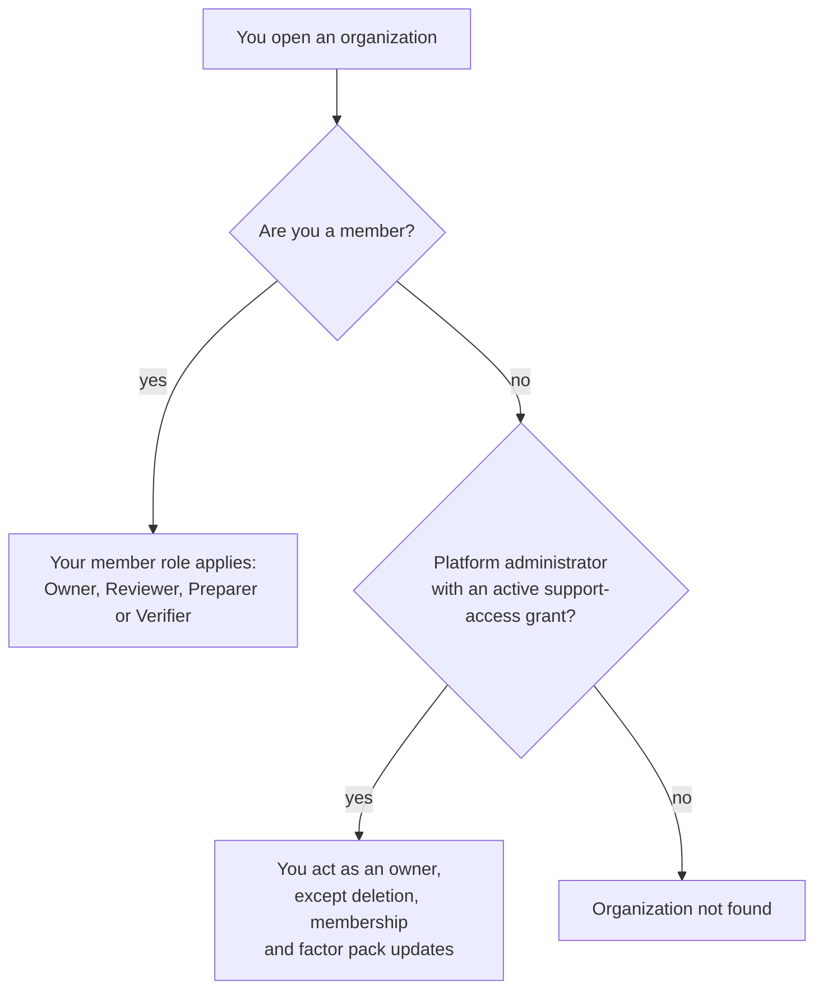

# Who can do what in an organization?

CarbonOS keeps two separate role systems. A platform role sits on every
account and decides whether you may run the platform. An organization
role sits on every membership and decides what you may do inside that
organization. The two almost never meet, and this page explains what each
decides, why an organization is invisible to everyone outside it, and the
one bridge between them.

<!-- sources: specs 01.2, 01.3, 01.4, 01.5; roles.ts; MembersCard.tsx; ReadOnlyBanner.tsx; OrganizationSettingsPage.tsx; SupportAccessBanner.tsx; OrganizationLayout.tsx 404 copy; governance QA 001 E, 002 A, 006 E, 007 C verified 2026-09-24 -->

## The two ladders

| | Platform role | Organization role |
| --- | --- | --- |
| Held by | Every account: Admin or Member | Every membership: Owner, Reviewer, Preparer or Verifier |
| Set by | A platform administrator, under **Users** | An owner of the organization, under **Settings** |
| Governs | The administration console: accounts, access requests, platform settings, the factor pack catalogue, support access | Everything inside one organization: facts, inventories, runs, reports, members |
| Does not grant | Any right inside an organization | Any right over other organizations or the platform |

The person a client would call their administrator is the **Owner**; no
organization role is named admin. A platform administrator is not a
member of any organization by right, and an owner cannot create a login or
change anyone's platform role.

## What each organization role is for

- **Owner** does everything below and also manages the organization
  itself: members and their roles, the details printed on the report
  header, and deletion. The person who creates an organization is its
  first owner, and the organization must always keep one: CarbonOS refuses
  to demote or remove the last owner.
- **Reviewer** (labelled "Reviewer (approves and publishes)") does
  everything a preparer does and also signs: marks a run as final,
  withdraws a designation, publishes, creates a correction, and accepts
  or declines a factor pack update.
- **Preparer** (labelled "Preparer (records, classifies, runs)") records
  and corrects the facts, classifies and excludes records, freezes,
  reopens and launches runs, designates the base year and decides its
  candidates, and imports or enters factors.
- **Verifier** (labelled "Verifier (read-only)") reads everything and
  changes nothing. Every page carries the banner "Your role in this
  organization is Verifier (read-only).", and every control that would
  write is disabled with a tooltip naming the roles that may use it.
  Nothing is hidden: a verifier sees the record, not a blank page.

The exact matrix, act by act, is in the reference page
[Roles and permissions](../reference/roles-and-permissions.md).

## Two checks that are not roles

Two rules apply to everyone regardless of role. A factor is approved by
someone other than the person who entered it; when nobody else is a
member, the approval is recorded as self-approved and the report prints
that sentence. And a role decides who may act, not whether the act is
allowed right now: a preparer may classify, but not while the inventory
is frozen; a reviewer may publish, but not while an undecided base-year
candidate holds the final designation.

## Membership decides visibility

Whether you can see an organization at all depends on one thing: a
membership row for you in it.

Two consequences follow, and both are deliberate:

- A platform administrator who is not a member sees an empty list under
  **GHG accounting**, and an organization's address answers "Organization
  not found". A stranger is not told that an organization exists.
- A verifier sees every page of the organization. Read-only means the
  controls are disabled, not that the data is withheld.

## The bridge: support access

The one way a platform administrator enters an organization is
**support access**: under **Organizations** in the administration console
they assume access with a reason of at least 10 characters, for the
window the platform settings fix (24 hours by default, at most 72). For
that window they act as an owner, every page they open carries the banner
"You are in *organization* under support access until *time*. Every act
is recorded in this organization's history.", and every act they record
is marked as taken under support access.

Three rights never transfer with the grant. Support access cannot delete
the organization, cannot add, change or remove members (there is no
**Settings** entry in the sidebar), and cannot accept or decline a factor
pack update: "Support access cannot adopt an edition for an organization.
That is the organization's own decision, so a reviewer or an owner of the
organization has to make it." The owner sees the grant begin and end in
the organization's history on **Settings**. The concept page
[Can the platform team see my data?](support-access-and-confidentiality.md)
takes this further.

## An example

Riverside Bottling Ltd has four members. Its preparer imports the year's
records and classifies them; the preparer may also freeze the inventory
and launch the run. Marking the run as final is refused for the preparer
with the tooltip "Needs the Reviewer or Owner role.", so the reviewer does
it, and publishes. The verifier, an external assurance provider, reads
the run's lines, the boundary version and the history without a single
write. When the preparer adds a factor by hand for a supplier's product,
the reviewer approves it: the preparer's own **Approve** button is refused
because they entered it.
