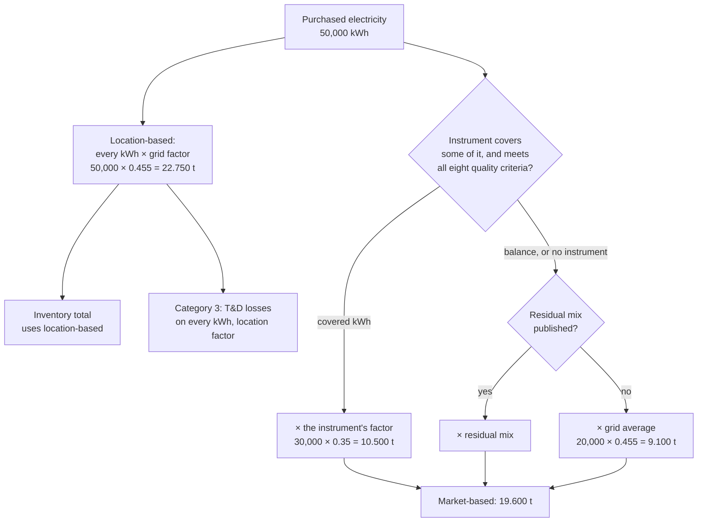

# Why does scope 2 have two figures?

Because the GHG Protocol Scope 2 Guidance asks for two. The
location-based figure prices every kilowatt-hour at the average of the
grid it was drawn from; the market-based figure prices the
kilowatt-hours a contractual instrument covers at that instrument's
factor, and the balance at the residual mix or, where none is
published, at the same grid average. CarbonOS reports both on every
run, side by side, and uses the location-based figure in the inventory
total. This page explains what each figure is made of, what an
instrument has to satisfy to count, and how the report says which
basis it used.

<!-- sources: specs 07.1, 07.3, 07.6; MarketFactorsCard.tsx; RunDetailPage.tsx section 04 and the line's market note; InventoryService.java instrument findings; FY2026 Run 002 on 2026-09-24 (50,000 kWh, one supplier-specific instrument covering 30 MWh at 0.35) -->

## The location-based figure

A record of purchased electricity is classified with a grid factor:
the one the facility's grid region suggests, or another the accountant
chooses. The run multiplies the kilowatt-hours by it, and that is the
location-based figure. Riverside's plant bought 50,000 kWh in the first
quarter of 2026 and the Ghana grid factor for 2026 is 0.455 kg per kWh
in the edition it adopted, so the line reads 22.75 t CO₂e.

The location-based figure is what the inventory total uses ("The total
uses the location-based scope 2 figure."), what the by-gas table splits,
and what the transmission and distribution losses of category 3 are
computed on: "Transmission and distribution losses are computed on
every kilowatt-hour consumed, at the location-based factor, not on the
market-based balance."

## The market-based figure

The market-based figure answers a different question: what did the
company contract for? On the **Method** tab, an instrument is recorded
per facility: a supplier-specific factor, a power purchase contract, an
energy attribute certificate, or a residual-mix factor, with its factor
in kg CO₂e per kWh, the megawatt-hours it covers, its dates, and its
certificate, registry, vintage and retirement as evidence.

An instrument counts only if it meets the Scope 2 Guidance's eight
Quality Criteria, answered one at a time as Met or Not met: "The
instrument is applied only when all eight are met; an unanswered
criterion counts as not met until it is answered." An instrument that
fails is recorded, reported, and not applied: "The instrument for
*facility* does not meet the Scope 2 Quality Criteria (…): the
market-based figure falls back to location-based."

The kilowatt-hours the instrument covers take its factor; the balance,
and every facility without an instrument, take the residual mix where
one is published, or the grid average where none is. Riverside's
supplier-specific instrument covers 30 MWh at 0.35, so the line reads:
"market-based: 19.6 t CO₂e (30,000 kWh at 0.35 kg/kWh (supplier
specific); 20,000 kWh at 0.455 kg/kWh (grid average: the location-based
figure stands, no residual mix is available))".

## The residual mix

A residual mix is the grid's average once the generation claimed by
instruments has been taken out. Where one is published, the balance
should be priced at it, otherwise the same green kilowatt-hour can be
counted by two consumers. Every inventory answers **Residual mix
available** on the **Method** tab, because "Every run reports scope 2
market-based, and the Scope 2 Guidance requires the disclosure either
way". Ghana publishes none, so Riverside answers "No residual mix is
available", and the report prints: "An adjusted emission factor
(residual mix) is not available or has not been estimated to account
for voluntary purchases in the markets the instruments sit in. This
may result in double counting between electricity consumers."

## What the report says

Section 04 prints both figures and, in words, the basis: with no
instrument, "no instrument applied and no residual mix available; the
grid average (location-based) stands in"; with one, "contractual
instruments applied to the kWh they cover; the balance at the residual
mix or grid average." A **Contractual instruments** block lists each
instrument with its factor, coverage, source, evidence and the eight
criteria. When the base year had no instrument, the report adds: "The
base year held no instrument: its market-based figure is the grid
average standing as a proxy."

## What the product checks and what it leaves to you

CarbonOS checks that the instrument's coverage fits the facility's
electricity ("covers 30,000 kWh but the facility's scope 2 electricity
in its period is 0 kWh: the excess covers nothing"), that its dates
fall inside the period, that the electricity is recorded in an energy
unit, and that every criterion has an answer. It does not judge whether
a criterion is truly met, whether the supplier's factor is credible, or
whether the company should buy instruments at all. Those are the
organization's decisions, and the report records them beside the
figures they produced.
