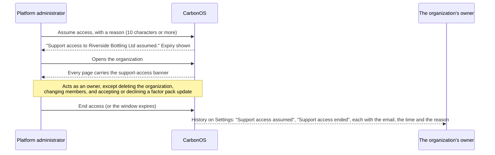

# Can the platform team see my data?

Not without leaving a trace you can read. An organization in CarbonOS is
private to its members; a platform administrator sees only its name, its
owners' email addresses and its member count, and enters it only by
taking support access with a reason, for a fixed window, with every act
recorded in the organization's own history. This page explains what an
outsider can and cannot see, how a support grant works, and what it can
never do.

<!-- sources: specs 01.3, 01.5; AdminOrganizationsPage.tsx intro; SupportAccessBanner.tsx; SupportAccessCard.tsx; OrganizationSettingsPage.tsx history; format.ts actionLabels; governance QA 007 C3 and mining QA 001 verified 2026-09-24; spec 01.8 (account numbers, verified 2026-09-26) -->

## What an outsider sees

Every read and write inside an organization is checked against your
membership in it. Without a membership, the organization and everything
under it answer "Organization not found": entities, facilities, records,
inventories, runs, reports. A platform administrator is an outsider like
anyone else. Under **GHG accounting** their list of organizations is
empty unless they are a member, and the administration console's
**Organizations** page shows each organization's name, its owners' email
addresses, its member count and whether a support grant is live, and
nothing from inside.

## How support access works

The steps, as the product presents them:

1. On **Organizations**, the administrator clicks **Assume access** on
   the organization and types a reason. The button stays disabled until
   the reason has 10 characters; the owners will read it.
2. CarbonOS confirms "Support access to *organization* assumed." and the
   row shows the expiry and **End access**. The window is the platform
   setting **Support access lasts**: 24 hours by default, between 1 and
   72. A grant keeps the window it was taken under; changing the setting
   later never moves a grant that is already live.
3. The organization now appears under the administrator's **GHG
   accounting**, and every page inside it carries the banner "You are in
   *organization* (ORG-*NNNN*) under support access until *time*. Every act is
   recorded in this organization's history."
4. The administrator works with an owner's rights, and every act they
   record carries their email and the mark that it was taken under
   support access.
5. **End access** on **Organizations** closes the grant at once; otherwise
   it expires at the time shown.

## What a grant can never do

Three acts stay with an owner by membership, and support access is
refused them however the grant was taken:

- **Delete the organization.** The **Settings** entry is not in the
  sidebar under support access at all; the page it leads to says
  "Settings are the owner's" and that support access does not carry the
  role.
- **Add, change or remove members.** The same page holds the members,
  so the grant never reaches them.
- **Accept or decline a factor pack update.** The refusal reads "Support
  access cannot adopt an edition for an organization. That is the
  organization's own decision, so a reviewer or an owner of the
  organization has to make it.", and the same for declining.

The reasoning is the same in each case: these acts change who the
organization is or what it has committed to, and only the organization
can make them.

## What the owner sees

The organization's history, at the foot of **Settings**, lists every act
that touched the organization itself: members added and removed, the
organization created, and every support grant as "Support access
assumed", "Support access ended" or "Support access expired", each with
the administrator's email, the moment and the reason typed. The
administration console's dashboard shows the platform side of the same
record: which grants are live and which were taken in the last 30 days.

## What confidentiality does not cover

Confidentiality is about who can open an organization. It is not an
assurance of the figures inside it, and it does not hide an organization
from the people who run the platform's database. A verifier who is a
member reads everything; that is what the role is for. The record of who
did what is complete because every act is attributed, not because access
is impossible.
