# What do Draft, Frozen, Final and Published mean?

An inventory passes through four states, and every transition between
them exists to protect a figure that someone signs. This page says what
each state lets you do, what moves the inventory on, and why the product
asks for a reason at some of the steps and refuses others.

<!-- sources: specs 05.1, 05.2, 05.3, 05.5, 05.7; LifecycleBar.tsx stateCopy and dialogs; badges.tsx; governance QA 004 D, 005 F, 006 A to F verified 2026-09-24; PR #101 for the base-year hold -->

## The four states

```mermaid
stateDiagram-v2
    accTitle: The four inventory states and the acts that move between them
    accDescr: A new inventory is a draft. Freezing it, once its classification is clean, cuts a boundary version and makes it frozen; runs can then be launched. A frozen inventory can be reopened as a draft with a reason, or a run can be marked as final, which makes the inventory final. A final designation can be withdrawn with a reason, which makes the inventory frozen again, or the inventory can be published. A published inventory never changes; a correction is a new draft inventory that supersedes it when published in turn.
    [*] --> Draft: New inventory
    Draft --> Frozen: Freeze inventory<br/>(classification clean; cuts a boundary version)
    Frozen --> Draft: Reopen as draft<br/>(reason)
    Frozen --> Final: Mark as final on a run<br/>(optional review note)
    Final --> Frozen: Withdraw final designation<br/>(reason)
    Final --> Published: Publish<br/>(stores the report)
    Published --> Draft: Create correction<br/>(a new inventory, with a reason)
```

| State | You can | You cannot |
| --- | --- | --- |
| Draft | Change the boundary, the scope 3 declaration, the instruments and upstream rules, and every classification and exclusion. Edit the inventory's name, period, straddle treatment, approach and GWP set. | Launch a run. The pre-flight gates report on a draft, but the launch waits for a freeze. |
| Frozen | Launch runs, void a run with a reason, read everything, reopen with a reason. | Change anything a run reads. The boundary checkboxes are disabled and the drawer shows a classification without its controls. |
| Final | Publish, or withdraw the designation. Launch further runs to compare; the designated run stays the result. | Reopen. The designated run's numbers are what the reviewer approved, and the boundary under them must not move. |
| Published | Read the report exactly as issued, launch runs for comparison, create a correction. | Change anything. A fact corrected after publication is marked "Changed since publication" on the published view and does not alter the report. |

The lifecycle bar at the top of the workbench prints the state, the acts it
offers, and who did what: "Final designated by *email* on *date*:
*review note*", "Published *time*."

## Why a freeze cuts a version

A run needs a boundary that does not move under it. Freezing writes a
boundary version: every entity and facility in the boundary with its
accounting share under the inventory's consolidation approach, its
membership window, and every exclusion with its reason. Each run records
which version it used, so two runs of one inventory can be compared line by
line, and a verifier can open the version a report rests on. Reopening
does not delete a version; the next freeze writes the next one, and the
badge reads `FROZEN · BOUNDARY v2`.

## Why the freeze waits

CarbonOS freezes the boundary and the activity view together, so both
must be ready. The freeze is refused while an included record is
unclassified, while a record departs from its stream's default scope
without a justification, or while a draft record sits at a facility in the
boundary; the dialog names the records ("8 records are not classified;
classify or exclude them first"). A facility that is neither in the
boundary nor excluded with a reason does not stop the freeze, because the
gate that holds the run catches it instead.

## Why a reason is asked, and where it goes

Reopening a frozen inventory is the act that makes the next freeze cut a
new version, so it takes a reason of at least 10 characters, and the
version it leaves behind records who reopened it, when and why, on the
**Boundary** tab's version list and in the inventory's history on the
**Runs** tab. Withdrawing a final designation takes a reason for the same
purpose. Designating a run as final takes an optional review note that the
report header prints with the reviewer's email and the date. The GHG
Protocol's chapter 7 asks for a review-and-approval step with a record of
who decided what; these entries are that record.

## What a final run refuses

Marking a run as final is refused, with the reason in a sentence, while
the run rests on something a reviewer should not sign: a quantity
converted through a typical density (a planning value; record the
supplier's density, or flag the classification as a proxy with a
justification), a blend whose CO₂e is published under a different GWP
basis than the inventory's, an unapproved factor, or an undecided
base-year recalculation candidate above the significance threshold. Runs
stay available in every one of these cases, because quantifying the
movement is how the problem is assessed.

## Two numberings

A **boundary version** counts the freezes of one inventory. A **report
version** counts the inventories of one period: 1 for the first, one more
for each correction. The run's report prints both, as "Report version 2,
supersedes FY2025" in the header and "Boundary version 3 of 3" in section
1, and never a bare "version".

## Runs are immutable and numbered

A run is a snapshot. Every line carries the converted quantity, the factor
and its version, the accounting share, the period share, and the result,
so the report can be re-added by hand. Nothing updates a run. A wrong run
is voided with a reason and stays listed under its number with the mark
VOIDED, because a report that referred to "Run 003" must still find it.
Numbers are never reused: after Run 001 is voided the next run is Run 002.

## What a correction does

A correction is a new draft inventory over the same period and approach
that inherits the published inventory's boundary, declaration,
instruments, rules and every classification and exclusion, each marked
"inherited". You change only what was wrong, freeze, run, and publish.
Its report reads "Report version 2, supersedes FY2025" and prints what
changed against the published run ("0 lines added, 0 removed, 1
changed"); the earlier report stays readable and says it is superseded.
