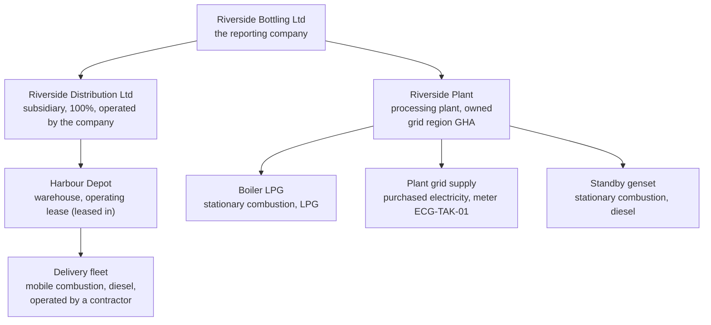

# Meet Riverside Bottling Ltd

Every page of this help that needs an example uses the same small company,
so that a rule you meet on one page connects to a figure you saw on
another. Riverside Bottling Ltd is invented. Its factors are the real
ones in the packs CarbonOS ships, and every figure on this page was read
from a calculation run of the example in CarbonOS, not computed by hand.

<!-- sources: reproduced in a clean local stack on 2026-09-24 (Run 001 of FY2025, boundary version 1); factors from the shipped editions defra-2025 and ghana; lines read from the run page and lines.csv -->

## The company

Riverside Bottling Ltd is a beverage bottler in Ghana. It reports for the
calendar year 2025 under **operational control**, with the IPCC AR5
global warming potentials, and it pro-rates records that straddle the
year end.

| Object | Facts recorded | The rule it shows |
| --- | --- | --- |
| Riverside Bottling Ltd | The reporting company, there by definition, 100% under every approach. | The reporting company cannot be removed or given a relationship. |
| Riverside Distribution Ltd | Group company or subsidiary, economic interest 100%, operated by the company, jurisdiction `GH`. | Table 1: a subsidiary under operational control carries a 100% share. |
| Riverside Plant | Processing plant in Takoradi, country `GH`, grid region `GHA`, owned. | The grid region is what makes CarbonOS suggest the Ghana grid factor. |
| Harbour Depot | Warehouse in Sekondi, country `GH`, under Riverside Distribution Ltd, operating lease (leased in). | A leased site: its records inherit the lease, and Appendix F of the Standard decides their scope under each approach. |
| Boiler LPG, Standby genset | Stationary combustion, fuels LPG and diesel, owned or controlled. | A stream owned by the company defaults its records to scope 1. |
| Plant grid supply | Purchased electricity, meter `ECG-TAK-01`. | Defaults to scope 2. |
| Delivery fleet | Mobile combustion, diesel, operated by a contractor. | A contractor's stream defaults its records to scope 3, category 1. |

Riverside holds two factor packs: `defra-2025`, the UK Government (DESNZ)
conversion factors for 2025, and `ghana`, the Ghana grid electricity and
transmission-loss factors. The people are named by role: the owner, the
preparer, the reviewer, the verifier.

## The records

Five records for 2025, imported from one file. You can download it:
[riverside-2025.csv](../assets/riverside-2025.csv).

| Record | Facility and stream | Activity | Quantity and period | The twist it carries |
| --- | --- | --- | --- | --- |
| ACT-0001 | Riverside Plant, Boiler LPG | Boiler LPG | 2,400 litre, March 2025 | None: the plain case. |
| ACT-0002 | Riverside Plant, Plant grid supply | Plant grid electricity | 6,000 kWh in the file, corrected to 60,000 kWh, June 2025 | A corrected quantity: the reason and both values stay in the record's history. |
| ACT-0003 | Riverside Plant, Standby genset | Genset diesel | 1,200 litre, August 2025 | None. |
| ACT-0004 | Harbour Depot, Delivery fleet | Delivery fleet diesel | 5,000 litre, September 2025 | A contractor's stream at a leased site: scope 3 by default, the lease inherited from the facility. |
| ACT-0005 | Riverside Plant, Boiler LPG | Year-end boiler LPG | 800 litre, 15 December 2025 to 15 January 2026 | A bill that straddles the year end: pro-rated by days, with a warning; blocked instead if the inventory says so. |

One more line comes from a rule rather than a record: the **transmission
and distribution losses** of the plant's electricity, derived from
ACT-0002 by an upstream rule on the **Method** tab. The Ghana pack's
loss factor arrives **Not approved**, because it is derived rather than
published, and the rule cannot use it until someone approves it under
**Emission factors**.

## What the first run says

With every record classified, the declaration listing categories 1 and 3,
no residual mix available, and the inventory frozen as boundary version
1, Run 001 of FY2025 reads as follows. Factor values are the values in
the named edition; they are not universal constants.

| Line | Arithmetic | kg CO₂e |
| --- | --- | --- |
| ACT-0001 Boiler LPG, scope 1 | 2,400 litre × 1.557131 kg/litre (`defra-2025`, Gaseous fuels: LPG) | 3,737.12 |
| ACT-0003 Genset diesel, scope 1 | 1,200 litre × 2.66155 kg/litre (`defra-2025`, Liquid fuels: Diesel, 100% mineral diesel) | 3,193.86 |
| ACT-0005 Year-end boiler LPG, scope 1 | 800 litre × 1.557131 kg/litre × 17 of 32 days (53.13%) | 661.78 |
| ACT-0002 Plant grid electricity, scope 2 | 60,000 kWh × 0.468809 kg/kWh (`ghana`, Grid electricity, Ghana (2024)) | 28,128.54 |
| ACT-0004 Delivery fleet diesel, scope 3 category 1 | 5,000 litre × 2.66155 kg/litre | 13,307.75 |
| Transmission and distribution losses of ACT-0002, scope 3 category 3 | 60,000 kWh × 0.117202 kg/kWh (`ghana`, Grid electricity T&D losses, Ghana (derived)) | 7,032.12 |

| Total | t CO₂e |
| --- | --- |
| Scope 1 | 7.593 |
| Scope 2, location-based | 28.129 |
| Scope 2, market-based | 28.129 (no instrument and no residual mix: the grid average stands in) |
| Scope 3 | 20.340 |
| **Total** | **56.061** |

The report's by-gas table splits the DESNZ lines into their gases: 27.719
t of CO₂, 0.202 kg of CH₄ (0.006 t CO₂e at a potential of 28) and 0.783
kg of N₂O (0.207 t CO₂e). The two Ghana factors publish CO₂e only, so
their 28.129 t sit on the row "CO₂e from factors without a gas split",
and the table still foots to 56.061 t.

## What happens to the example later

The concept and task pages take the same company further, each time
changing one thing:

- The reviewer marks Run 001 as final and publishes FY2025.
- A second invoice shows June's electricity was 61,000 kWh. The
  correction to the record marks the published view "Changed since
  publication"; a correction inventory restates the year and supersedes
  the report.
- FY2026 leaves Harbour Depot out after the depot is sold, and the freeze
  raises a base-year recalculation candidate.
- The platform publishes `defra-2026`, and the reviewer accepts the notice
  as a vintage progression, so 2026 records take the 2026 factors while
  2025 keeps its own.
