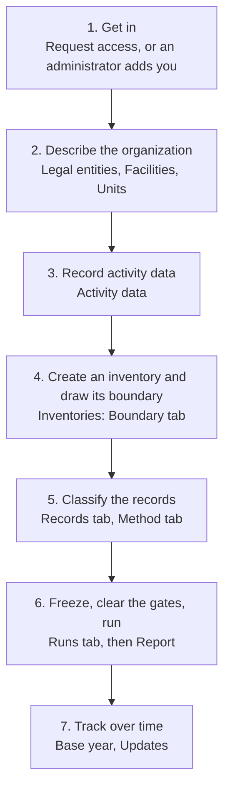

# How does an inventory get from facts to a published report?

CarbonOS follows the order the GHG Protocol Corporate Standard sets out,
and its navigation follows the same order. This page walks that order once,
names where each step happens in the product, and says what each step
leaves behind. Read it before the other concept pages; each of them takes
one step apart.

<!-- sources: spec 00 "The workflow, in the order a user meets it"; OrganizationLayout.tsx sidebar labels; InventoryDetailPage.tsx tabs; OverviewPage.tsx "From facts to a final inventory"; governance QA 001 to 008 verified 2026-09-24 -->

## The seven steps

### 1. Get in

A platform administrator creates your account, or you ask for one with
**Request access** on the sign-in page and an administrator approves it.
Either way you sign in with an email address and a password of at least 12
characters with a letter and a digit. What you can then do depends on the
role an owner gives you in an organization, not on how your account was
made. See [Who can do what?](roles-and-who-does-what.md).

### 2. Describe the organization

Under **Legal entities** you record the companies the organization
consolidates and the facts the GHG Protocol's Table 1 needs about each:
its relationship to the reporting company, the economic interest, whether
the company operates it, and the parent it is held through. Under
**Facilities** you record the sites, each under one entity, with its lease
type and the grid it draws from, and under each facility the **source
streams**: a boiler, a meter, a fleet. Under **Units** you define any
custom unit and record the densities that turn a mass into a volume.

These are facts about the organization. Every inventory reads them; none
of them belongs to one inventory.

### 3. Record activity data

Under **Activity data** you record what happened: litres of fuel, kilowatt
hours of electricity, kilograms of refrigerant, with the period they cover,
the source document and the evidence. A record can be typed in the drawer,
saved as a draft until its figures arrive, or imported from a CSV file in
one go. A record names its facility and, where one exists, its stream. It
carries no scope, no category and no emission factor: those are decisions
an inventory makes.

### 4. Create an inventory and draw its boundary

Under **Inventories** you create an inventory for one reporting period
under one consolidation approach and one set of global warming
potentials. On its **Boundary** tab CarbonOS has already placed every
operation the approach includes, with the accounting share Table 1 gives
it. You confirm the boundary, give a reason for anything you leave out,
set a membership window for an entity that joined or left mid-period, and
declare which scope 3 categories the inventory covers.

### 5. Classify the records

**Review activity data** on the **Records** tab pulls the organization's
records into the inventory and decides the obvious ones: a record outside
the period or outside the boundary is excluded with the computed reason.
You classify each remaining record with an emission factor, a scope and a
category. The record's stream suggests the default; if you depart from it
you say why. A record you leave out gets a reason and a statement of what
it would have emitted. On the **Method** tab you record any scope 2
instrument, the residual mix position, and the upstream rules that derive
well-to-tank and transmission-loss lines.

### 6. Freeze, clear the gates, run

The five pre-flight gates read the inventory as you work and say whether a
run may launch. When the classification is clean you **Freeze inventory**,
which cuts a boundary version and makes the view read-only. On the
**Runs** tab you launch a calculation run: an immutable, numbered snapshot
of every line and exclusion. The **Report** tab and the run's own page
show the report in the Standard's chapter 9 order, with the PDF and the
CSV and JSON exports. A reviewer or owner designates the run that stands
as the result, then publishes. After publication nothing on the inventory
changes; a correction is a new inventory that supersedes it.

### 7. Track over time

Under **Base year** you designate the year later years are compared
against, with a significance threshold and a policy. From then on a
freeze that moves the boundary raises a candidate for recalculation, and
you decide it. Under **Updates** you decide, edition by edition, whether
the organization moves to a new vintage of a factor pack that the platform
has published. Neither happens by itself: a published edition changes none
of your numbers until a reviewer or owner accepts it.

## What the order protects

The order is not a wizard. It separates three kinds of thing that must not
be confused, and the concept page
[Why does changing a record not change last year's report?](facts-views-and-runs.md)
explains the separation in full:

- **Facts** (steps 2 and 3) describe what the organization is and what it
  did. They are corrected in place, with a reason, and every inventory
  reads the same facts.
- **Views** (steps 4 and 5) are one inventory's accounting decisions about
  those facts: its boundary, its classifications, its exclusions. Two
  inventories over the same facts may report different totals, and both are
  right for their approach.
- **Runs** (step 6) are the view calculated, frozen at the moment of the
  run. Nothing edited later changes a past run.

The **Overview** page of a new organization lists the first four steps as
a checklist, and the list disappears once every step is done.
