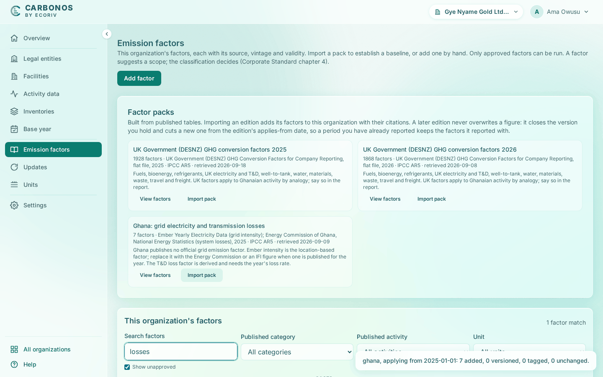

# Add and approve a factor

A hand-entered factor carries a supplier's figure, a national publication the packs lack, or a proxy; it arrives unapproved, and a second person approves it.

<!-- sources: spec 02.11; the old page tasks/emission-factors/add-and-approve-a-factor.md (verified 2026-09-24); frontend/src/features/ghg/EmissionFactorsPage.tsx (the Add an emission factor dialog, the Status column, Delete, Retire… and the Retire dialog); backend/src/main/java/com/carbonos/ghg/internal/GhgService.java (setFactorApproval, deleteEmissionFactor); screen text from the Gye Nyame Gold walkthrough of 2026-09-28 (replay-log.txt): "3 losses row", "6 approved row" -->

## Before you start

- A Preparer, Reviewer or Owner adds a factor; another member with one of those roles approves it.
- Have the source to hand: publication, table, data year and unit.

## Add a factor

1. Open **Emission factors** and click **Add factor**.
2. Fill **Name**, **Suggested scope** and **Category**.
3. Fill **Unit** and **kg CO₂e per unit**.
4. Fill the gas masses the source publishes, in kg per unit: CO₂, CH₄, N₂O, HFCs, PFCs, SF₆ and NF₃; all optional.
5. Leave **Methane is of fossil origin** ticked unless it is biogenic.
6. For a refrigerant blend, fill **Blend composition (optional)**.
7. Choose **GWP basis of the published figure** when the source states it.
8. Fill **Source (publication, table, data year)**, **Source URL (optional)**, **Publication year** and **Data year**, and, when the source limits them, **Valid from (optional)** and **Valid to (optional)**.
9. Leave **Reporting basis** as "Counted in the scopes" unless the factor is for a Montreal Protocol gas.
10. Leave **Approved for use in runs** unticked and click **Add factor**.

What you see: "*Name* added." With **Show unapproved** ticked, the row reads "entered by hand" under **Packs** and **Not approved** under **Status**, with **Approve** and **Delete**.

## Approve a factor

1. As a member who did not enter the factor, open **Emission factors**; **Show unapproved** is ticked by default.
2. Find the row and click **Approve**.

What you see: the status reads **Approved** "by *email* on *date*", and the button becomes **Unapprove**. Approving a factor you entered is refused: "A factor is checked by someone other than the person who typed it (Corporate Standard chapter 7)".

### Approve a derived pack row

Nobody typed a derived pack row, so any Preparer, Reviewer or Owner can approve it.

1. With **Show unapproved** ticked, type `losses` in **Search factors**.
2. Read the row "Grid electricity T&D losses, Ghana (derived)": "approve it after checking the year's loss rate with the Energy Commission statistics".
3. Check the loss rate, then click **Approve**.

What you see: the row reads **Approved** "by owner@gyenyame.example on 2026-09-28 16:31".

## Retire or delete a factor

**Delete** removes a hand-entered factor at once; a pack row has no **Delete**, and a factor a run has applied is refused: "Set its validity end to retire it instead of deleting it." To retire a factor, click **Retire…**, set **Valid to** and click **Retire factor**: "*Factor* retired: valid to *date*." A retired factor stays in every run that used it.

## What happens next

An unapproved factor holds the run at the Emission factors gate until it is approved.
