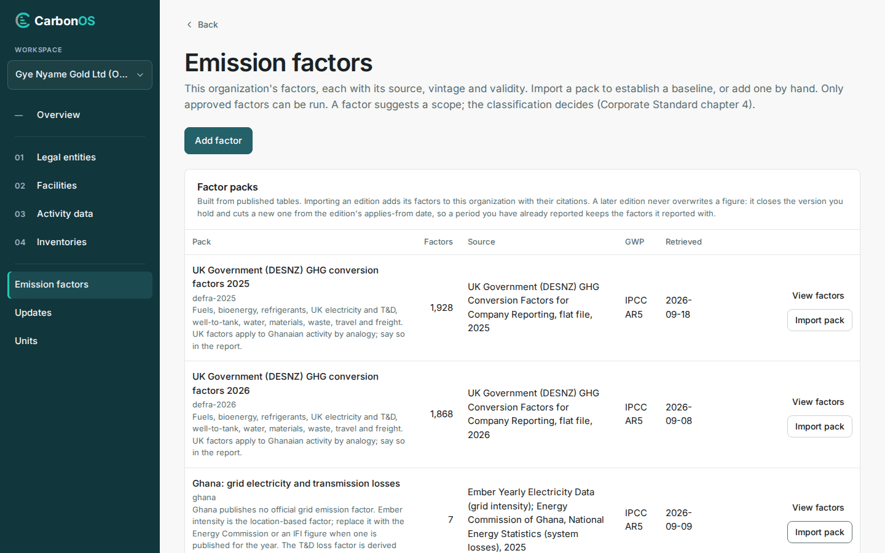

# Import a factor pack

Importing an edition adds its factors to the organization, with their citations, ready to be chosen in a classification. Do it when an organization starts, and again to hold a later edition.

<!-- sources: specs 02.5, 02.6, 02.9 and 10 (the factor packs table); the old page tasks/emission-factors/import-a-factor-pack.md (verified 2026-09-24); frontend/src/features/ghg/EmissionFactorsPage.tsx (packs card, importNote); backend/src/main/java/com/carbonos/ghg/internal/FactorPackImportService.java (locked-period refusal) and EditionLock.java (the published-period setting, spec 02.6 amendment 2026-09-29); screen text and figures from the Gye Nyame Gold walkthrough of 2026-09-28 (replay-log.txt): "3 factors page", "3 toasts", "3 after imports" -->

## Before you start

- You hold the Preparer, Reviewer or Owner role in the organization.
- Know which edition the reporting year needs: a period is offered only the versions valid inside it.

## Import an edition

1. Open **Emission factors**. The **Factor packs** table lists every published edition with its row count, source, GWP basis and retrieval date.
2. To read an edition's rows first, click **View factors** on it.
3. Click **Import pack** on the edition. For Gye Nyame Gold, that is "UK Government (DESNZ) GHG conversion factors 2025", then "Ghana: grid electricity and transmission losses".

What you see: one message per import, "defra-2025, applying from 2025-01-01: 1928 added, 0 versioned, 0 tagged, 0 unchanged." and "ghana, applying from 2025-01-01: 7 added, 0 versioned, 0 tagged, 0 unchanged." **This organization's factors** reads "1,935 factors", and the **Published category** and **Published activity** filters list the packs' taxonomy.

## Read the import message

The four numbers say what the import did with each lineage, each factor code the editions share.

| Number | Meaning |
| --- | --- |
| added | Lineages the organization did not hold. |
| versioned | Lineages held from an earlier edition: the version you hold closes the day before the edition applies and a new one starts from that date. |
| tagged | Rows already held with the same value, now also tagged with this edition. |
| unchanged | Rows already held from this edition. |

The message adds a sentence for lineages the edition drops ("this edition drops, retired by nobody"), rows you edited locally that the import "left untouched", or a draft period the applies-from date falls inside, "so that period would be calculated on two editions." Importing the same edition again reports every row as unchanged.

## Check the rows the pack flags

- The Ghana pack's "Grid electricity T&D losses, Ghana (derived)" arrives **Not approved**: "Derived, not published: approve it after checking the year's loss rate with the Energy Commission statistics, or replace it with the utility's figure." Tick **Show unapproved** to see it; see [Add and approve a factor](add-and-approve-a-factor.md).
- The DESNZ rows carry the note "UK factors apply to Ghanaian activity by analogy; say so in the report."

## What happens next

When the platform publishes a later edition of a pack you hold, a notice appears under **Updates**; see [Accept or decline an edition notice](accept-or-decline-an-edition-notice.md). An edition whose applies-from date falls inside a frozen or final period cannot be imported: "A reported period keeps the factors it reported with." Reopen that period first. A published period blocks the import too while the platform setting **Editions inside a published period** is "Blocked (default)"; choose an edition that applies from a later date, or ask a platform administrator. Under "Allowed: published runs keep their factors" the import goes ahead, and the published report keeps the figures it was published with.
