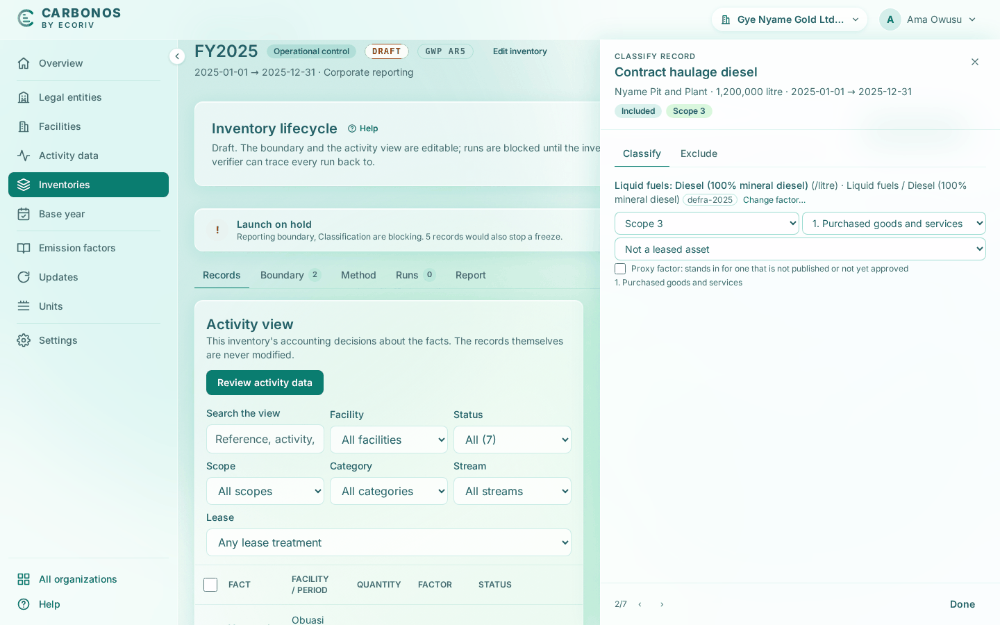

# Classify the records and add the upstream rule

This step classifies the seven records in FY2025 and adds the rules that derive category 3 from them. Step 7 runs the result.

<!-- sources: specs 04.1 and 04.3 (scope as an accounting decision, source defaults), 04.7 (derived fuel- and energy-related lines), 05.5 (review at scale), 07.3 (residual mix and dual reporting), 10 (the split register, the pre-flight chip); section 6 of the old tutorial help/docs/get-started/your-first-inventory.md; screen text and figures from the Gye Nyame Gold walkthrough of 2026-09-28 (replay-log.txt) -->

## Before you start

- Step 5 is done: FY2025 exists as a draft with categories 1 and 3 declared.

## Record the residual mix

Every run reports scope 2 location-based and market-based, as the Scope 2 Guidance requires even without an instrument. Ghana publishes no residual mix.

1. Open the **Method** tab. Choose **No residual mix is available** and click **Save residual mix**.

What you see: "Residual mix recorded." Without an instrument or a residual mix, the market-based figure uses the grid average.

## Bring the records under review

1. Open the **Records** tab. **Activity view** reads "Nothing under review yet". Click **Review activity data**.

What you see: "7 new records under review." Each record is listed as **Unclassified**. In the pre-flight chip's popover, the **Activity data completeness** gate warns about the year-end LPG bill: "17 of 32 days fall inside the reporting period and the membership window: the run pro-rates it to 53.13%." Pro-rating does not hold the run.

## Classify the seven records

Classifying a record means choosing its emission factor; the scope and category follow the emission source.

1. Click **Haul fleet diesel** (ACT-0001), then **Choose factor…**. Type `mineral diesel` and choose **Liquid fuels: Diesel (100% mineral diesel) (/litre)**. The record's detail now reads **Scope 1 / Mobile combustion** and **Included**. Choosing the factor records the classification; there is no save button.
2. Repeat for **Contract haulage diesel** (ACT-0002) and **Genset diesel** (ACT-0005). The contractor's diesel lands in **Scope 3**, category "1. Purchased goods and services", with no justification asked: the Corporate Standard puts a contractor's combustion in the customer's scope 3. The genset diesel lands in Scope 1, "Stationary combustion", and its detail adds "Leased facility: operating lease (leased in) inherited."
3. For **Kitchen LPG** (ACT-0006) and **Year-end kitchen LPG** (ACT-0007) type `LPG` and choose **Gaseous fuels: LPG (/litre)**. Both land in Scope 1, "Stationary combustion".
4. For **Plant grid electricity H1** (ACT-0003) and **Plant grid electricity H2** (ACT-0004) click the shortcut **Suggested for this facility's grid: Grid electricity, Ghana (2024)**. Each lands in **Scope 2**.

What you see: "7 of 7 records", every row **Included** with its scope. The **Classification** gate warns that category 3 is declared but no upstream rule matches a factor yet, and the **Emission factors** gate warns that "'Grid electricity, Ghana (2024)' publishes CO2e only". A warning is a disclosure, not a hold.

## Approve the loss factor

A rule needs an approved factor, and the Ghana loss factor arrived unapproved with its caveat.

1. Open **Emission factors**, tick **Show unapproved**, search `losses`, and click **Approve** on "Grid electricity T&D losses, Ghana (derived)".
2. In the dialog, fill **Check note**, for example `Loss rate checked against the Energy Commission's 2024 statistics (20%).`, and click **Approve factor**.

What you see: the row reads **Approved** "by owner@gyenyame.example" with the moment, then "Checked:" and your note. The report prints the caveat and the note together. Nobody typed a pack factor, so the owner approves it.

## Add the upstream rules

A rule derives the losses of every scope 2 kilowatt-hour and the well-to-tank emissions of every scope 1 litre, so nothing is entered twice.

1. On the **Method** tab, under **Upstream rules**, type `Ghana` in **Narrow the primary factors** and choose **Primary factor** "Grid electricity, Ghana (2024) (/kWh) · Ghana (GHA)". Type `losses` in **Narrow the upstream factors** and choose **Upstream factor** "Grid electricity T&D losses, Ghana (derived) (/kWh)". Set **Kind** to "Transmission and distribution losses" and click **Add rule**.
2. Add a second rule: primary factor "Liquid fuels: Diesel (100% mineral diesel) (/litre)", upstream factor "Well-to-tank: Liquid fuels: Diesel (100% mineral diesel) (/litre)", kind "Well-to-tank (upstream emissions of the fuel)".

What you see: "Upstream rule added." after each, and two rows in the card, each with **RECORDS** 2: the two electricity records and the two scope 1 diesel records. The **Classification** gate now passes.

## What you have

- No residual mix, recorded.
- Seven records classified: four in scope 1, two in scope 2, one in scope 3.
- The loss factor approved, and two upstream rules matching four records.
