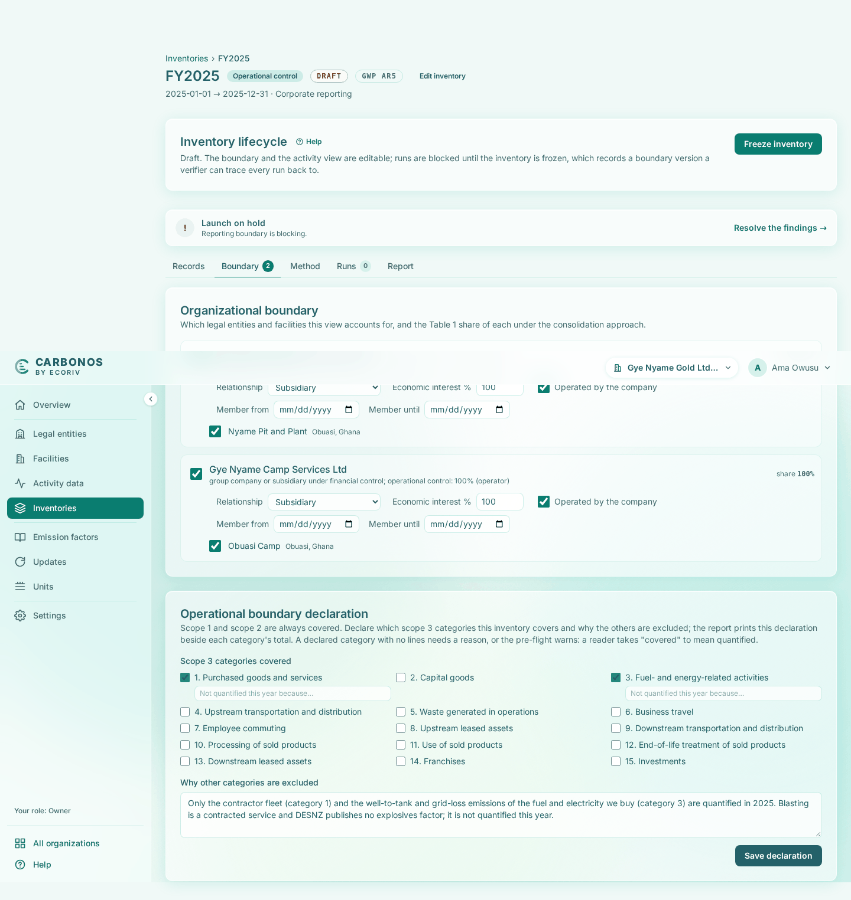

# Create the inventory and draw its boundary

This step produces FY2025, a draft inventory over the facts from steps 1 to 4. You confirm its boundary and declare its scope 3 coverage; steps 6 and 7 classify the records inside it and run it.

<!-- sources: specs 03 and 03.4 (organizational boundary and pre-population), 04 and 04.2 (operational boundary declaration, pro-rating), 05.6 (the workbench), 07.6 (the scope 3 cross-check) and 10 (the title row, the pre-flight chip); section 5 of the old tutorial help/docs/get-started/your-first-inventory.md; screen text and figures from the Gye Nyame Gold walkthrough of 2026-09-28 (replay-log.txt) -->

## Before you start

- Steps 1 to 4 are done: Gye Nyame Gold Ltd has two legal entities, two facilities with five source streams, two imported factor packs, and seven activity records, one of them corrected.

## Create the inventory

An inventory is one accounting view over the facts: a period, a consolidation approach, a boundary, and a set of decisions about each record. The facts stay where they are.

1. Open **Inventories** and click **New inventory**.
2. Fill **Name** `FY2025`, **Period start** `2025-01-01`, **Period end** `2025-12-31`, and **Purpose (optional)** `Corporate reporting`.
3. Leave the rest as offered: **Records that straddle the period or a membership window** "Pro-rate by days (default)", **Consolidation approach** "Operational control", **GWP set** "AR5 (default)", **Copy the view from (optional)** "Start from scratch", and **Start with every operation the approach includes in the boundary** ticked.
4. Click **Create inventory**.

What you see: "FY2025 created." and the inventory workbench. The title row reads "FY2025", "Operational control" and "DRAFT", with "GWP AR5" at the right of the breadcrumb row. **Inventory lifecycle** explains the state: "Draft. The boundary and the activity view are editable; runs are blocked until the inventory is frozen, which records a boundary version a verifier can trace every run back to." The tabs are **Records**, **Boundary**, **Method**, **Runs**, and **Report**.

The pre-flight chip beside the title reads "Launch on hold · 1 blocking"; click it, and **Pre-flight checks** lists five gates. **Reporting boundary** holds: "The inventory is a draft. Freeze it to enable a run." **Activity data completeness** warns that "7 organizational activity records have not been reviewed" and tells you to run **Review activity data**. **Classification** passes, since nothing is under review yet. **Emission factors** warns: "The inventory does not say whether a residual mix is available. Every run reports scope 2 market-based, and the Scope 2 Guidance requires the disclosure either way; until it is recorded, uncovered electricity is priced at the grid average." **Base year** passes. Steps 6 and 7 clear every finding.

## Confirm the boundary

Open the **Boundary** tab. Because you left "Start with every operation" ticked, both entities are already in. Each reads "group company or subsidiary under financial control; operational control: 100% (operator)" and "share 100%", with Nyame Pit and Plant under Gye Nyame Gold Ltd and Obuasi Camp under Gye Nyame Camp Services Ltd. There is nothing to change: under a control approach an operated subsidiary is in by definition, and leaving one out would be an exclusion with a reason.

## Declare the scope 3 categories

Further down the same tab, **Operational boundary declaration** asks which scope 3 categories this inventory covers; scope 1 and scope 2 are always covered. Gye Nyame quantifies two in 2025: the haulage contractor's fleet (category 1) and the upstream emissions of the fuel and electricity it buys (category 3).

1. Tick **1. Purchased goods and services** and **3. Fuel- and energy-related activities**.
2. Fill **Why other categories are excluded** with `Only the contractor fleet (category 1) and the well-to-tank and grid-loss emissions of the fuel and electricity we buy (category 3) are quantified in 2025. Blasting is a contracted service and DESNZ publishes no explosives factor; it is not quantified this year.`
3. Click **Save declaration**.

What you see: "Operational boundary declaration saved." Blasting is left out because it is a contracted service and the DESNZ pack publishes no explosives factor, so there is nothing to multiply its quantity by. The report prints this declaration beside each category's total, and the pre-flight warns if a declared category ends up with no lines, because a reader takes "covered" to mean quantified.

## What you have

- FY2025: a draft operational-control inventory over 2025, with AR5 potentials, that pro-rates a straddling record by days.
- Both entities and both facilities in the boundary at a share of 100%.
- A scope 3 declaration covering categories 1 and 3, with the reason the others are excluded.
