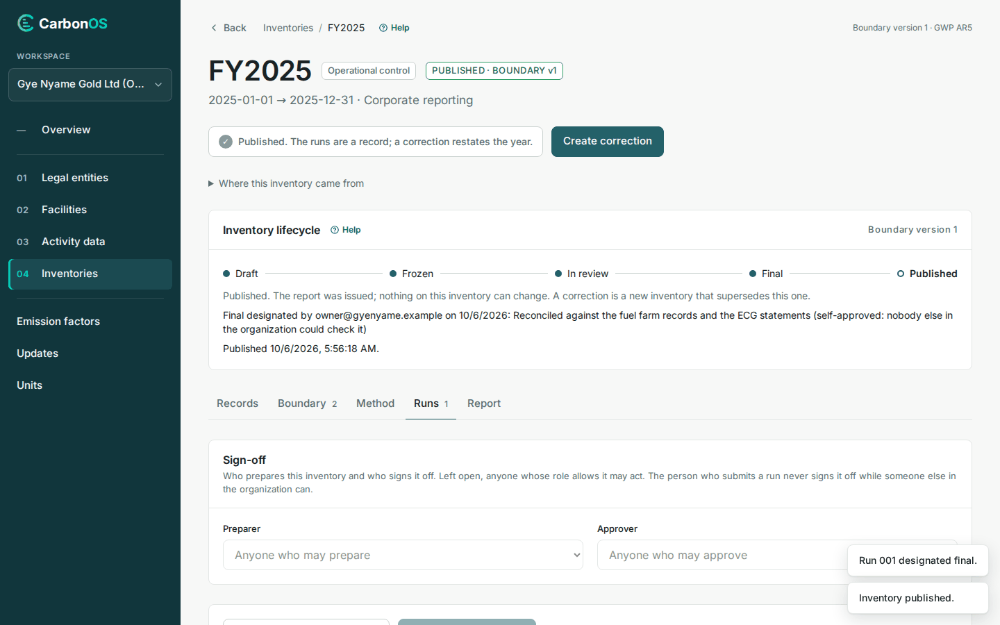

# Fill the header, publish and export

This last step signs off Run 001 and issues the FY2025 report of Gye Nyame Gold Ltd with its four export files. Afterwards nothing on the inventory can change.

<!-- sources: specs 05.1 and 05.5 (final designation, publication, deliberate lifecycle acts), 05.8 (the sign-off workflow), 05.3 (the published record), 07.4 (report metadata, intensity), 07.5 (report export) and 10 (the lifecycle acts in the title row); section 9 of the old tutorial help/docs/get-started/your-first-inventory.md; screen text and figures from the Gye Nyame Gold walkthrough of 2026-10-06 (walkthrough-log.txt) -->

## Before you start

- Step 7 is done: FY2025 is frozen and Run 001 has been launched.

## Fill the report header

The **Report** tab holds the report's assurance and the intensity denominators it divides the total by.

1. Open the **Report** tab. Leave **Assurance** as "Not verified", since nobody has verified this inventory.
2. Under **Intensity denominators** fill **Denominator** `Gold produced`, **Value** `185000`, **Unit** `oz`, and click **Add denominator**. The card now lists "Gold produced: 185,000 oz".
3. Click **Save report header**.

What you see: "Report header saved." Section 04 of the report gains an intensity line: "0.467092 t CO₂e per oz of gold produced (185,000 oz)".

## Submit the run and sign it off

A run becomes the result in two acts: someone submits it for review, and someone else marks it as final. As the organization's only member, you do both, and the report says so.

1. On the **Runs** tab click **Submit for review** on Run 001. Fill **Note for the approver (optional)** with `Fuel farm records and ECG statements attached` and click **Submit for review**. The message reads "Run 001 submitted for review." and the status chip "IN REVIEW · BOUNDARY v1".
2. Click **Mark as final** on Run 001. The dialog "Mark Run 001 as final?" says: "Nobody else in the organization may approve, so your sign-off of the run you submitted is recorded as a self-approval, and the report says so." Fill **Review note (optional)** with `Reconciled against the fuel farm records and the ECG statements`.
3. Click **Mark as final**.

What you see: "Run 001 designated final." The status chip reads "FINAL · BOUNDARY v1" and the run's row carries the tag FINAL. In a team, a preparer submits and a reviewer or owner signs; see [Designate a final run and publish](../reporting/designate-a-final-run-and-publish.md).

## Publish

1. Click **Publish** in the title row.
2. Read the dialog "Publish the inventory?": "Publishing issues the report; nothing on this inventory can change afterwards. A correction is a new inventory that supersedes it."
3. Click **Publish**.

What you see: "Inventory published." The status chip reads "PUBLISHED · BOUNDARY v1", **Inventory lifecycle** records the moment of publication, and the only action left is **Create correction**.

Open Run 001 again. Section 00 now reads "Prepared by" and "Approved by" with your name, email and run 1, the second ending "self-approved: nobody else in the organization could check it", "Published" with the moment and your email, and "Final designated by owner@gyenyame.example" with your note. A new block, **Since publication**, reads "The report above reads exactly as it was published. What came after is listed here and nowhere else." and, for now, "Nothing has changed since." A later correction is listed there, not in the report.

## Export

The run page offers four files at the top:

| Link | File | Contents |
| --- | --- | --- |
| **PDF report** | `gye-nyame-gold-ltd-org-0001-2025-run-1.pdf` | The report as the page shows it. |
| **Lines (CSV)** | `run-1-lines.csv` | One row per line, eleven here: record, facility, scope, category, quantity, factor, share, CO₂e, and gases. |
| **Exclusions (CSV)** | `run-1-exclusions.csv` | One row per excluded record; only the header row here, because the report says "No exclusions." |
| **Frozen inputs (JSON)** | `run-1-inputs.json` | The run's period, approach, GWP set, boundary version, the five factors it applied, and the residual-mix answer. |

A verifier can rebuild every figure from the lines file and check every factor against the inputs file.

## What you have

- An organization with two legal entities, two facilities, and five emission sources, with their shares under each approach.
- Seven activity records, one of them corrected with its history kept.
- Two factor pack editions, and one derived factor you approved.
- FY2025: an operational-control inventory with a declared scope 3, boundary version 1, two upstream rules, seven classifications, one run of 86,412 t CO₂e designated final, and a published report with its exports.

## Where next

- [Correct a published inventory](../reporting/correct-a-published-inventory.md): what a correction after publication does.
- [Designate the base year](../reporting/designate-the-base-year.md): section 07 of the report is waiting for one.
- [Understand the export files](../reporting/understand-the-export-files.md): every column and field of the four files.
