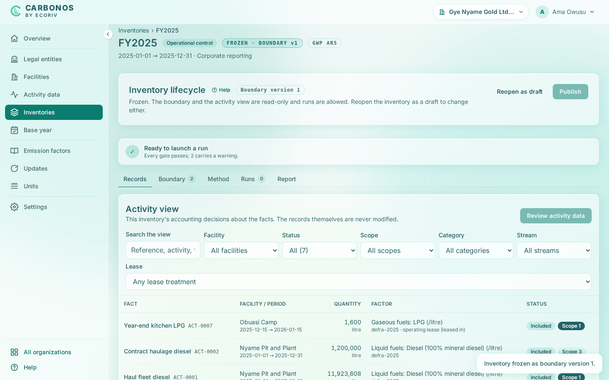

# Freeze the inventory and launch the run

This step freezes FY2025, launches Run 001, and reads the report. Step 8 publishes it.

<!-- sources: specs 05.1 and 05.2 (lifecycle, run snapshots, run numbering), 04.7 (derived lines), 07.2, 07.4 and 07.7 (report sections, factor table, by-gas table), 10 (the pre-flight chip, the lifecycle acts in the title row); sections 7 and 8 of the old tutorial help/docs/get-started/your-first-inventory.md; screen text and figures from the Gye Nyame Gold walkthrough of 2026-09-28 (replay-log.txt) -->

## Before you start

- Step 6 is done: seven records classified, the loss factor approved, two upstream rules in place.

## Freeze the inventory

A run launches only from a frozen inventory, because it cites the boundary version the freeze cuts.

1. In the title row click **Freeze inventory**.
2. Read the dialog "Freeze the inventory?". It explains: "This freezes the boundary and the activity view together and cuts boundary version 1: an immutable record of the 2 facilities currently in the boundary with their accounting shares. Calculation runs will cite this version. You can reopen the inventory later with a reason; the version is kept."
3. Click **Freeze inventory**.

What you see: "Inventory frozen as boundary version 1." The status chip reads "FROZEN · BOUNDARY v1", **Inventory lifecycle** reads "Frozen. The boundary and the activity view are read-only and runs are allowed. Reopen the inventory as a draft to change either.", and the pre-flight chip reads "Ready to launch · 2 warnings" and its popover "Every gate passes; 2 carry a warning." The two warnings are the pro-rated LPG bill and the CO2e-only grid factor.

## Launch the run

1. Open the **Runs** tab. **History** at its foot lists everything you did, from "7 records reviewed, 0 refreshed" to "Inventory frozen".
2. Click **Launch calculation run**.

What you see: "Calculation complete." and the run's page, "Run 001", headed "Gye Nyame Gold Ltd (ORG-0001) · 2025-01-01 → 2025-12-31 · 11 lines". On the **Runs** tab the run is listed as "#001 Run 001", "11 lines · boundary v1", with **Mark as final** and **Void…**. A run is never edited or deleted, only voided with a reason.

## Read Run 001

Check these figures against your screen.

| Section | What it says for Gye Nyame Gold |
| --- | --- |
| 04 Emissions by scope | Scope 1 34,194.283 t; scope 2 location-based 32,816.630 t; scope 2 market-based 32,816.630 t; scope 3 19,401.086 t; **total 86,411.999 t CO₂e**. Category 1: 1 line, 3,193.860 t; category 3: 4 lines, 16,207.226 t. Nyame Pit and Plant 83,391.314 t; Obuasi Camp 3,020.685 t. |
| 05 Emissions by gas | CO2 45,124.224 t; CH4 147.269 kg (4.124 t CO₂e); N2O 1.751 t (463.936 t CO₂e); "CO₂e from factors without a gas split" 40,819.716 t CO₂e, the two grid lines and the two well-to-tank lines; the total ties to section 04. |
| 08 Methodology | The two rules with "2 lines" each, and **Emission factors applied**: the five factors with values, gases, and packs. |

The eleven lines of section 10, as the report prints them; each derived line is scope 3, category 3:

| Line | Quantity × factor (kg per unit) | CO₂e |
| --- | --- | --- |
| ACT-0001 Haul fleet diesel, scope 1 | 11,923,608 litre × 2.66155 | 31,735.28 t |
| ACT-0004 Plant grid electricity H2, scope 2 | 36,000,000 kWh × 0.468809 | 16,877.12 t |
| ACT-0003 Plant grid electricity H1, scope 2 | 34,000,000 kWh × 0.468809 | 15,939.51 t |
| "well-to-tank of ACT-0001 Haul fleet diesel" | 11,923,608 litre × 0.62409 | 7,441.4 t |
| "transmission and distribution losses of ACT-0004 Plant grid electricity H2" | 36,000,000 kWh × 0.117202 | 4,219.27 t |
| "transmission and distribution losses of ACT-0003 Plant grid electricity H1" | 34,000,000 kWh × 0.117202 | 3,984.87 t |
| ACT-0002 Contract haulage diesel, scope 3, category 1 | 1,200,000 litre × 2.66155 | 3,193.86 t |
| ACT-0005 Genset diesel, scope 1 | 900,000 litre × 2.66155 | 2,395.4 t |
| "well-to-tank of ACT-0005 Genset diesel" | 900,000 litre × 0.62409 | 561.68 t |
| ACT-0006 Kitchen LPG, scope 1 | 40,000 litre × 1.557131 | 62.29 t |
| ACT-0007 Year-end kitchen LPG, scope 1 | 1,600 litre × 1.557131, "pro-rated: 17 of 32 days inside the reporting period and the membership window (53.13%)" | 1.32 t |

Three things to notice:

- Each derived line names its origin, and the contractor's diesel has no well-to-tank line: the rule rides on scope 1 litres only.
- Each electricity line carries a second sentence for the market-based figure: "no contractual instrument; 36,000,000 kWh at 0.468809 kg/kWh (grid average: the location-based figure stands, no residual mix is available)".
- The year-end bill counts 53.13% of its 1,600 litres, as the pre-flight warned.

## What you have

- FY2025 frozen as boundary version 1.
- Run 001: 11 lines, 86,412 t CO₂e (scope 1 34,194.28 t, scope 2 32,816.63 t, scope 3 19,401.09 t).
