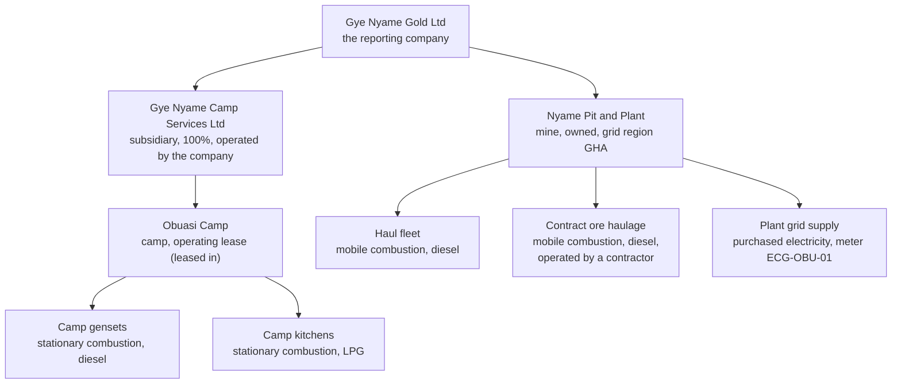

# Meet Gye Nyame Gold

Gye Nyame Gold Ltd is the invented company the Get started steps build.
Its factors are the real ones CarbonOS ships; every figure here was
read from Run 001, not computed by hand.

<!-- sources: concepts/the-running-example.md (Riverside Bottling, verified 2026-09-24); spec 04.2 (pro-rating); screen text and figures from the Gye Nyame Gold walkthrough of 2026-09-28 (replay-log.txt): "1 entities after", "2 facilities after", "2 streams", "3 losses row", "4 preview", "4 history", "7 run page" -->

## What is the company?

A gold mine near Obuasi, Ghana, reporting calendar 2025 under
**operational control** with AR5 potentials, pro-rating records that
straddle the year end.

| Object | Facts | What it shows |
| --- | --- | --- |
| Gye Nyame Camp Services Ltd | Subsidiary, 100%, operated by the company, `GH` | 100% share under operational control. |
| Nyame Pit and Plant | Mine, grid region `GHA`, owned | Suggests the Ghana grid factor. |
| Obuasi Camp | Camp, operating lease (leased in), under the subsidiary | Records inherit the lease. |
| Haul fleet, Camp gensets, Camp kitchens | Owned or controlled | Scope 1 by default. |
| Contract ore haulage | Contractor-operated, on diesel from the mine's own fuel farm | Scope 3, category 1, by default. |
| Plant grid supply | Purchased electricity, meter `ECG-OBU-01` | Scope 2 by default. |

Two packs, `defra-2025` and `ghana`. The Ghana transmission-loss factor
arrives "Not approved" because it is derived, not published; approval
under **Emission factors** comes before any rule uses it. Blasting stays
out of the declaration: a contracted service, no published explosives
factor.

## What are the records?

Seven records for 2025, from
[gye-nyame-2025.csv](../assets/gye-nyame-2025.csv).

| Record | Quantity | The twist |
| --- | --- | --- |
| ACT-0001 Haul fleet diesel | 11,923,608 litre | None. |
| ACT-0002 Contract haulage diesel | 1,200,000 litre | A contractor's stream: scope 3. |
| ACT-0003 Plant grid electricity H1 | 34,000,000 kWh | None. |
| ACT-0004 Plant grid electricity H2 | 3,600,000 kWh in the file, corrected to 36,000,000 | Both values and the reason stay in history. |
| ACT-0005 Genset diesel | 900,000 litre | Inherits the camp's lease. |
| ACT-0006 Kitchen LPG | 40,000 litre, to 14 December | None. |
| ACT-0007 Year-end kitchen LPG | 1,600 litre, 15 December 2025 to 15 January 2026 | Pro-rated: 17 of 32 days (53.13%). |

Two upstream rules on the **Method** tab derive four more lines:
grid transmission losses and diesel well-to-tank.

## What does Run 001 say?

| Total | t CO₂e |
| --- | --- |
| Scope 1 | 34,194.283 |
| Scope 2, location-based | 32,816.630 |
| Scope 2, market-based | 32,816.630 (the grid average stands in) |
| Scope 3 | 19,401.086 |
| **Total** | **86,412** |

By gas: CO₂ 45,124.224 t, CH₄ 4.124 t CO₂e, N₂O 463.936 t CO₂e, and
40,819.716 t on "CO₂e from factors without a gas split" from the two
CO₂e-only factors.

## Where next

- [Create the organization and its legal entity](create-the-organization-and-its-legal-entity.md), step 1.
- [How an inventory becomes a report](how-an-inventory-becomes-a-report.md).
