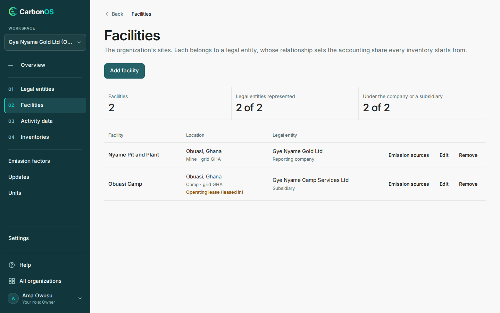

# Record the facilities and emission sources

This second step of the Get started series records the two sites of Gye Nyame Gold and the five emission sources its activity records name. The facilities draw the boundary; the sources fix each record's default scope and category.

<!-- sources: specs 03, 04.1, 04.7, 04.10 (facilities, emission sources and their defaults, the Emission sources page); the old tutorial get-started/your-first-inventory.md (verified 2026-09-24); screen text and figures from the Gye Nyame Gold walkthrough of 2026-09-28 (replay-log.txt) and the local walkthrough of 2026-10-04 on the ECO-5 branch -->

## Before you start

- The organization Gye Nyame Gold Ltd and its subsidiary Gye Nyame Camp Services Ltd exist, from [Create the organization and its legal entity](create-the-organization-and-its-legal-entity.md).
- You are its owner, which includes all a preparer may do.

## Add the two facilities

1. Open **Facilities**. The page reads "No facilities yet". Click **Add facility**.
2. Fill **Name** `Nyame Pit and Plant`, **Location** `Obuasi, Ghana`, **Country (optional)** `GH` and **Grid region (optional)** `GHA`.
3. Choose **Facility type (optional)** "Mine"; leave **Lease (optional)** as "Owned, not leased" and **Legal entity** as "Gye Nyame Gold Ltd (Reporting company)". Click **Add facility**.
4. Click **Add facility** again. Fill **Name** `Obuasi Camp`, **Location** `Obuasi, Ghana`, **Country (optional)** `GH`, and leave **Grid region (optional)** empty.
5. Choose **Facility type (optional)** "Camp", **Lease (optional)** "Operating lease (leased in)", and **Legal entity** "Gye Nyame Camp Services Ltd (Subsidiary)". Click **Add facility**.

What you see: "Nyame Pit and Plant added." then "Obuasi Camp added." The counters read "Facilities 2", "Legal entities represented 2 of 2" and "Under the company or a subsidiary 2 of 2". Both rows show "grid GHA": you left the camp's grid region blank, and, as the field says, "Blank follows the country." The camp's row also shows "Operating lease (leased in)". Records at a leased site inherit the lease, and Appendix F sets their scope under each approach, so the lease is recorded once.

## Register the emission sources

An emission source is one source of emissions at a site: a fleet, a genset, a grid supply. A record names its source; the kind fixes which categories the record can be classified into, and the operator fixes the default scope. A source can also be described on a record as you enter it; here the mine registers its five up front.

1. On the row for Nyame Pit and Plant click **Emission sources**. The page opens under the breadcrumb **Facilities › Nyame Pit and Plant › Emission sources** and reads "No emission sources registered yet."
2. Under **Add emission source**, fill **Source name** `Haul fleet`, choose **Kind** "Mobile combustion", fill **Fuel or material (optional)** `Diesel`, and click **Add emission source**.
3. Fill **Source name** `Contract ore haulage`, **Kind** "Mobile combustion", **Fuel or material (optional)** `Diesel`, tick **Operated by a contractor (its emissions default to scope 3)**, and click **Add emission source**.
4. Untick **Operated by a contractor (its emissions default to scope 3)**, which keeps its state between additions. Fill **Source name** `Plant grid supply`, **Kind** "Purchased electricity", **Meter or supplier (optional)** `ECG-OBU-01`, and click **Add emission source**. Click **Facilities** in the breadcrumb.
5. On the row for Obuasi Camp click **Emission sources**. Add `Camp gensets`, kind "Stationary combustion", fuel `Diesel`; then `Camp kitchens`, kind "Stationary combustion", fuel `LPG`. Click **Facilities**.

What you see: a message for each source, from "Haul fleet added to Nyame Pit and Plant." to "Camp kitchens added to Obuasi Camp." The page lists a site's sources alphabetically, each with the default it gives its records: under "Contract ore haulage", "Mobile combustion · Diesel · contractor-operated · defaults to Scope 3, 1. Purchased goods and services"; under "Haul fleet", "Mobile combustion · Diesel · owned or controlled · defaults to Scope 1, Mobile combustion". At the camp, both sources default to "Scope 1, Stationary combustion". The contractor's default is the Corporate Standard's rule (chapter 4) that a contractor's combustion belongs in the customer's scope 3; CarbonOS applies it without asking for a justification.

## What you have

- Two facilities, Nyame Pit and Plant under Gye Nyame Gold Ltd and Obuasi Camp under Gye Nyame Camp Services Ltd, both on grid GHA, the camp leased in.
- Five emission sources: three at the pit, one of them contractor-operated, and two at the camp, each with a default scope and category.
- Nothing recorded against them yet; steps 3 and 4 bring the factors and the records.
