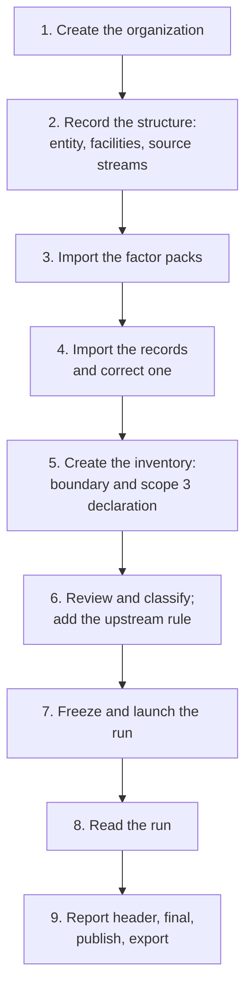

# Your first inventory

This tutorial takes a new CarbonOS account from nothing to a published
2025 inventory for a small example company, Riverside Bottling Ltd, with
a total you can check at the end. You create the organization,
record its structure, import a year of activity data, classify it in an
inventory, run the calculation, and publish the report with its exports.

Plan about two hours. Every step names what you see on screen, and each
figure below was read from CarbonOS while this page was written, not
computed by hand. The company is described in
[Meet Riverside Bottling Ltd](../concepts/the-running-example.md); you
do not need to read that page first.

<!-- sources: driven end to end in a clean local stack (make db-reset, make admin) on 2026-09-24 in the order written; labels and messages read from the screen; figures from Run 001 of FY2025 -->

## Before you start

You need:

- An account. A platform administrator creates it, or approves the
  request you make with **Request access** on the sign-in page. Either
  way you sign in with your email address and a password.
- Nothing else. Creating an organization makes you its owner, and the
  owner can do everything in this tutorial alone.

The tutorial does not need a second person. Where CarbonOS would ask
someone else to check your work, it says what it records instead.

## 1. Create the organization

1. Sign in. Open **GHG accounting**: it is where a member of no
   organization lands, and it is also in the account menu at the top
   right. The page reads "No organizations yet" and offers
   **New organization**.
2. Click **New organization**. Fill **Name** with `Riverside Bottling
   Ltd`. **Address (optional)** is printed in the report header as the
   reporting entity's address; enter `Harbour Road, Takoradi`. Leave
   **Owner's email (optional)** empty: the dialog explains that naming
   somebody else makes them the owner and leaves you outside.
3. Click **Create organization**.

What you see: the message "Riverside Bottling Ltd created." and a card
for the organization reading "0 facilities in the boundary" with
**Open** and **Settings**. Click **Open**.

The organization's **Overview** lists four numbered steps, from "Add
your legal entities and facilities" to "Clear pre-flight and launch a
run", and the sidebar lists the pages this tutorial visits: **Legal
entities**, **Facilities**, **Activity data**, **Inventories**,
**Emission factors**, and the rest.

## 2. Record the structure

### The legal entity

Riverside Bottling Ltd is already listed under **Legal entities** as the
reporting company, at 100% under every approach. The company also owns a
distribution subsidiary.

1. Open **Legal entities** and click **Add entity**.
2. Fill **Name** with `Riverside Distribution Ltd`. Leave
   **Relationship** as "Group company or subsidiary (financial control)"
   and **Economic interest (%)** at 100. Fill **Legal ownership (%)** with
   `100`. Leave **Operated by the company** ticked, **Financial control**
   as "Follows the Table 1 row", and **Held through** as "Held directly by
   the reporting company". Fill **Jurisdiction (optional)** with `GH`.
3. Click **Add entity**.

What you see: "Riverside Distribution Ltd added." The table now has two
rows, and the last three columns show the share each entity would carry
under **equity share**, **financial control** and **operational
control**: 100% in every column for both. Those columns are Table 1 of
the GHG Protocol Corporate Standard applied to what you typed; they are
the reason the relationship is recorded here rather than on each
inventory.

### The facilities

1. Open **Facilities** and click **Add facility**.
2. Fill **Name** `Riverside Plant`, **Location** `Takoradi, Ghana`,
   **Country (optional)** `GH`, **Grid region (optional)** `GHA`. Choose
   **Facility type** "Processing plant" and leave **Lease** as "Owned, not
   leased". **Legal entity** is "Riverside Bottling Ltd (Subsidiary)".
   Click **Add facility**.
3. Click **Add facility** again. Fill **Name** `Harbour Depot`,
   **Location** `Sekondi, Ghana`, **Country** `GH`, and leave the grid
   region empty. Choose **Facility type** "Warehouse", **Lease**
   "Operating lease (leased in)", and **Legal entity** "Riverside
   Distribution Ltd (Subsidiary)". Click **Add facility**.

What you see: "Riverside Plant added." then "Harbour Depot added." The
counters read "Facilities 2", "Legal entities represented 2 of 2". Both
rows show "grid GHA": the depot's grid region was left blank, and a blank
grid region follows the country. Harbour Depot's row also shows
"Operating lease (leased in)", the fact that later decides which scope
its records land in.

### The source streams

A source stream is one source of emissions at a site. A record names its
stream, and the stream's kind fixes which categories the record can be
classified into; whether a contractor operates it fixes the default
scope.

1. On Riverside Plant's row click **Source streams**. In the dialog fill
   **Stream name** `Boiler LPG`, **Kind** "Stationary combustion",
   **Fuel or material (optional)** `LPG`, and click **Add stream**.
2. In the same dialog add `Plant grid supply`, kind "Purchased
   electricity", **Meter or supplier (optional)** `ECG-TAK-01`; then
   `Standby genset`, kind "Stationary combustion", fuel `Diesel`. Click
   **Close**.
3. On Harbour Depot's row click **Source streams**. Add `Delivery fleet`,
   kind "Mobile combustion", fuel `Diesel`, and tick **Operated by a
   contractor (its emissions default to scope 3)**. Click **Add stream**,
   then **Close**.

What you see: each stream is listed with the default it gives its
records: "Boiler LPG: Stationary combustion · LPG · owned or controlled ·
defaults to Scope 1, Stationary combustion", "Plant grid supply … defaults
to Scope 2, Purchased electricity", and at the depot "Delivery fleet:
Mobile combustion · Diesel · contractor-operated · defaults to Scope 3,
1. Purchased goods and services". That last default is the Corporate
Standard's rule that a contractor's combustion belongs in the customer's
scope 3, and CarbonOS applies it without asking you to justify it.

## 3. Import the factor packs

An organization starts with no emission factors. The quickest baseline
is a pack edition the platform publishes.

1. Open **Emission factors**. The **Factor packs** card lists the
   published editions with their row counts and sources.
2. On "UK Government (DESNZ) GHG conversion factors 2025" click
   **Import pack**. Wait for the message: "defra-2025, applying from
   2025-01-01: 1928 added, 0 versioned, 0 tagged, 0 unchanged."
3. On "Ghana: grid electricity and transmission losses" click **Import
   pack**: "ghana, applying from 2025-01-01: 7 added, 0 versioned, 0
   tagged, 0 unchanged."

What you see: **This organization's factors** now reads "1,935 factors".
Importing an edition again changes nothing ("0 added … 1928 unchanged"),
so a second click is harmless.

One of the seven Ghana rows is different from the rest. Tick **Show
unapproved** and search for `losses`: "Grid electricity T&D losses, Ghana
(derived)" has the status **Not approved** and an **Approve** button. The
row explains why: "Derived, not published: approve it after checking the
year's loss rate with the Energy Commission statistics, or replace it
with the utility's figure." Leave it as it is for now. Step 6 shows what
an unapproved factor does, and approves it then.

## 4. Import the records and correct one

Activity data is what happened: fuel burned, electricity bought. It
carries no scope and no factor; every inventory decides those
separately. Download the year's records for Riverside:
[riverside-2025.csv](../assets/riverside-2025.csv). One of its quantities
is wrong on purpose.

1. Open **Activity data** and click **Import CSV**. The dialog offers
   **Download CSV template**; the tutorial file follows it.
2. Under **Select your completed CSV** choose `riverside-2025.csv`.
3. Read the preview. **Control totals** groups the rows by facility and
   stream ("Riverside Plant, Boiler LPG, 2 rows, 3,200 litre" and so
   on) so you can check them against the spreadsheet's footer. **Worth a
   look before adding** notes that row 6's period is longer than one
   month. **5 records to add** lists each row as Ready.
4. Click **Add records**.

What you see: "5 records imported." and five rows, numbered ACT-0001 to
ACT-0005 in the order of the file, each with the data status **Ready**
and a "ref" mark, because each cites a document reference and nothing is
attached.

### Correct the electricity record

The file says the plant bought 6,000 kWh in June. The second invoice
says 60,000 kWh. A record is corrected in place, and CarbonOS keeps both
values.

1. Click the row "Plant grid electricity" (ACT-0002). The drawer opens
   with "All completeness checks passed." and the fields of the record.
   Notice the line "Stream default: Scope 2 · Purchased electricity.
   Scope is confirmed in each inventory's review."
2. Change **Activity quantity** to `60000`. A field **Reason for the
   correction** appears: "Recorded with the old and new values in the
   record's history." Fill it with `Second ECG invoice: the June reading
   was 60,000 kWh, not 6,000`.
3. Click **Save**.

What you see: the row now reads 60,000 kWh. Open the record again and
click **History**: "Corrected by admin@riverside.example" with the
moment, your reason, and "Quantity: 6000 → 60000". No inventory exists
yet, so nothing else changes; step 9 shows what a correction does to a
published inventory.

## 5. Create the inventory, draw its boundary, declare scope 3

An inventory is one accounting view over the facts: a period, a
consolidation approach, a boundary, and a set of decisions about each
record. The facts stay where they are.

1. Open **Inventories** and click **New inventory**.
2. Fill **Name** `FY2025`, **Period start** `2025-01-01`, **Period end**
   `2025-12-31`, **Purpose (optional)** `Corporate reporting`. Leave the
   rest as offered: **Records that straddle the period or a membership
   window** "Pro-rate by days (default)", **Consolidation approach**
   "Operational control", **GWP set** "AR5 (default)", **Copy the view
   from** "Start from scratch", and **Start with every operation the
   approach includes in the boundary** ticked.
3. Click **Create inventory**, then **Open** on the FY2025 card.

What you see: the inventory workbench. Its header reads "FY2025,
Operational control, DRAFT, GWP AR5". The **Inventory lifecycle** card
explains the state: "Draft. The boundary and the activity view are
editable; runs are blocked until the inventory is frozen, which records
a boundary version a verifier can trace every run back to." Under it,
**Pre-flight checks** reads "LAUNCH ON HOLD" with five gates; the
Reporting boundary gate holds because "The inventory is a draft. Freeze
it to enable a run." and the Activity data completeness gate warns that
"5 organizational activity records have not been reviewed". Every one of
those findings is cleared by a step below. The five tabs are
**Records**, **Boundary**, **Method**, **Runs** and **Report**.

### The boundary

Open the **Boundary** tab. Because you left "Start with every operation"
ticked, both entities are already in, each reading "operational control:
100% (operator), share 100%", with Riverside Plant under Riverside
Bottling Ltd and Harbour Depot under Riverside Distribution Ltd. There is
nothing to change: an operated subsidiary is in a control approach by
definition.

### The scope 3 declaration

Further down the same tab, **Operational boundary declaration** asks
which scope 3 categories this inventory covers. Scope 1 and scope 2 are
always covered. Riverside quantifies two categories in 2025: the
contractor's fleet (category 1) and the losses upstream of its
electricity (category 3).

1. Tick **1. Purchased goods and services** and **3. Fuel- and
   energy-related activities**.
2. Fill **Why other categories are excluded**: `Only the contractor fleet
   (category 1) and fuel- and energy-related activities (category 3) are
   material in 2025; the other categories are not quantified this year.`
3. Click **Save declaration**.

What you see: "Operational boundary declaration saved." The report
prints this beside each category's total, and the pre-flight warns if
a declared category ends up with no lines, because a reader takes
"covered" to mean quantified.

### The residual mix

Open the **Method** tab. The **Market-based scope 2 instruments** card
ends with a question CarbonOS asks every inventory: **Residual mix
available**. Every run reports scope 2 location-based and market-based
side by side, and the Scope 2 Guidance requires the disclosure either
way. Ghana publishes none.

1. Choose **No residual mix is available**.
2. Click **Save residual mix**.

With no instrument recorded and no residual mix, the market-based figure
uses the grid average, and the report says so.

## 6. Review and classify the records, and add the upstream rule

### Bring the records under review

Open the **Records** tab. The **Activity view** card reads "Nothing under
review yet". Click **Review activity data**.

What you see: "5 new records under review." Each record now has a row in
the view with the status **Unclassified**, and the **Classification**
gate in **Pre-flight checks** holds with one finding per record: "'Boiler
LPG' (Riverside Plant, 2025-03-01 to 2025-03-31) is unclassified: assign
an emission factor or exclude it." The electricity row already says
"Suggested: Grid electricity, Ghana (2024)", because the plant's grid
region is GHA.

Two more findings are worth reading now. The **Activity data
completeness** gate warns: "'Year-end boiler LPG' (Riverside Plant)
covers 2025-12-15 to 2026-01-15; 17 of 32 days fall inside the reporting
period and the membership window: the run pro-rates it to 53.13%." That
is what "Pro-rate by days" means, and the warning does not hold the run.
The same gate lists, for information, that each record "cites … but
nothing is attached": the tutorial attaches no evidence, and a citation
alone is enough to run.

### Classify the four plain records

Classifying a record means choosing the emission factor the inventory
applies to it. The scope and category come from the record's stream,
and CarbonOS fills them in.

1. Click the row **Boiler LPG** (ACT-0001). The drawer reads "CLASSIFY
   RECORD" with the record's quantity and period, the status
   Unclassified, and the choices **Classify** and **Exclude**. Click
   **Choose factor…**.
2. In the picker type `LPG`. It lists the approved factors that fit the
   record's unit, each with its value, source and pack. Click **Gaseous
   fuels: LPG (/litre)**, "1.557 kg CO₂e / litre … defra-2025".

What you see: the drawer now reads **Included, Scope 1**, the factor with
its pack tag, and the fields **scope** "Scope 1", **category**
"Stationary combustion" and **lease type** "Not a leased asset", all
filled from the stream. There is no save button: choosing the factor
recorded the classification. Close the drawer.

3. Do the same for **Genset diesel** (ACT-0003): type `mineral diesel`
   and choose **Liquid fuels: Diesel (100% mineral diesel) (/litre)**. It
   lands in Scope 1, Stationary combustion.
4. For **Delivery fleet diesel** (ACT-0004) the drawer already says
   "Leased facility: operating lease (leased in) inherited." Choose the
   same diesel factor. It lands in **Scope 3**, category "1. Purchased
   goods and services", lease type "Operating lease (leased in)", with no
   justification asked: the stream is contractor-operated, and the
   Corporate Standard puts a contractor's combustion in the customer's
   scope 3.
5. For **Year-end boiler LPG** (ACT-0005) choose **Gaseous fuels: LPG
   (/litre)** again. Scope 1.

If you choose a scope other than the one the stream suggests, the
drawer asks for a justification of at least 10 characters, and the
Classification gate errors until it is written. The tutorial never
departs from a default, so that field does not appear.

### Classify the electricity record

Click **Plant grid electricity** (ACT-0002). Under **Choose factor…** the
drawer offers a shortcut: **Suggested for this facility's grid: Grid
electricity, Ghana (2024)**. Click it.

What you see: **Included, Scope 2**, category "Purchased electricity",
factor "Grid electricity, Ghana (2024) (/kWh) · Ghana (GHA)" with the
pack tag "ghana". Close the drawer.

The table now shows every row as **Included** with its scope, and the
**Classification** gate reads **PASS**. The **Emission factors** gate
warns that "'Grid electricity, Ghana (2024)' publishes CO2e only", so its
emissions sit on the by-gas table's row "CO2e from factors without
a gas split". A warning is a disclosure, not a hold.

### Approve the loss factor and add the upstream rule

Riverside declared category 3. The transmission and distribution losses
of the plant's electricity are derived from the electricity record by a
rule, so that nothing is entered twice.

1. Open the **Method** tab. Under **Upstream rules**, type `losses` in
   **Narrow the upstream factors**. The **Upstream factor** list offers
   nothing: a rule can only use an approved factor, and the Ghana loss
   factor arrived unapproved.
2. Open **Emission factors**, tick **Show unapproved**, search `losses`,
   and click **Approve** on "Grid electricity T&D losses, Ghana
   (derived)". The row now reads **Approved** "by
   admin@riverside.example" with the moment. CarbonOS asks someone other
   than the person who typed a factor to approve it; a factor that came
   from a pack was typed by nobody in the organization, so the owner
   can approve it after checking the loss rate the row describes.
3. Back on the inventory's **Method** tab, type `Ghana` in **Narrow the
   primary factors** and choose **Primary factor** "Grid electricity,
   Ghana (2024) (/kWh) · Ghana (GHA)". Type `losses` in **Narrow the
   upstream factors**; the list now offers "Grid electricity T&D losses,
   Ghana (derived) (/kWh)". Choose it. Set **Kind** to "Transmission and
   distribution losses" and click **Add rule**.

What you see: "Upstream rule added." and a row in the card: primary
factor, upstream factor, kind, and **Records** 0. The count is 0 until a
run applies the rule. On the **Records** tab, the **Classification** gate
now carries the information line "1 upstream rule: Grid electricity,
Ghana (2024) → Grid electricity T&D losses, Ghana (derived)
(transmission and distribution losses)."

## 7. Freeze the inventory and launch the run

A run can only be launched from a frozen inventory, because a run cites
the boundary version the freeze cuts.

1. In the **Inventory lifecycle** card click **Freeze inventory**.
2. Read the dialog "Freeze the inventory?". It lists the five gates
   ("Reporting boundary, 1 error" is the draft state itself; "Activity
   data completeness, 1 warning"; "Classification, passes"; "Emission
   factors, 1 warning"; "Base year, passes") and explains: "This freezes
   the boundary and the activity view together and cuts boundary version
   1: an immutable record of the 2 facilities currently in the boundary
   with their accounting shares. Calculation runs will cite this
   version. You can reopen the inventory later with a reason; the version
   is kept."
3. Click **Freeze inventory**.

What you see: "Inventory frozen as boundary version 1." The header reads
"FROZEN · BOUNDARY v1", the lifecycle card reads "Frozen. The boundary
and the activity view are read-only and runs are allowed. Reopen the
inventory as a draft to change either.", and the pre-flight reads
**READY TO LAUNCH**: "Every gate passes; 2 carries a warning." The two
warnings, the pro-rated bill and the CO2e-only factor, stay as
disclosures.

Open the **Runs** tab. The **History** card at the bottom already lists
everything you did, each entry with your email and the moment: the
records classified, the rule added, the review, and "Inventory frozen:
boundary version 1 cut". That history is what a reviewer or a verifier
reads to follow the work.

## 8. Read the run

Click **Launch calculation run** on the **Runs** tab. There is no
dialog: the run computes at once, and CarbonOS opens its page, "Run 001".

The page is the report, section by section. Check these figures against
your screen; they are the ones CarbonOS produced from the tutorial's
inputs. Factor values are the values in the named pack edition, not
universal constants.

| Section | What it says for Riverside |
| --- | --- |
| 00 Report | "Prepared by admin@riverside.example" with the moment; "Approved by: not yet approved"; "Published: not published"; "Report version 1"; "Final designated: not designated". |
| 01 Company and organizational boundary | "Boundary version 1 of 1", frozen by you, "2 entities, 2 facilities", each at an accounting share of 100%. |
| 02 Operational boundary | Categories 1 and 3 declared, one line each, and your reason for excluding the others. |
| 04 Emissions by scope | Scope 1 7.593 t, scope 2 location-based 28.129 t, scope 2 market-based 28.129 t, scope 3 20.340 t, **total 56.061 t CO₂e**. By facility, Riverside Plant carries 42.753 t and Harbour Depot 13.308 t. |
| 05 Emissions by gas | CO2 27.719 t, CH4 0.202 kg (0.006 t CO₂e), N2O 0.783 kg (0.207 t CO₂e), and "CO₂e from factors without a gas split: not separable, 28.129 t CO₂e", which is the Ghana grid line. The table ties to 56.061 t. |
| 07 Base year | "No base year designated. Set one under Base year." |
| 08 Methodology | The sentences a verifier reads: activity data times factor times the accounting share, conversions within one dimension only, AR5 potentials, methane at 28, scope 2 both ways with the grid average standing in for the market-based figure, and the upstream rule with its one line. Below it, **Emission factors applied** lists the four factors with their values, gases, packs and publications. |
| 10 Snapshot lines | The six lines. |

The six lines, as the report prints them:

| Line | Quantity × factor | CO₂e |
| --- | --- | --- |
| ACT-0002 Plant grid electricity, scope 2 | 60,000 kWh × 0.468809 kg/kWh | 28.13 t |
| ACT-0004 Delivery fleet diesel, scope 3, category 1 | 5,000 litre × 2.66155 kg/litre | 13.31 t |
| Derived line: transmission and distribution losses of ACT-0002, scope 3, category 3 | 60,000 kWh × 0.117202 kg/kWh | 7.03 t |
| ACT-0001 Boiler LPG, scope 1 | 2,400 litre × 1.557131 kg/litre | 3.74 t |
| ACT-0003 Genset diesel, scope 1 | 1,200 litre × 2.66155 kg/litre | 3.19 t |
| ACT-0005 Year-end boiler LPG, scope 1 | 800 litre × 1.557131 kg/litre, "pro-rated: 17 of 32 days inside the reporting period and the membership window (53.13%)" | 661.8 kg |

Three things to notice:

- The derived line names its origin: "transmission and distribution
  losses of ACT-0002 Plant grid electricity". Nothing was entered twice.
- The electricity line carries a second sentence for the market-based
  figure: "no contractual instrument; 60,000 kWh at 0.468809 kg/kWh
  (grid average: the location-based figure stands, no residual mix is
  available)". That is your residual-mix answer, printed where it
  applies.
- The year-end bill counts 53.13% of its 800 litres, as the pre-flight
  warned it would.

Back on the **Runs** tab, the run is listed as "#001 Run 001" with its
moment, "6 lines · boundary v1", its totals, and the actions **Mark as
final** and **Void…**. A run is never edited or deleted: a wrong run is
voided with a reason and its number is never reused, and a change to the
view means a new run.

## 9. Fill the report header, mark the run final, publish and export

### The report header

Open the **Report** tab. The **Report header** card holds what is
printed at the top of the report: who approved it, its assurance, an
uncertainty statement, and the intensity denominators the report divides
the total by.

1. Fill **Approved by (optional)** with `The owner, Riverside Bottling
   Ltd`. Leave **Assurance** as "Not verified": nobody has verified this
   inventory, and the header says so.
2. Under **Intensity denominators** fill **Denominator** `Litres
   bottled`, **Value** `18500000`, **Unit** `litre`, and click **Add
   denominator**. The button is disabled until all three are filled, and
   once added the denominator is listed above the fields.
3. Click **Save report header**: "Report header saved."

The report prints the intensity as "0.000003 t CO₂e per litre of litres
bottled (18,500,000 litre)". CarbonOS divides by whatever you give it;
a denominator in thousands or millions of litres would read better, and
that is your choice, not the product's.

### Mark the run final

1. On the **Runs** tab click **Mark as final** on Run 001.
2. Read the dialog: "Run #001 (56.06 t CO₂e) becomes this inventory's
   final run: the report and the base year attach to it, and the
   inventory can be published. The designation, your name and your note
   are recorded in the history and printed in the report header." Fill
   **Review note (optional)** with `Reconciled against the supplier
   invoices and the ECG bill`.
3. Click **Mark as final**.

What you see: "Run 001 designated final." The header reads "FINAL ·
BOUNDARY v1", the run's row carries the tag FINAL, and the lifecycle
card reads "Final. A run is designated the final result. Withdraw the
designation to reopen the inventory, or publish it to issue the
report." with your note under it. In a team, this is the reviewer's
act; as the sole owner you did it yourself, and the history says so.

### Publish

1. Click **Publish** in the lifecycle card.
2. Read the dialog: "Publishing issues the report; nothing on this
   inventory can change afterwards. A correction is a new inventory
   that supersedes it."
3. Click **Publish**.

What you see: "Inventory published." The header reads "PUBLISHED ·
BOUNDARY v1"; the lifecycle card reads "Published. The report was
issued; nothing on this inventory can change. A correction is a new
inventory that supersedes this one." with the moment of publication, and
the only action left is **Create correction**. On the **Report** tab the
header fields are now disabled.

Open Run 001 again. Section 00 now reads "Approved by: The owner,
Riverside Bottling Ltd", "Published" with the moment and your email,
"Report version 1", and "Final designated by admin@riverside.example …:
Reconciled against the supplier invoices and the ECG bill". A new block,
**Since publication**, reads "The report above reads exactly as it was
published. What came after is listed here and nowhere else. Nothing has
changed since." If you corrected the electricity record again now, that
block, not the report, is where the change would be listed.

### Export

The run page offers four files at the top:

| Link | File | Contents |
| --- | --- | --- |
| **PDF report** | `riverside-bottling-ltd-2025-run-1.pdf` | The report as the page shows it. |
| **Lines (CSV)** | `run-1-lines.csv` | One row per line, six here, with the record, facility, scope, category, quantity, factor, conversion, share, kilograms of CO₂e, the gas masses, the market-based columns, and the data-quality fields. |
| **Exclusions (CSV)** | `run-1-exclusions.csv` | One row per excluded record; only the header row here. |
| **Frozen inputs (JSON)** | `run-1-inputs.json` | The run's period, approach, GWP set, market-based basis, boundary version, the four factors it applied, its instruments and the residual-mix answer. |

A verifier who receives these files can rebuild every figure in the
report from the lines file and check every factor against the inputs
file.

## What you have

- An organization with two legal entities, two facilities and four
  source streams, whose shares under each approach are computed from the
  facts you recorded.
- Five activity records, one of them corrected with its history kept.
- Two factor pack editions, and one derived factor you approved.
- FY2025: an operational-control inventory with a declared scope 3, a
  boundary version, an upstream rule, five classifications, one run of
  56.061 t CO₂e designated final, and a published report with its
  exports.

## Where next

- [Facts, views and runs](../concepts/facts-views-and-runs.md) explains
  why the correction in step 4 left nothing else to change, and what a
  correction after publication does instead.
- [Why is the launch on hold?](../concepts/pre-flight-gates.md) explains
  the five gates you watched clear.
- [Who can do what?](../concepts/roles-and-who-does-what.md) explains
  which of these steps a preparer, a reviewer or a verifier would take
  in a team.
- The [Tasks](../tasks/index.md) section has one page per action for the
  day you need it again.
