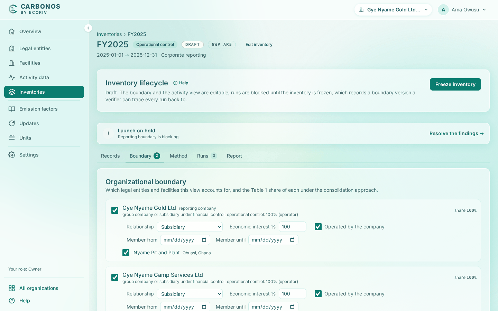

# Create an inventory and draw the boundary

An inventory is one accounting view over the organization's records: a period, an approach, a boundary and the decisions the view makes about each record. Create one each reporting year, or a second over the same period under another approach.

<!-- sources: specs 03, 03.3, 04.2, 04.4, 05, 07.2 and 10 (the title row, the pre-flight chip); the old page tasks/inventories/create-an-inventory-set-the-boundary-and-declare-scope-3.md (verified 2026-09-24); InventoryFormPage.tsx; BoundarySection.tsx (the reason list, "left out without a reason", "Detail for the verifier"); LifecycleBar.tsx (the disabled freeze button); PreflightChip.tsx; InventoryService.java boundary findings; screen text from the Gye Nyame Gold walkthrough of 2026-09-28 (replay-log.txt): "5 inventory dialog", "5 inventories", "5 workbench", "5 boundary" -->

## Before you start

- The organization has a legal entity with a facility, and you are Preparer, Reviewer or Owner.
- **Edit inventory** changes the approach, period and GWP set only while the inventory is a draft.

## Create the inventory

1. Open **Inventories** and click **New inventory**.
2. Fill **Name**, `FY2025` for Gye Nyame Gold, **Period start** and **Period end**.
3. Keep **Pro-rate by days (default)** for records that straddle the period, or choose **Block the run until the record is split**.
4. Fill **Purpose (optional)**.
5. Choose the **Consolidation approach**.
6. Choose the **GWP set**, **AR5 (default)** or **AR6**.
7. Leave **Copy the view from (optional)** at **Start from scratch**; see [Copy a view to another approach or the next year](copy-a-view.md).
8. Leave **Start with every operation the approach includes in the boundary** ticked.
9. Click **Create inventory**.

What you see: "FY2025 created." and the workbench of the new inventory, with **DRAFT** beside its title. **Back** and the breadcrumb **Inventories** lead to the list, where FY2025 has a row.

## Find your way around the workbench

The title row reads the name, the approach and **DRAFT**, with **GWP AR5** at the right of the breadcrumb row and, beside the title, **Edit inventory**, the pre-flight chip and **Freeze inventory**. Below it:

- The pre-flight chip reads **Launch on hold · 1 blocking**. Click it: **Pre-flight checks** says "Reporting boundary is blocking." because the gate prints "The inventory is a draft. Freeze it to enable a run."
- **Inventory lifecycle** reads "Draft." under the four states.
- The tabs are **Records**, **Boundary**, **Method**, **Runs** and **Report**; **Records** opens on "Nothing under review yet".

## Draw the boundary

The **Boundary** tab lists every entity with its share and its facilities; changes save as you make them.

1. To leave a facility out, untick it and choose a reason under **Why is it left out?**, adding **Detail for the verifier** where asked.
2. To leave an entity out, untick it and choose the reason its row asks for.
3. To account an entity differently in this view only, change **Relationship**, **Economic interest %** or **Operated by the company**.
4. For an entity acquired or sold in the period, fill **Member from** and **Member until**.

What you see: a row left out reads "left out:" with its reason. A facility unticked without a reason reads "left out without a reason", and the **Reporting boundary** gate holds the launch until it is ticked in or the reason is recorded.

## What happens next

The freeze fixes the boundary as version 1. Next, [Declare scope 3](declare-scope-3.md), then [Review and classify records](review-and-classify-records.md).
