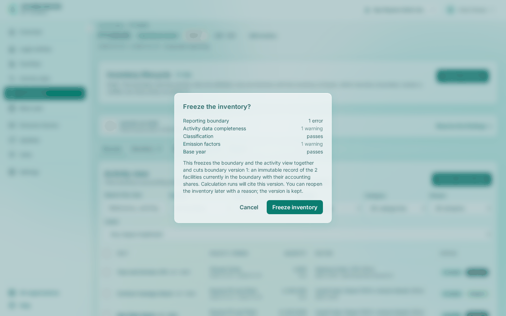

# Freeze the inventory and launch a run

A run can only be launched from a frozen inventory; the freeze cuts the boundary version every run cites. Freeze once every record is decided.

<!-- sources: specs 05, 05.1, 05.5 and 05.6; the old pages tasks/inventories/freeze-and-launch-a-run.md and reference/pre-flight-gates-and-findings.md (verified 2026-09-24); LifecycleBar.tsx (freeze and reopen dialogs, describeFreezeBlockers); InventoryService.java freezeBlockers and leaseDisagreement; PreflightBanner.tsx; InventoryDetailPage.tsx (Run label, launch, void); screen text and figures from the Gye Nyame Gold walkthrough of 2026-09-28 (replay-log.txt): "7 freeze dialog", "7 after freeze", "7 runs tab", "7 run page", "7 runs listed" -->

## Before you start

- Every record is classified or excluded, and you are Preparer, Reviewer or Owner.
- The **Pre-flight checks** panel holds no error other than "The inventory is a draft."; see [Clear the pre-flight findings](clear-the-pre-flight-findings.md).

## Freeze the inventory

1. In the **Inventory lifecycle** card click **Freeze inventory**.
2. Read the dialog "Freeze the inventory?".
3. Click **Freeze inventory**.

What you see: "Inventory frozen as boundary version 1." The header reads **FROZEN · BOUNDARY v1**, the lifecycle card offers **Reopen as draft**, and the banner turns to **Ready to launch a run**, "Every gate passes".

## What blocks a freeze

Only records refuse a freeze; the dialog lists them by reference, name and facility, for example "*N* records block the freeze; classify, justify or exclude them first".

| The record | What clears it |
| --- | --- |
| "is not classified" | Choose a factor or exclude it: [Review and classify records](review-and-classify-records.md). |
| "is classified in *scope* without a justification" | Fill the scope justification, or take the stream's default scope. |
| "is a leased asset (…) stored in *scope*, but Appendix F under *approach* puts it in *scope* (…)" | Choose the factor again to re-derive it. |
| "is a draft with data outstanding" | Complete or remove the draft under **Activity data**. |

## Launch a run

1. Open the **Runs** tab. **Run label** is prefilled, `Run 001`.
2. Click **Launch calculation run**, disabled while the launch is on hold: "Resolve the blocking findings first".

What you see: "Calculation complete." and the run's page, "Run 001", "Gye Nyame Gold Ltd (ORG-0001) · 2025-01-01 → 2025-12-31 · 11 lines", with **PDF report**, **Lines (CSV)** and **Exclusions (CSV)**; see [Fill the report header and read the report](../reporting/fill-the-report-header-and-read-the-report.md). The **Runs** tab lists "#001 Run 001", "11 lines · boundary v1" and "86,412 t CO₂e", with **Mark as final** and **Void…**.

## Reopen as a draft

1. In the lifecycle card click **Reopen as draft**.
2. Fill **Reason**, at least 10 characters, and click **Reopen as draft**.

What you see: "Inventory reopened as a draft." and the dialog's promise: "Boundary version 1 stays on the record with your reason, and the next freeze cuts a new boundary version." **Void…** with a **Reason** of at least 5 characters marks a run VOIDED and keeps its number, lines and totals.

## What happens next

The **History** card on the **Runs** tab records each freeze, launch, reopen and void. Next: [Designate a final run and publish](../reporting/designate-a-final-run-and-publish.md).
