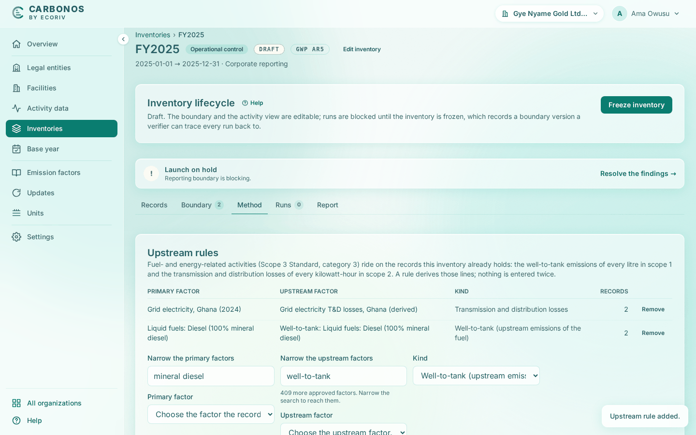

# Record scope 2 instruments and upstream rules

The **Method** tab holds the residual mix answer, the instruments the market-based scope 2 figure applies, and the upstream rules that derive scope 3 category 3 lines. Set them while the inventory is a draft.

<!-- sources: specs 04.7, 04.8, 07.3 and 07.6; the old page tasks/inventories/record-instruments-and-upstream-rules.md (verified 2026-09-24); MarketFactorsCard.tsx (field labels, criteria, toasts); format.ts instrumentLabels; UpstreamRulesCard.tsx; InventoryService.java instrument and rule findings; screen text from the Gye Nyame Gold walkthrough of 2026-09-28 (replay-log.txt): "6 method", "6 rule ...", "6 method after rules", "6 records after rules", "7 runs tab" history, "7 run page" -->

## Before you start

- The inventory is a draft, and you are Preparer, Reviewer or Owner.
- Every factor a rule names is approved under **Emission factors**.

## Answer the residual mix question

1. Under **Market-based scope 2 instruments**, set **Residual mix available** to **Yes, an adjusted residual mix is published** or **No residual mix is available**.
2. If yes, fill **Residual mix, kg CO₂e per kWh**.
3. Click **Save residual mix**.

What you see: "Residual mix recorded." Until it is answered the **Emission factors** gate warns: "The inventory does not say whether a residual mix is available."

## Record an instrument

1. Choose the **Facility** and the **Instrument**: **Supplier-specific factor**, **Power purchase contract**, **Energy attribute certificate** or **Residual mix**.
2. Fill **kg CO₂e per kWh** and **Source**.
3. Fill **Covered quantity (MWh)**, and **Covers from (optional)** and **Covers to (optional)** when it does not span the period.
4. Fill **Certificate or contract reference**, **Registry**, **Vintage (year)** and **Retirement date**.
5. Under **Scope 2 Quality Criteria, one at a time**, answer each as **Met** or **Not met**.
6. Click **Add instrument**.

What you see: "Instrument recorded for *facility*." A facility has one instrument per inventory: **Edit** on its row loads it into the form, and the button then reads **Save instrument**. The card states the rule: "The instrument is applied only when all eight are met; an unanswered criterion counts as not met until it is answered."

## Add an upstream rule

A rule derives the category 3 lines, well-to-tank for scope 1 fuel and transmission and distribution losses for scope 2 electricity, from records the inventory already holds.

1. Under **Upstream rules**, choose the **Primary factor** the records use, for example `Grid electricity, Ghana (2024) (/kWh)`.
2. Choose the **Upstream factor**, for example `Grid electricity T&D losses, Ghana (derived) (/kWh)`; its unit must convert from the primary factor's.
3. Choose the **Kind**: **Transmission and distribution losses** or **Well-to-tank (upstream emissions of the fuel)**.
4. Click **Add rule**. Repeat for the diesel with `Liquid fuels: Diesel (100% mineral diesel) (/litre)` and its well-to-tank factor.

What you see: "Upstream rule added." and a row with the two factors, the kind and **RECORDS**, 2 for each Gye Nyame Gold rule. A run prints each derived line with its origin, "well-to-tank of ACT-0001 Haul fleet diesel", under "3. Fuel- and energy-related activities".

## What happens next

The freeze fixes all three, and the report's methodology names each rule with its line count. When the gates are clear, [freeze the inventory and launch a run](freeze-and-launch-a-run.md).
