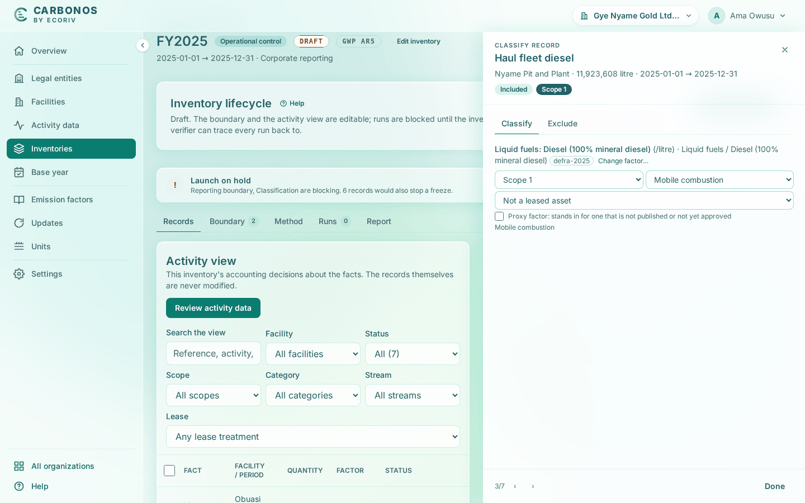

# Review and classify records

Reviewing brings the organization's records into the inventory's view. Classifying decides, for each, the factor, scope and category this inventory applies, or excludes it with a reason. The records themselves never change.

<!-- sources: specs 04, 04.3, 04.4, 04.8, 05.5 and 10 (the split register); the old page tasks/inventories/review-and-classify-records.md (verified 2026-09-24); AssignmentsSection.tsx (review toasts, "Select a row to classify"); AssignmentDetail.tsx (the record's detail: Show unapproved, the justification lengths, the exclusion fields, Done and Close); format.ts manualExclusionReasons; InventoryService.java ("A proxy factor needs a justification"); screen text from the Gye Nyame Gold walkthrough of 2026-09-28 (replay-log.txt): "6 under review", "6 drawer ...", "6 options ...", "6 classified ...", "6 records classified", "6 records after rules" -->

## Before you start

- The inventory is a draft, and you are Preparer, Reviewer or Owner.
- The factors you will choose are approved, or a reviewer is ready to approve them.

## Review the activity data

1. Open the inventory's **Records** tab and click **Review activity data**.

What you see: "7 new records under review." for Gye Nyame Gold. Each record gets a row with the status **Unclassified**; an electricity record at a facility with a grid region reads "Suggested: Grid electricity, Ghana (2024)". Records outside the period, the boundary or a membership window are excluded on review.

## Classify a record

1. Click the row, or move with `j` and `k` and press Enter. The **Records** tab splits: the records as a summary list on the left, under the tabs **All**, **Unclassified**, **Included** and **Excluded**; the record's detail on the right, with the tabs **Classify** and **Exclude**.
2. Click **Choose factor…** and type to narrow the list. Tick **Show unapproved** to see the rest.
3. Click the factor, or for electricity the shortcut "Suggested for this facility's grid: Grid electricity, Ghana (2024)".
4. Check the scope and category filled from the record's emission source, then use ‹ and › to reach the next record.

What you see: the detail's eyebrow reads the decision and its status **Included**: **Scope 1 / Mobile combustion** for Haul fleet diesel; **Scope 3 / 1. Purchased goods and services** for the contractor's diesel, with no justification asked. Choosing the factor saved the classification; **Done** (**Close** on the last record) only closes the detail, and **Change factor…** changes it later.

## Justify a departure

- **Another scope than the source's default.** Fill "Why the scope departs from the default (at least 10 characters)", or the record stops the freeze.
- **A proxy factor.** Tick **Proxy factor: stands in for one that is not published or not yet approved** and fill "What the factor stands in for (at least 5 characters)".
- **A mass meeting a factor per litre.** Choose the density that converts between them; see [Define units and densities](../organization/define-units-and-densities.md).

## Exclude a record

1. In the detail open the **Exclude** tab and choose the reason: Non-GHG activity, Duplicate, Not applicable, Methodology exclusion, Other documented reason, or Outside the scopes: Montreal Protocol gas.
2. Fill **Justification**, "Why this record is left out", of at least 10 characters.
3. Say what the record would have emitted: **Estimated emissions left out (kg CO₂e)**, **This record emits nothing**, or **Not estimated**.

What you see: the row reads **Excluded** with the reason; a Montreal Protocol gas asks for the **Gas** instead.

## What happens next

The **Classification** gate reads **PASS** once every record is decided; a record changed after review is refreshed by the next **Review activity data**.
